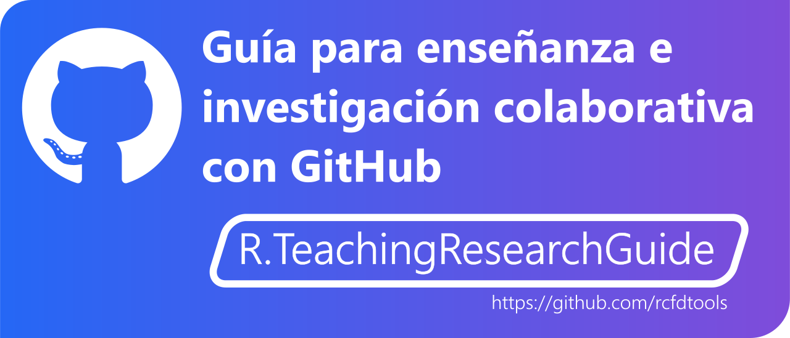
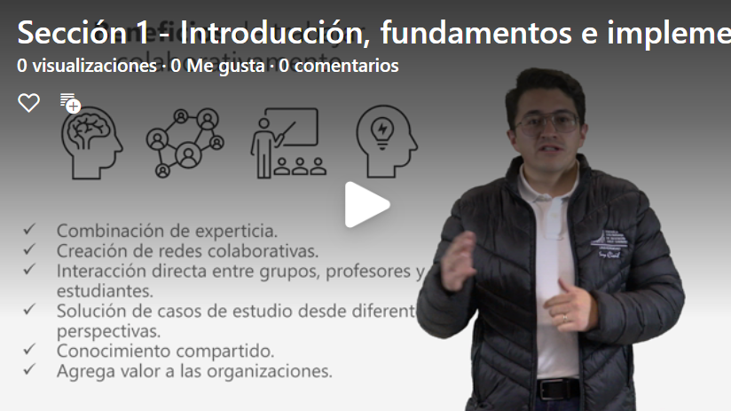

   

En esta guía encontrará diferentes micro-contenidos, enlaces y ayudas para la creación de contenidos académicos relacionados con educación e investigación orientada a desarrollo colaborativo bajo el esquema de uso abierto o uso libre a través de GitHub.  

 https://web.microsoftstream.com/video/4f117fdd-5cea-4165-bf82-e66c8f890b89  

## Sección 1 - Introducción, fundamentos e implementación de GitHub

El desarrollo colaborativo se refiere al proceso de creación de contenidos académicos y científicos a través de la interacción simultánea de más de una persona para alcanzar uno o varios objetivos comunes; es así como programadores, investigadores y educadores (denominados en esta guía como “**creadores de contenido**”), colaboran entre ellos para obtener un producto de calidad que puede ser un software, una investigación, un curso, un programa académico o un libro electrónico, entre otros. No existe una manera única en que esta interacción se lleve a cabo debido a que el desarrollo colaborativo es un concepto amplio que se puede abordar desde diferentes perspectivas.

| Microcontenido                                                                                   | Alcance                                                                                                                                                                                                                                                                                                                                    |
|--------------------------------------------------------------------------------------------------|--------------------------------------------------------------------------------------------------------------------------------------------------------------------------------------------------------------------------------------------------------------------------------------------------------------------------------------------|
| [¿Qué es el desarrollo colaborativo?](Section01/WhatIsCollab)                                    | En esta actividad aprenderás diferentes conceptos relacionados con desarrollo colaborativo, sus beneficios y las diferencias principales entre cooperación y colaboración.                                                                                                                                                                 |
| [Herramientas para desarrollo colaborativo](Section01/CollabTools)                               | Existen diferentes herramientas o plataformas informáticas para desarrollo colaborativo que facilitan la interacción y gestión de la información. Los equipos de desarrollo ya no deben estar en el mismo lugar para poder comunicarse y crear, ni siquiera tienen que conocerse para poder dar sus criterios y participar en un proyecto. |
| [Fundamentos de Git](Section01/GitFundamentals)                                                  | Git es un software que permite rastrear y validar cambios en archivos de un proyecto o un repositorio.                                                                                                                                                                                                                                     |
| [Lenguaje Markdown y escritura en GitHub](Section01/Markdown)                                    | Los repositorios de GitHub utilizan para su documentación el lenguaje Markdown, que permite crear texto con formato, tablas, enlaces y utilizar elementos embebidos del lenguaje de hipertextos HTML y sin tener que definir estilos o tener conocimientos de programación.                                                                |
| [Creación y gestión en línea de repositorios y documentos en GitHub](Section01/GitHubRepository) | En esta actividad aprenderás a crear y gestionar repositorios en GitHub directamente desde el navegador de Internet.                                                                                                                                                                                                                       |
| [Fundamentos de organizaciones y equipos en GitHub](Section01/GitHubOrganization)                | Las organizaciones permiten integrar miembros de la comunidad de creadores, en equipos de trabajo para generar y publicar contenidos colaborativos a través de la clonación de versiones oficiales lanzadas por cada miembro o desde repositorios creados directamente por la organización.                                                |
| [Centro de documentación Wiki en GitHub](Section01/GitHubWiki)                                   | Conceptos de documentación global de proyectos orientados a desarrollo de software o App's a través de espacios wiki                                                                                                                                                                                                                       |
| [Centro de discusiones en GitHub](Section01/GitHubDiscussions)                                   | Discusiones es el espacio donde los creadores de contenido, estudiantes, colaboradores y usuarios finales se reúnen para intercambiar ideas, solicitar ayuda, dar solución a problemas o para comunicarse entre sí.                                                                                                                        |

## Sección 2 - Gestión local de repositorios GitHub con PyCharm Community

PyCharm Community es un entorno de desarrollo integrado (IDE) desktop, diseñado para la producción de proyectos basados en el lenguaje de programación Python, contiene editores avanzados y asistentes que no solamente permiten crear y editar código, sino también la documentación en formato de marcas Markdown, gestionar controles de cambios en múltiples repositorios, corrección de escritura, gramática avanzada, publicación y actualización comentada en GitHub.

| Microcontenido                                                                                        | Alcance                                                                                                                                                                                                             |
|-------------------------------------------------------------------------------------------------------|---------------------------------------------------------------------------------------------------------------------------------------------------------------------------------------------------------------------|
| [Instalación, clonación local de proyecto GitHub y configuración general de PyCharm](Section02/Setup) | Para la gestión y clonación local de repositorios creados en GitHub, es necesario descargar, instalar y configurar la versión de uso libre PyCharm Community.                                                       |
| [Edición local de proyectos con PyCharm y publicación en la nube](Section02/SingleProject)            | Luego de realizada la clonación local del repositorio creado en GitHub, es necesario modificar la estructura de directorios, agregar nuevos archivos y editar o actualizar los archivos existentes.                 |
| [Gestión local de múltiples proyectos en PyCharm](Section02/MultipleProject)                          | A través de PyCharm Community se pueden gestionar local y simultáneamente múltiples repositorios y sus centros de documentación Wiki asociados.                                                                     |
| [Proyectos GitHub utilizando Python en PyCharm](Section02/Python)                                     | Python es un potente lenguaje de programación interpretado con licencia de código abierto que soporta orientación a objetos y es comúnmente utilizado en el desarrollo de proyectos e investigación en ingeniería.  |

## Sección 3 - Gestión local de repositorios GitHub con Visual Studio Code

Visual Studio Code (VS Code) de Microsoft, es un editor de código fuente multi-lenguaje que permite la gestión y publicación de proyectos en GitHub, además de la edición de archivos en el lenguaje de marcas Markdown.

| Microcontenido                                                              | Alcance                                                                                                                                                                                                                                     |
|-----------------------------------------------------------------------------|---------------------------------------------------------------------------------------------------------------------------------------------------------------------------------------------------------------------------------------------|
| [Instalación y configuración de Visual Studio Code](Section03/Setup)        | Para la gestión de repositorios GitHub a través de Visual Studio Code, es necesario instalar el entorno de desarrollo integrado (IDE) y diferentes extensiones.                                                                             |
| [Edición local de repositorios GitHub con VS Code](Section03/SingleProject) | Luego de realizada la instalación y configuración, podrás gestionar localmente repositorios de GitHub, revisar los controles de cambios realizados sobre los archivos de los proyectos, comentar y publicar las actualizaciones en la nube. |

##  

_:beginner: Ayuda / Colabora: a través de la pestaña _[Discussions](https://github.com/rcfdtools/R.TeachingResearchGuide/discussions)_ localizada en la parte superior de esta ventana, podrás encontrar y participar en los [_anuncios o noticias_](https://github.com/rcfdtools/R.TeachingResearchGuide/discussions/categories/announcements) publicados, enviarnos tus [_ideas_](https://github.com/rcfdtools/R.TeachingResearchGuide/discussions/categories/ideas) para actividades complementarias, participar en preguntas, respuestas y consultas específicas [_Q&A_](https://github.com/rcfdtools/R.TeachingResearchGuide/discussions/categories/q-a) y realizar [_publicaciones o consultas generales_](https://github.com/rcfdtools/R.TeachingResearchGuide/discussions/categories/general) públicas._

_[:blue_heart: Consejos y buenas prácticas de desarrollo colaborativo](BestPractice.md): algunos consejos que tal vez te sean de utilidad a la hora de crear y mantener tus repositorios._

_R.TeachingResearchGuide es de uso libre para fines académicos, conoce nuestra licencia, cláusulas, condiciones de uso y como referenciar los contenidos publicados en este repositorio, dando [clic aquí](LICENSE.md)._

_¡Encontraste útil este repositorio!, apoya su difusión marcando este repositorio con una ⭐ o síguenos dando clic en el botón Follow de [rcfdtools](https://github.com/rcfdtools) en GitHub._

##

 Este curso guía ha sido desarrollado con el apoyo de la Escuela Colombiana de Ingeniería - Julio Garavito. Encuentra más contenidos en https://github.com/uescuelaing  

