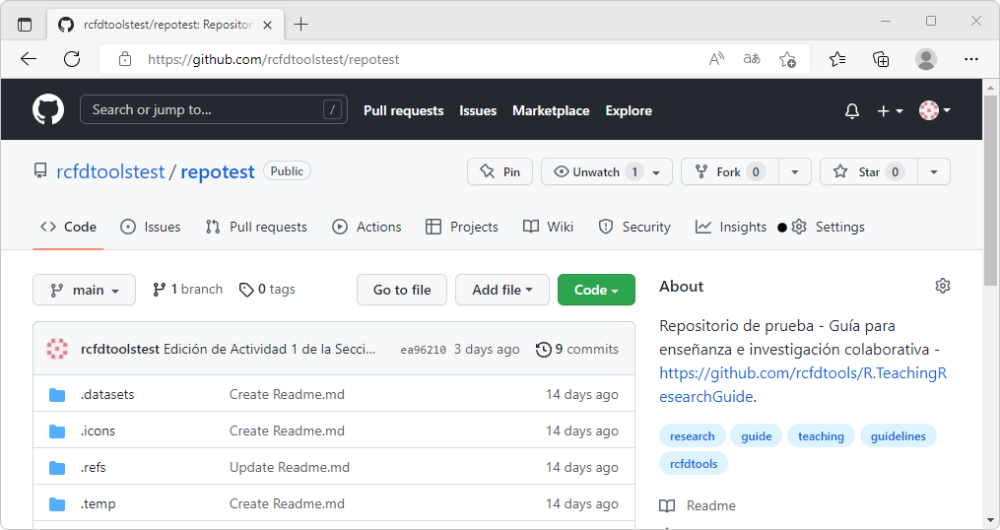
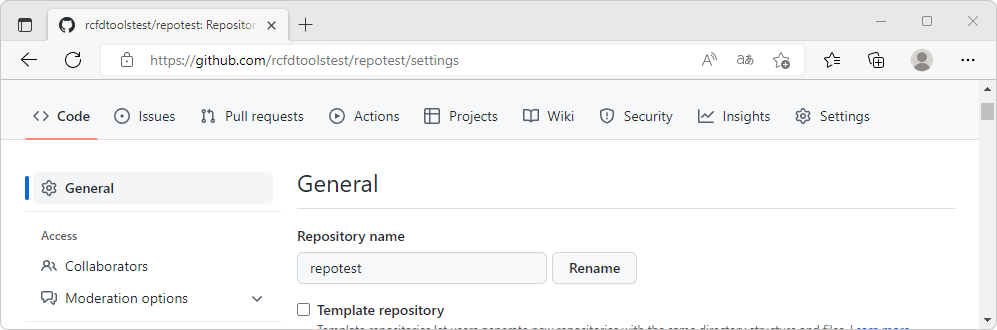
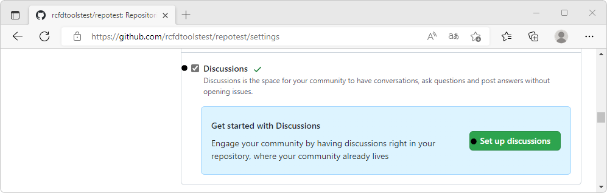
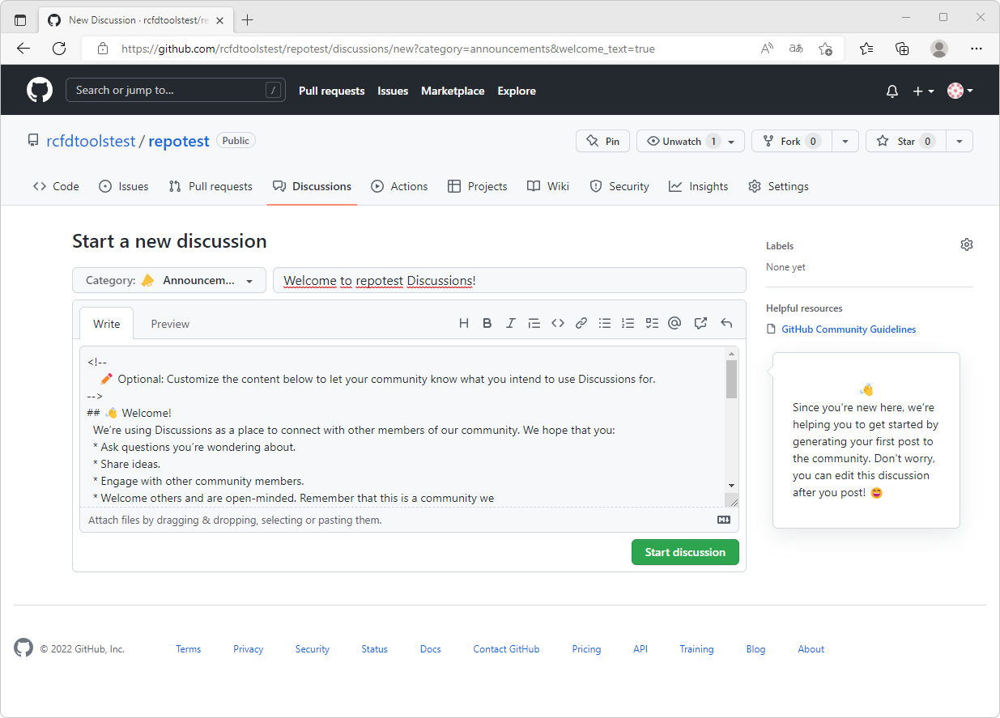
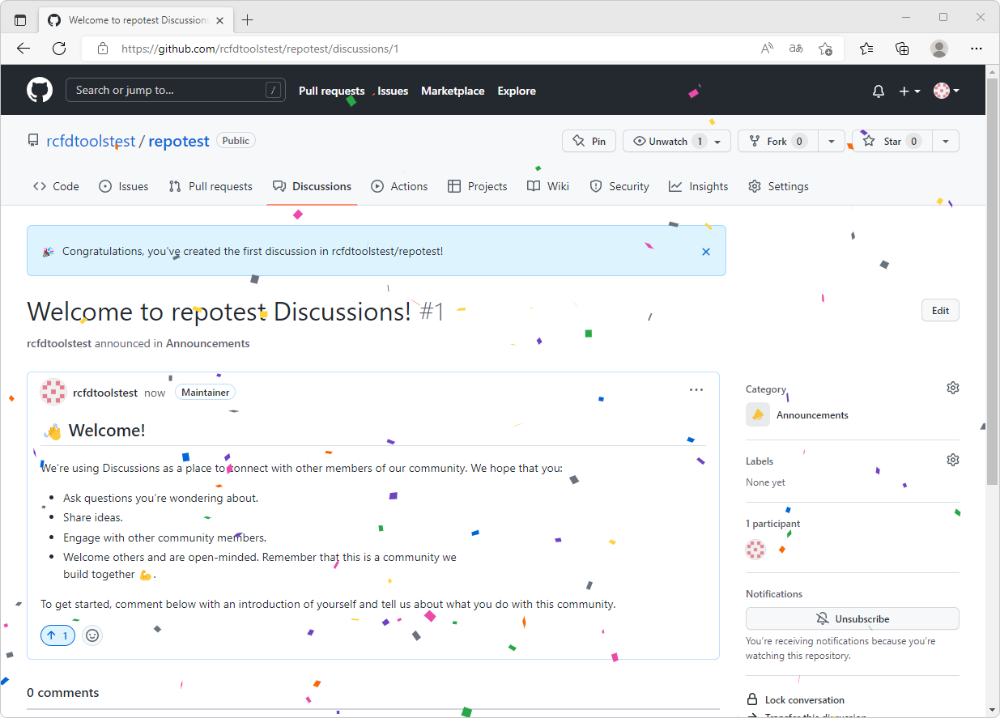
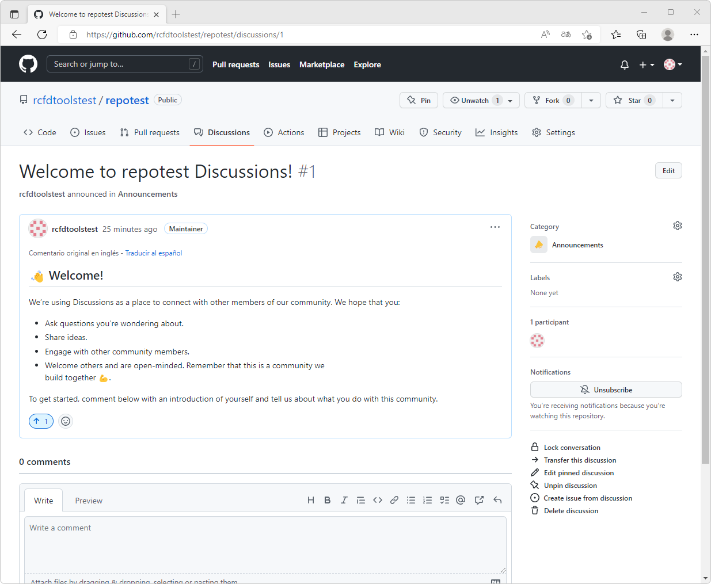
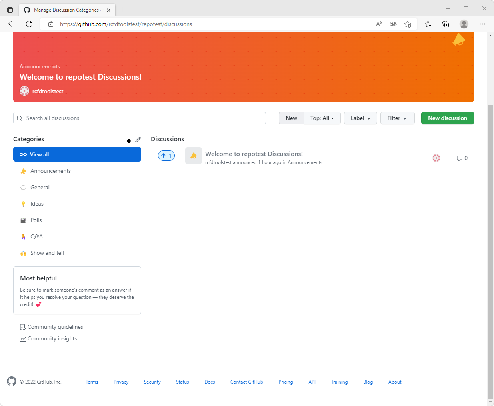
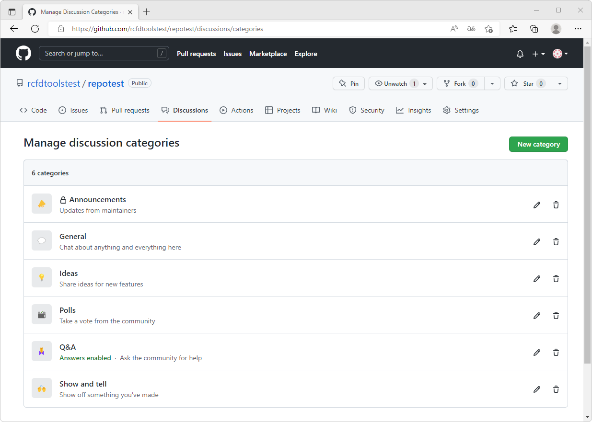
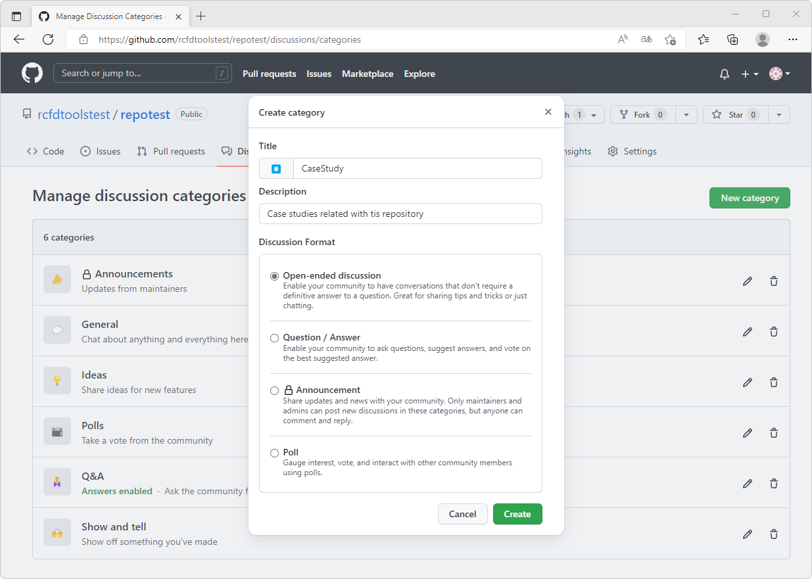
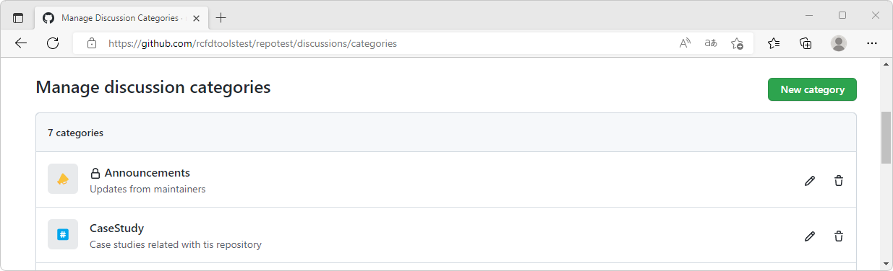

## Centro de discusiones en GitHub
Keywords: `Discussions`

Discusiones es el espacio donde los creadores de contenido, estudiantes, colaboradores y usuarios finales se reúnen para intercambiar ideas, solicitar ayuda, dar solución a problemas o para comunicarse entre sí.

 https://www.youtube.com/watch?v=IpBw2SJkFyk  

### Objetivos

* Activar el centro de discusiones.
* Crear una discusión.
* Crear y editar categorías de discusión.

### Requerimientos

* Cuenta y repositorio GitHub. [:mortar_board:Aprender.](../../Section01/GitHubRepository) 

### Activación del centro de discusiones y creación de la primera publicación

1. Acceda a su repositorio de GitHub desde su navegador de Internet, luego de clic en la pestaña superior _Settings_

2. En _Settings_, seleccione a la izquierda _General_, desplace la ventana hacia abajo y en la sección _Features_ active _Discussions_. En la misma ventana, de clic en el botón `Set up discussions` para iniciar la configuración.

3. En la parte superior de la ventana, podrá observar una nueva pestaña llamada _Discussions_ y que automáticamente fue redirigido a la creación de la primera discusión correspondiente a la bienvenida general. De clic en el botón `Start Discussión` que realizará la publicación.

4. Luego de guardada la discusión podrá observar en el panel derecho, que la primera discusión ha sido creada en el grupo `Announcements` y que no se encuentra asociada a ningún label.

Desde el panel derecho y dando clic en los íconos de configuración :gear:, podrá cambiar la categoría de la discusión y editar los rótulos asociados.

También podrá observar en el panel lateral él número de participantes, notificaciones que le permitirán suscribirse o de-suscribirse y las siguientes opciones de gestión:

| Opción                       | Descripción                                                                                                                                                                                                                              | Visibilidad                 |
|------------------------------|------------------------------------------------------------------------------------------------------------------------------------------------------------------------------------------------------------------------------------------|-----------------------------|
| Lock conversation            | Bloquea la discusión actual para que los usuarios no puedan publicar nuevos comentarios. El propietario y los colaboradores directos pueden seguir publicando comentarios y la discusión puede ser desbloqueada.                         | Propietario y colaboradores |
| Transfer this discussion     | Transfiera la discusión a otro repositorio que sea propio del usuario creador.                                                                                                                                                           | Propietario y colaboradores |
| Edit pinned discussion       | Edita discusiones ancladas permitiendo cambiar el color del patrón de fondo y el ícono. Se pueden anclar hasta 4 discusiones que aparecerán al inicio de la página de discusiones. Por defecto, la publicación de bienvenida es anclada. | Propietario y colaboradores |
| Unpin discussions            | Desancla la discusión.                                                                                                                                                                                                                   | Propietario y colaboradores |
| Create issue from discussion | A partir de la discusión, crea una entrada a la lista de tareas pendientes o Issues.                                                                                                                                                     | Todos los usuarios          |
| Delete discussion            | Elimina completamente una discusión, no podrá ser recuperada y también todos los comentarios realizados serán eliminados.                                                                                                                | Propietario y colaboradores |

### Gestión de categorías en el centro de discusión

De clic en la pestaña de discusiones. 

Por defecto, en la activación del centro de discusión son creadas las siguientes categorías:

| Categoría     | Descripción                                                                                         | Formato               |
|---------------|-----------------------------------------------------------------------------------------------------|-----------------------|
| Announcements | Anuncios de actualización por parte del creador o los colaboradores directos del repositorio.       | Announcement          |
| General       | Hablar acerca de cualquier cosa relacionada con el repositorio.                                     | Open-ended discussion |
| Ideas         | Compartir ideas para nuevas características, nuevas actividades, nuevos modelos, nuevos contenidos. | Open-ended discussion |
| Polls         | Encuestas por votación para tu comunidad                                                            | Poll                  |
| Q&A           | Preguntas y respuestas para pedir ayuda a la comunidad.                                             | Question - Answer     |
| Show and tell | Mostrar a la comunidad alguna de tus creaciones.                                                    | Open-ended discussion |

Descripción de los formatos de discusión

| Formato               | Descripción                                                                                                                                                                                                                                                                     |
|-----------------------|---------------------------------------------------------------------------------------------------------------------------------------------------------------------------------------------------------------------------------------------------------------------------------|
| Open-ended discussion | Permite que la comunidad que mantiene y utiliza el repositorio, mantenga conversaciones directas sin que se requiera de una respuesta definitiva a una pregunta formulada. Es la opción ideal para compartir trucos, experiencias o simplemente para hablar con otros miembros. |
| Question - Answer     | Permite que la comunidad realice preguntas, sugiera respuestas y vote por la mejor respuesta sugerida.                                                                                                                                                                          |
| Announcement          | Compartir actualizaciones y novedades con la comunidad. Solo los usuarios colaboradores y los administradores pueden publicar nuevos anuncios en esta categoría pero cualquier usuario puede comentar o responder.                                                              |
| Poll                  | Permite crear encuestas para generar interés sobre un tema en particular.                                                                                                                                                                                                       |

> Cualquier usuario es libre de participar en las discusiones ya creadas, o podrá crear nuevas discusiones para las categorías disponibles.

Para editar las categorías, en el panel izquierdo y al lado derecho del título _Categories_, de clic en el ícono en forma de _lápiz_ :pencil2:

Para crear nuevas categorías, p. ej., una categoría específica para casos de estudio, en la parte superior derecha del administrador de categorías, de clic en el botón `New category`. Ingrese el nombre de la nueva categoría, una descripción general de su propósito y seleccione el formato. Para el ejemplo, generaremos una categoría de discusión abierta para discutir acerca de casos de estudio relacionados con el repositorio. Para finalizar, de clic en el botón `Create`.

### Actividades complementarias:pencil2:

En la siguiente tabla se listan las actividades complementarias a ser desarrolladas por el estudiante.

|  #  | Alcance                                                                                                                                       |
|:---:|:----------------------------------------------------------------------------------------------------------------------------------------------|
|  1  | Active el centro de discusiones.                                                                                                              |
|  2  | Cree una discusión por cada actividad de su repositorio y asocie a los enlaces Ayuda / Colabora.                                              |
|  3  | Cree una nueva categoría para discutir acerca de casos de estudio relacionados con su repositorio.                                            |
|  4  | [Deje un comentario](https://github.com/rcfdtoolstest/repotest/discussions/1) en la discusión creada en el repositorio ejemplo de este curso. |

### Preguntas y respuestas Q&A

| Pregunta                                                                             | Respuesta                                                                                                        |
|--------------------------------------------------------------------------------------|------------------------------------------------------------------------------------------------------------------|
| ¿Cuando otro usuario clona o descarga mi repositorio, son incluidas las discusiones? | No, las discusiones únicamente están asociadas al repositorio donde fueron creadas.                              |
| ¿Al eliminar una categoría se eliminan todas las publicaciones relacionadas?         | No, las publicaciones pueden ser reasignadas o movidas a otra categoría antes de que la categoría sea eliminada. |
| ¿Al eliminar una publicación se eliminan todos sus comentarios?                      | Sí y no podrán ser recuperados.                                                                                  |

> Ayúdame desde este [hilo de discusión](https://github.com/rcfdtools/R.TeachingResearchGuide/discussions/17) a crear y/o responder preguntas que otros usuarios necesiten conocer o experiencias relacionadas con esta actividad.

### Referencias

* https://docs.github.com/en/discussions
* https://docs.github.com/en/discussions/quickstart
* https://docs.github.com/en/discussions/guides/best-practices-for-community-conversations-on-github
* https://docs.github.com/en/discussions/collaborating-with-your-community-using-discussions/participating-in-a-discussion
* https://docs.github.com/es/site-policy/github-terms/github-community-guidelines

### Control de versiones

| Versión    | Descripción                                                                                                                                  | Autor                                      | Horas |
|------------|:---------------------------------------------------------------------------------------------------------------------------------------------|--------------------------------------------|:-----:|
| 2022.09.04 | Versión inicial. Activación del centro de discusiones y creación de la primera publicación. Gestión de categorías en el centro de discusión. | [rcfdtools](https://github.com/rcfdtools)  |   3   |

_R.TeachingResearchGuide es de uso libre para fines académicos, conoce nuestra licencia, cláusulas, condiciones de uso y como referenciar los contenidos publicados en este repositorio, dando [clic aquí](../../LICENSE.md)._

_¡Encontraste útil este repositorio!, apoya su difusión marcando este repositorio con una ⭐ o síguenos dando clic en el botón Follow de [rcfdtools](https://github.com/rcfdtools) en GitHub._

| [Anterior](../GitHubWiki) | [:house: Inicio](../../Readme.md) | [:beginner: Ayuda / Colabora](https://github.com/rcfdtools/R.TeachingResearchGuide/discussions/17) | [Siguiente](../../Section02/Setup) |
|---------------------------|-----------------------------------|----------------------------------------------------------------------------------------------------|------------------------------------|

[^1]: 