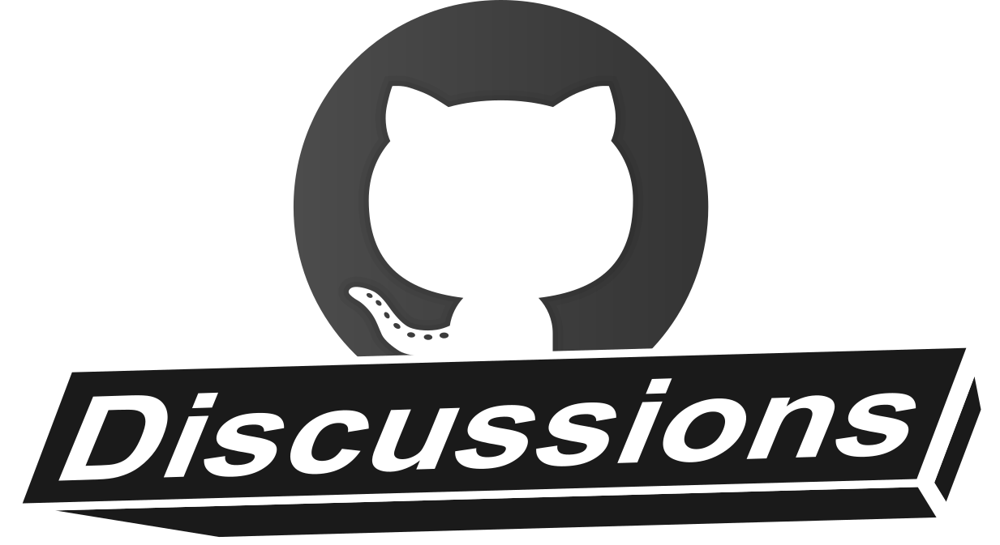

## Centro de discusiones en GitHub
Keywords: `Discussions`

Discusiones es el espacio donde los creadores de contenido, estudiantes, colaboradores y usuarios finales se reúnen para intercambiar ideas, solicitar ayuda, dar solución a problemas o para comunicarse entre sí.

   

### Objetivos

* Activar el centro de discusiones.
* Crear una discusión por cada actividad y asociarla al enlace Ayuda / Colabora.

### Requerimientos

* Cuenta y repositorio GitHub. [:mortar_board:Aprender.](../../Section01/GitHubRepository) 

### Desarrollo

 https://www.youtube.com/watch?v=IpBw2SJkFyk  <

### Actividades complementarias:pencil2:

En la siguiente tabla se listan las actividades complementarias a ser desarrolladas por el estudiante.

|  #  | Alcance                                                                                          |
|:---:|:-------------------------------------------------------------------------------------------------|
|  1  | Active el centro de discusiones.                                                                 |
|  2  | Cree una discusión por cada actividad de su repositorio y asocie a los enlaces Ayuda / Colabora. |

### Preguntas y respuestas Q&A

| Pregunta                                                                             | Respuesta                                                                           |
|--------------------------------------------------------------------------------------|-------------------------------------------------------------------------------------|
| ¿Cuando otro usuario clona o descarga mi repositorio, las discusiones son incluidas? | No, las discusiones únicamente están asociadas al repositorio donde fueron creadas. |

> Ayúdame desde este [hilo de discusión](https://github.com/rcfdtools/R.TeachingResearchGuide/discussions/9999) a crear y/o responder preguntas que otros usuarios necesiten conocer o experiencias relacionadas con esta actividad.

### Referencias

* https://docs.github.com/en/discussions
* https://docs.github.com/en/discussions/quickstart
* https://docs.github.com/en/discussions/guides/best-practices-for-community-conversations-on-github
* https://docs.github.com/en/discussions/collaborating-with-your-community-using-discussions/participating-in-a-discussion

### Control de versiones

| Versión    | Descripción      | Autor                                      | Horas |
|------------|:-----------------|--------------------------------------------|:-----:|
| 2022.08.22 | Versión inicial. | [rcfdtools](https://github.com/rcfdtools)  |  XX   |

_R.TeachingResearchGuide es de uso libre para fines académicos, conoce nuestra licencia, cláusulas, condiciones de uso y como referenciar los contenidos publicados en este repositorio, dando [clic aquí](../../LICENSE.md)._

_¡Encontraste útil este repositorio!, apoya su difusión marcando este repositorio con una ⭐ o síguenos dando clic en el botón Follow de [rcfdtools](https://github.com/rcfdtools) en GitHub._

| [Anterior](../GitHubRepository) | [:house: Inicio](../../Readme.md) | [:beginner: Ayuda / Colabora](https://github.com/rcfdtools/R.TeachingResearchGuide/discussions/9) | [Siguiente]() |
|---------------------------------|-----------------------------------------------------------------------------|------------------------------------------------------------------------------------------------------|---------------|

[^1]: 