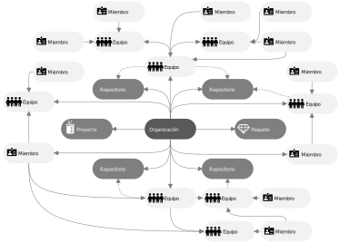

## Fundamentos de organizaciones y equipos en GitHub
Keywords: `Organization` `Collaboration` `Teams` `Members` `Manteiners`

Las organizaciones permiten integrar miembros de la comunidad de creadores, en equipos de trabajo para generar y publicar contenidos colaborativos a través de la clonación de versiones oficiales lanzadas por cada miembro o desde repositorios creados directamente por la organización.

   

                                                                                                                                                      

### Conceptos generales[^1]

Las organizaciones de GitHub son cuentas compartidas donde empresas, instituciones y creadores de contenidos de código abierto, pueden integrar su trabajo en un único espacio y con el soporte de un robusto sistema de seguridad y opciones administrativas avanzadas. La organización es un gran contenedor donde se crean o integran trabajos compartidos con el propósito de ofrecerlos a la comunidad bajo un único nombre o marca.

Por ejemplo, los profesores o los investigadores de un centro de estudios de una institución, pueden crear de forma particular diferentes contenidos o desarrollos a través de sus cuentas personales de usuario, luego estos pueden desde una organización clonar las versiones finales y presentar a estudiantes u otros investigadores sus creaciones en un espacio integrado. Por otra parte, los creadores de contenido pueden generar un proyecto desde la organización o desde equipos de trabajo y trabajar colaborativamente de manera agrupada.

Existen diversas [topologías](https://wikidiff.com/topology/typology) para la creación de organizaciones: desde la creación de una única organización donde se crean o publican los contenidos de todos los colaboradores (la navegabilidad pública dentro de los repositorios de la organización no clasifica los contenidos por un nivel jerárquico específico o una temática común sino a través de su popularidad y cronología, sin embargo, se pueden crear equipos de trabajo en múltiples niveles para organizar internamente los repositorios para los usuarios que pertenecen a la organización); la creación de organizaciones segmentadas de acuerdo a criterios académicos y administrativos (p. ej., un centro de estudios, un programa académico, una facultad con diferentes equipos de trabajo) para integrar las actividades específicas de un equipo de trabajo y las organizaciones segmentadas particulares para crear contenidos al rededor de una temática específica con un menor número de miembros. 

Cada persona que utiliza GitHub, siempre inicia sesión en su cuenta personal para trabajar de manera independiente y esta cuenta puede estar asociada a una o múltiples organizaciones o equipos de trabajo para trabajar en proyectos compartidos. Un subconjunto de estas cuentas personales puede obtener el rol de propietario de la organización, el cual permite a estas personas administrar el acceso a los recursos de la organización de forma granular, usando características administrativas y de seguridad sofisticadas.  

#### Características de una organización en GitHub (2022.08.24)

* Una organización puede tener uno o múltiples repositorios, proyectos, paquetes, equipos y miembros.
* Los repositorios son creados o asociados por clonación directamente desde la raíz de la organización.
* Los repositorios asociados a un equipo son visibles para todos los subequipos de niveles inferiores.
* Usuarios externos que no pertenecen a la organización, pueden consultar los repositorios públicos en un único tablero sin los niveles de agrupamiento interno por equipos.
* Usuarios externos pueden clonar los repositorios públicos de la organización.
* Los repositorios de una organización se asocian a los equipos o subequipos.
* Los repositorios personales de los miembros de la organización se pueden vincular a través de clonación.
* Los equipos principales pueden ser únicos o estar compuestos por múltiples equipos.
* Cada equipo o subequipo tiene una página o tablero de control que incluye: opciones de discusión, administración de miembros, administración de subequipos, administración de repositorios, administración de proyectos propios y configuraciones generales.
* Un miembro dentro de la organización puede ser integrado a uno o varios equipos o subequipos.

:mortar_board: Aprende más acerca de organizaciones en GitHub [aquí](https://docs.github.com/es/organizations/collaborating-with-groups-in-organizations/about-organizations).

### Como funcionan los equipos de trabajo[^2]

Los equipos de trabajo dentro de GitHub están compuestos por diferentes miembros de una organización, los cuales son invitados por los propietarios o administradores generales o por los gestores de equipo. Un usuario de GitHub puede pertenecer a múltiples organizaciones y a múltiples equipos de trabajo dentro de ellas, y sus funciones y privilegios dependerán del rol (administrar, leer, escribir, acceder) que desempeñe en cada proyecto o en cada repositorio.    

| Característica                 | Descripción                                                                                                                                                                                                                                                                                                                                                                                                                                                                                                           |
|--------------------------------|-----------------------------------------------------------------------------------------------------------------------------------------------------------------------------------------------------------------------------------------------------------------------------------------------------------------------------------------------------------------------------------------------------------------------------------------------------------------------------------------------------------------------|
| **Visibilidad**                | Los equipos de trabajo pueden ser visibles o secretos. Todos los miembros en la organización pueden ver y @mencionar a los equipos visibles. Solo las personas en el equipo y aquellas con permisos de propietario pueden ver los equipos secretos. Son ideales para ocultar equipos con nombres o miembros sensibles, tales como aquellos que se utilizan para trabajar con socios o clientes externos. Los equipos secretos no pueden anidarse bajo equipos padre ni tener equipos hijo.                            |
| **Espacio virtual por equipo** | Cada equipo tiene una página o un tablero propio y dentro de él se pueden observar los miembros del equipo, sub equipos y los repositorios propios o en los que participa el equipo. Los propietarios y los gestores de los equipos pueden acceder a la configuración del equipo, actualizar su descripción, el logo, agregar nuevos miembros, crear subgrupos y asociar repositorios.                                                                                                                                |
| **Equipos anidados**           | Cuando se crea dentro de una organización un equipo de trabajo, a este se le pueden integrar diferentes miembros o subequipos a los cuales se les podrán también agregar diferentes miembros. Por ejemplo, si la organización corresponde a una institución educativa, esta podrá tener equipos de trabajo por programa académico, a su vez estos podrán tener dentro diferentes centros de estudios y estos a su vez diferentes áreas de investigación, semilleros o proyectos conformados por sus propios miembros. |

:mortar_board: Aprende más acerca de como crear equipos [aquí](https://docs.github.com/es/articles/creating-a-team).  
:mortar_board: Aprende más acerca de como agregar miembros a un equipo [aquí](https://docs.github.com/es/articles/adding-organization-members-to-a-team).

### Tipos de cuentas en GitHub[^3]

Para la creación y la gestión de las organizaciones en GitHub, existen diferentes tipos de cuentas de usuario. 

#### Cuentas personales[^3]

Cada persona que utilice GitHub.com deberá iniciar sesión con una cuenta personal. La cuenta personal es tu identidad en GitHub.com y tiene un nombre de usuario y perfil. Tu cuenta personal puede ser propietaria de recursos tales como repositorios, paquetes y proyectos. En cualquier momento que realices una acción en GitHub.com, tal como crear una propuesta o revisar una solicitud de cambios, dicha acción se atribuirá a tu cuenta personal.

Cada cuenta personal utiliza ya sea GitHub Free o GitHub Pro. Todas las cuentas personales pueden ser propietarias de una cantidad ilimitada de repositorios públicos o privados, con una cantidad ilimitada de colaboradores en dichos repositorios. Si usas GitHub Free, los repositorios privados que le pertenezcan a tu cuenta personal tendrán un conjunto de características limitado, sin embargo, se puede mejorar migrando a una cuenta de pago en GitHub Pro para obtener el conjunto total de características para los repositorios privados. Para obtener más información, consulta "[Productos de GitHub](https://docs.github.com/es/get-started/learning-about-github/githubs-products)".

Utilizando cuentas libres y para los repositorios públicos, las discusiones y documentación wiki podrán ser habilitadas y utilizadas sin tener que utilizar una cuenta de pago. 

#### Cuentas de organización[^3]

Las organizaciones son cuentas compartidas en donde una cantidad ilimitada de personas pueden colaborar en muchos proyectos al mismo tiempo.

Tal como las cuentas personales, las organizaciones pueden ser propietarias de recursos tales como repositorios, paquetes y proyectos. Sin embargo, no puedes iniciar sesión en una organización. En vez de esto, cada persona firmará su propia cuenta personal y cualquier acción que tome la persona sobre los recursos organizacionales se le atribuirá a su cuenta personal. Cada cuenta personal puede ser un miembro de varias organizaciones.

Se puede otorgar roles diferentes a las cuentas personales de una organización dentro de esta, lo cual otorga niveles diferentes de acceso a la organización y a sus datos. Todos los miembros pueden colaborar entre ellos en los repositorios y proyectos, pero solo los propietarios de organizaciones y administradores de seguridad pueden administrar la configuración de la organización y controlar el acceso a los datos de la organización con seguridad sofisticada y características administrativas. Para obtener más información, consulta las secciones "[Roles en una organización](https://docs.github.com/es/organizations/managing-peoples-access-to-your-organization-with-roles/roles-in-an-organization)" y "[Mantener tu organización segura](https://docs.github.com/es/organizations/keeping-your-organization-secure)".

Todas las organizaciones pueden ser propietarias de una cantidad ilimitada de repositorios públicos y privados. Puedes utilizar las organizaciones gratuitamente con GitHub Free, el cual incluye características limitadas en los repositorios privados. 

> Para obtener el conjunto de características completo en los repositorios privados y las características adicionales a nivel de la organización, incluyendo el inicio de sesión único de SAML y la cobertura de soporte mejorada, se puede migrar a GitHub Team o Nube de GitHub Enterprise.

#### Cuentas de empresa[^3]

Nube de GitHub Enterprise y GitHub Enterprise Server incluyen cuentas empresariales de pago, las cuales permiten a los administradores administrar las políticas y facturas centralmente para organizaciones múltiples y habilitar el innersourcing entre ellas. Para obtener más información, consulta la sección "[Acerca de las cuentas empresariales](https://docs.github.com/es/enterprise-cloud@latest/admin/overview/about-enterprise-accounts)" en la documentación de Nube de [GitHub Enterprise](https://docs.github.com/es/get-started/signing-up-for-github/setting-up-a-trial-of-github-enterprise-cloud).

> Para la creación y gestión de repositorios relacionados con investigación y docencia, no es necesario adquirir productos de pago y se pueden utilizar las cuentas de usuario y organizaciones libres.  

:mortar_board: Aprende más acerca de tipos de cuentas [aquí](https://docs.github.com/es/get-started/learning-about-github/types-of-github-accounts).

### Preguntas y respuestas Q&A

| Pregunta                                                                                                                                            | Respuesta                                                                                                                                                                                                                                                                                                                             |
|-----------------------------------------------------------------------------------------------------------------------------------------------------|---------------------------------------------------------------------------------------------------------------------------------------------------------------------------------------------------------------------------------------------------------------------------------------------------------------------------------------|
| ¿Que sucede con los repositorios creados dentro de la organización en los que he participado y mis derechos de propiedad si cambio de organización? | Si los repositorios son públicos puedes descargar una copia o clonarlo en tu cuenta personal, si el repositorio es privado y ya no perteneces a la organización, no podrás descargar una copia. Los derechos de propiedad dependen de las políticas y acuerdos propios de cada organización, institución, entidad o empresa.          |
| ¿Puedo clonar los repositorios públicos de una organización dentro de mi cuenta personal?                                                           | Sí, por tratarse de desarrollo colaborativo bajo el concepto de uso abierto, los repositorios pueden ser clonados y sus clonaciones pueden ser actualizadas. Si el repositorio de la organización fue clonado de la cuenta personal de uno de sus miembros, se recomienda clonar el repositorio original y no el repositorio clonado. |
| ¿Al eliminar un equipo se eliminan también sus repositorios?                                                                                        | No, los repositorios de todos los equipos son administrados a nivel global de organización y estos son asociados a los equipos. Directamente los equipos no crear repositorios, únicamente los asocian si estos han sido creados previamente dentro de la organización.                                                               |

> Ayúdame desde este [hilo de discusión](https://github.com/rcfdtools/R.TeachingResearchGuide/discussions/9) a crear y/o responder preguntas que otros usuarios necesiten conocer o experiencias relacionadas con esta actividad.

### Referencias

* https://docs.github.com/es/organizations/collaborating-with-groups-in-organizations/about-organizations
* https://github.com/organizations/plan
* https://docs.github.com/es/get-started/learning-about-github/types-of-github-accounts

### Control de versiones

| Versión     | Descripción                                                             | Autor                                      | Horas |
|-------------|:------------------------------------------------------------------------|--------------------------------------------|:-----:|
| 2022.08.24  | Como funcionan los equipos de trabajo. Tipos de cuentas en GitHub. Q&A. | [rcfdtools](https://github.com/rcfdtools)  |   6   |
| 2022.08.22  | Versión inicial.                                                        | [rcfdtools](https://github.com/rcfdtools)  |   1   |

_R.TeachingResearchGuide es de uso libre para fines académicos, conoce nuestra licencia, cláusulas, condiciones de uso y como referenciar los contenidos publicados en este repositorio, dando [clic aquí](../../LICENSE.md)._

_¡Encontraste útil este repositorio!, apoya su difusión marcando este repositorio con una ⭐ o síguenos dando clic en el botón Follow de [rcfdtools](https://github.com/rcfdtools) en GitHub._

| [Anterior](../GitHubRepository) | [:house: Inicio](../../Readme.md) | [:beginner: Ayuda / Colabora](https://github.com/rcfdtools/R.TeachingResearchGuide/discussions/9) | [Siguiente]() |
|---------------------------------|-----------------------------------------------------------------------------|------------------------------------------------------------------------------------------------------|---------------|

[^1]: Tomado o adaptado de https://docs.github.com/es/organizations/collaborating-with-groups-in-organizations/about-organizations
[^2]: Tomado o adaptado de https://docs.github.com/es/organizations/organizing-members-into-teams/about-teams
[^3]: Tomado o adaptado de https://docs.github.com/es/get-started/learning-about-github/types-of-github-accounts
