## Centro de documentación Wiki en GitHub
Keywords: `Wiki` `Documentation`

Conceptos de documentación global de proyectos orientados a desarrollo de software o App's a través de espacios wiki.

<div align="center">
<br><br><br>
</div>


### Objetivos

* Crear y editar la página principal Home de Wiki.
* Crear y modificar el archivo de pie de página.


### Requerimientos

* Cuenta y repositorio GitHub. [:mortar_board:Aprender.](../../Section01/GitHubRepository) 


### Conceptos generales

Al crear un repositorio en GitHub, automáticamente se crea el centro de documentación Wiki, que comúnmente es utilizado para documentar proyectos orientados al desarrollo de software. Si bien, el centro de documentación puede ser usado para cualquier tipo de proyecto sin importar su propósito, no es recomendable usarlo para contenidos orientados a cursos y libros electrónicos, debido a que al realizar la clonación por parte de otros usuarios, los archivos Markdown embebidos dentro del espacio virtual Wiki, no son incluidos en la descarga o en la sincronización.

Otro elemento a tener en cuenta en la gestión de documentación Wiki, tiene que ver con que los elementos no son editables por otros usuarios para posteriores solicitudes de integración de cambios, causando que la actualización directa solo dependa del propietario y colaboradores directos del repositorio. Si bien, la sección Wiki de un repositorio puede ser clonada localmente por otros usuarios, esta difícilmente puede ser integrada y publicada a los repositorios principales clonados.


### Procedimiento de edición de documentos Wiki

1. En su repositorio, de clic en la pestaña Wiki localizada en la parte superior de la ventana. Por tratarse de un repositorio nuevo, aparecerá el botón `Create the first page`, de clic sobre él.

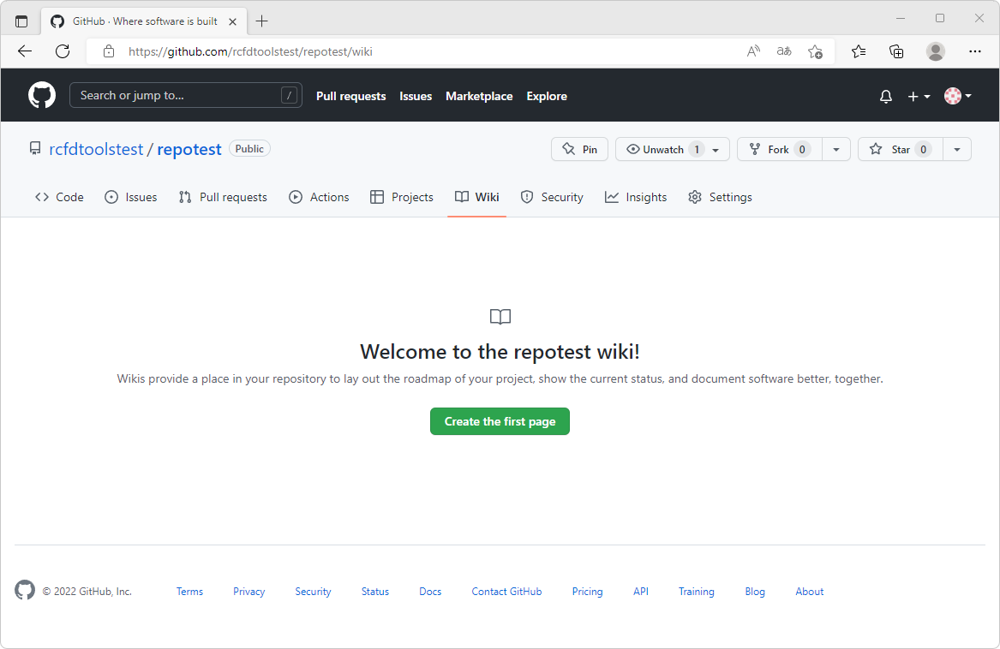

En la ventana de creación de la nueva página se incluye por defecto el nombre **Home** que corresponderá a la página principal del repositorio, cuyo propósito es similar al archivo README.md que se incluye en la raíz del repositorio principal.

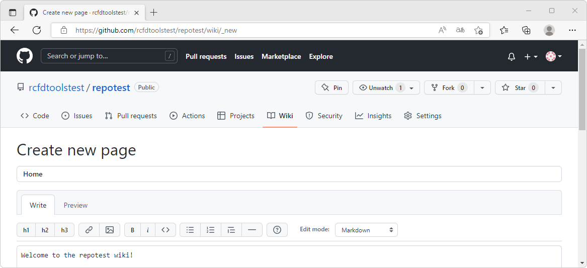

Ingrese un texto descriptivo dentro la página de inicio, por defecto se incluye **Welcome to the repotest wiki!** e ingrese un mensaje de edición (similar al mensaje que se incluye al realizar _Commit_ dentro del repositorio principal). De clic en el botón `Save Page`.

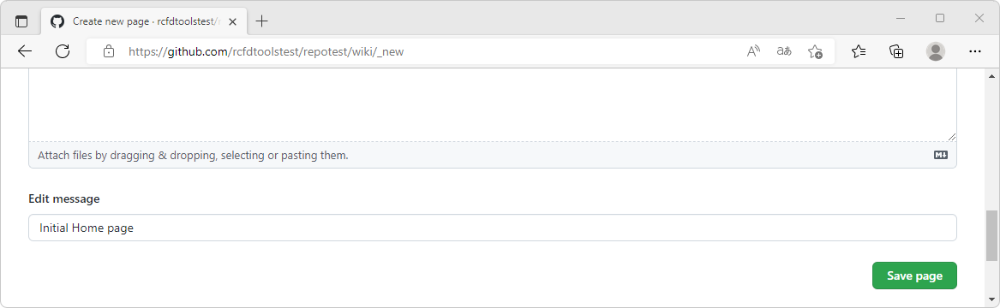

Luego de crear y guardar la primera página correspondiente al Home, el centro de documentación se encontrará activado para editar los contenidos, crear nuevas páginas, adicionar el pie de página para todos los documentos, una barra lateral personalizada y además, un enlace para la clonación local del centro de documentación Wiki, que para el ejemplo es https://github.com/rcfdtoolstest/repotest.wiki.git.

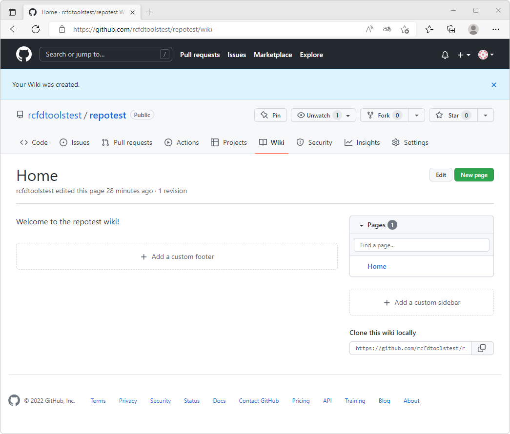

Para acceder a la página principal del Wiki de ejemplo, ingresar en su navegador a la dirección https://github.com/rcfdtoolstest/repotest/wiki

2. Para editar Home, de clic en el botón `Edit` localizado en la parte derecha de la ventana. Observará que al editar la página, se activan diferentes herramientas de edición asistida del documento que le permitirán incluir títulos, enlaces, imágenes, estilos, listas y guiones; además podrá cambiar el modo de edición para que sea visualizado en diferentes estilos de escritura y el historial de cambios realizado desde la creación. Modifique la página de inicio incluyendo elementos descriptivos del repositorio como aparece en la siguiente imagen.


Realice la previsualización del documento, incluya un mensaje corto para informar acerca de los cambios realizados y de clic en el botón `Save Page`.

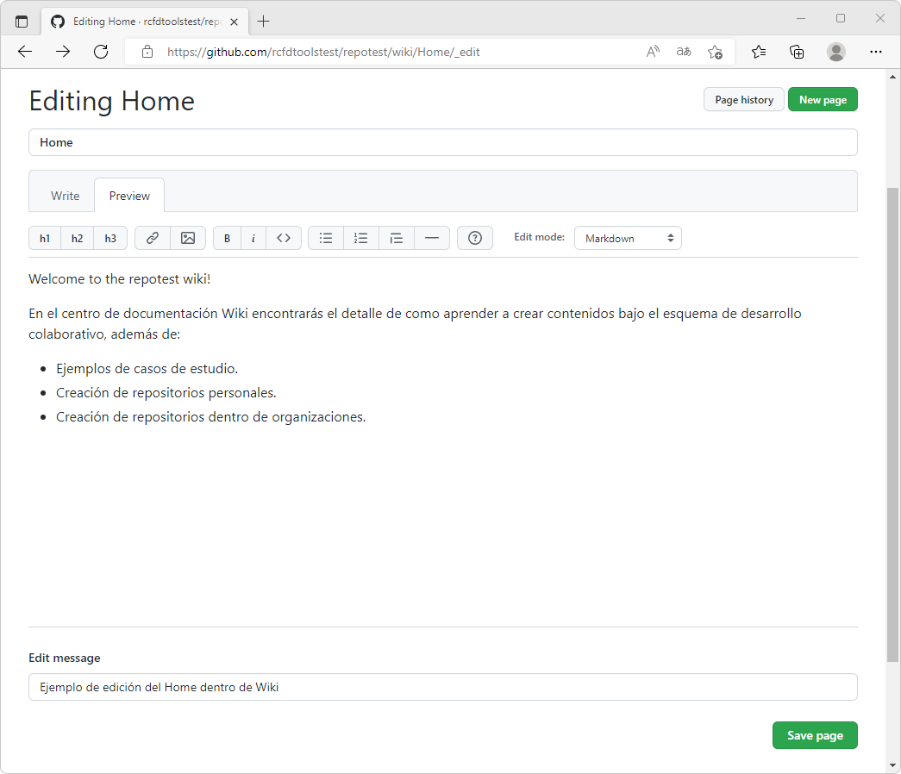
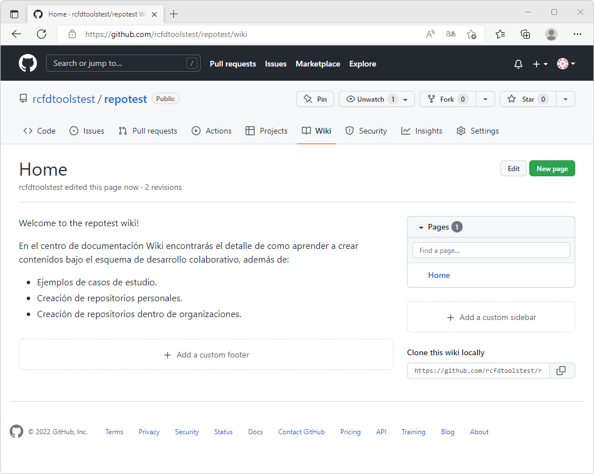

3. Los documentos Wiki pueden contener diferentes secciones que podrán ser visibles en el panel derecho, las cuales son definidas a partir de los niveles de títulos contenidos dentro del documento. Modifique la lista creada anteriormente y ahora cree para cada elemento subtítulos, p. ej. nivel 2 o H2, guarde y verifique en el panel derecho la inclusión de las secciones.

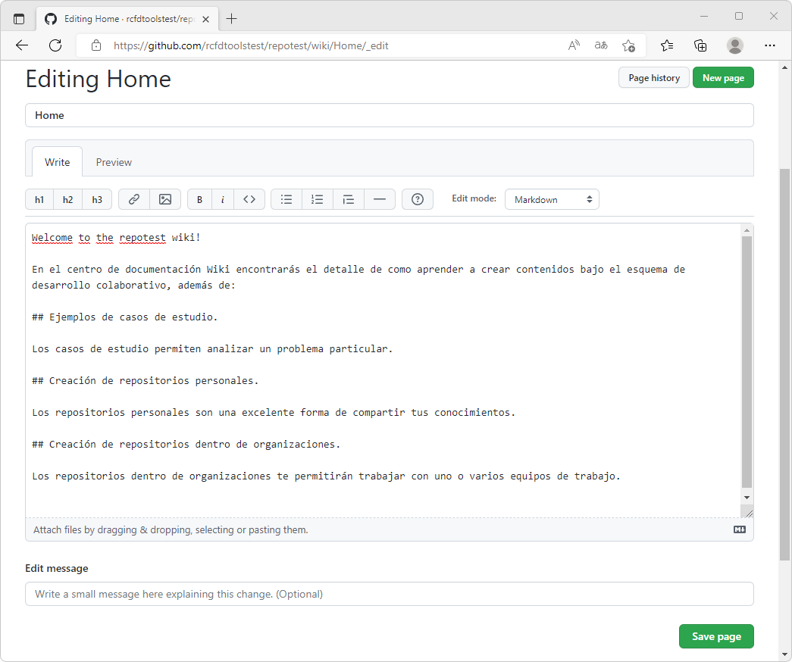
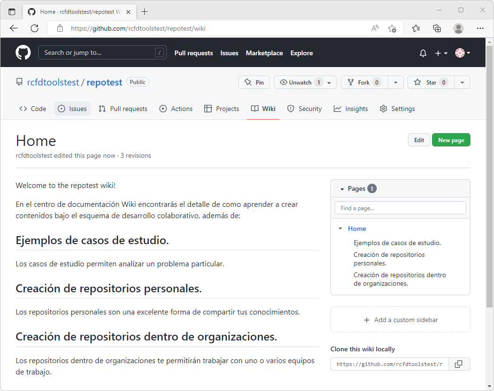

Las secciones creadas a partir de la definición de títulos en diferentes niveles, pueden ser consultadas desde la barra lateral o desde la barra de direcciones del navegador. Por ejemplo, para acceder a casos de estudio podrá utilizar el enlace  https://github.com/rcfdtoolstest/repotest/wiki#ejemplos-de-casos-de-estudio 

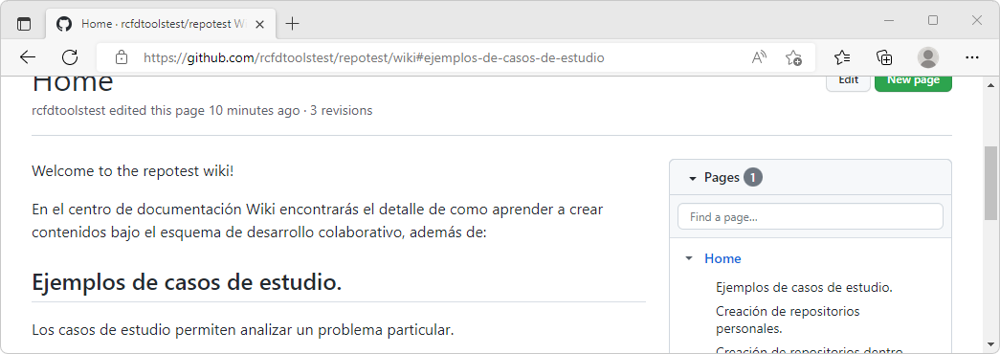

> Es importante considerar que si el título es modificado, p. ej. de **Ejemplos de casos de estudio** a **Ejemplos de casos de estudio 2022**, el enlace lo dirigirá a la raíz de Home pero no a la localización específica del contenido requerido dentro de la página.

4. Para la creación del pié de página global, en la parte inferior de la pantalla de clic en la opción `+ Add a custom footer`

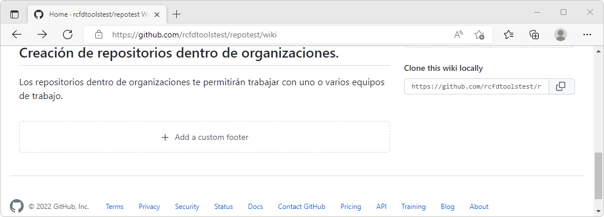

Ingrese p. ej. el siguiente texto, ingrese comentarios de edición y de clic en el botón `Save Page`.

```
R.TeachingResearchGuide es de uso libre para fines académicos, conoce nuestra licencia, cláusulas, condiciones de uso y como referenciar los contenidos publicados en este repositorio, dando clic aquí.

¡Encontraste útil este repositorio!, apoya su difusión marcando este repositorio con una ⭐ o síguenos dando clic en el botón Follow de rcfdtools en GitHub.
```
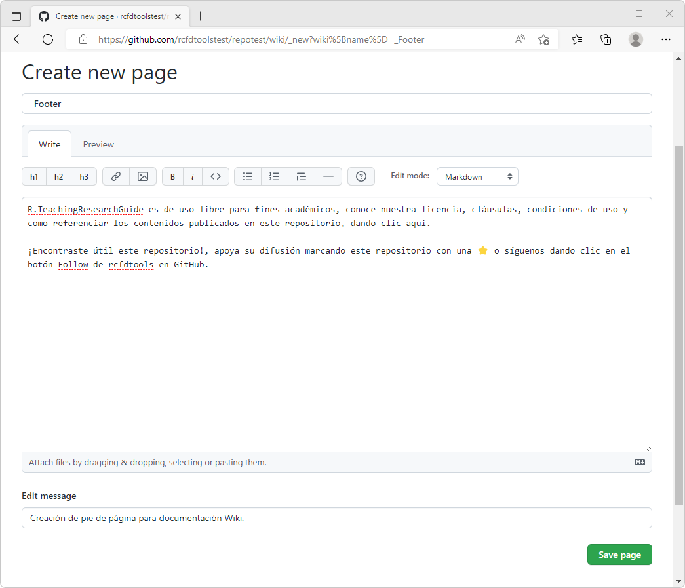

> Como observa, el archivo es creado con el nombre **_Footer** que es el nombre por defecto utilizado para los pies de página globales en la documentación.

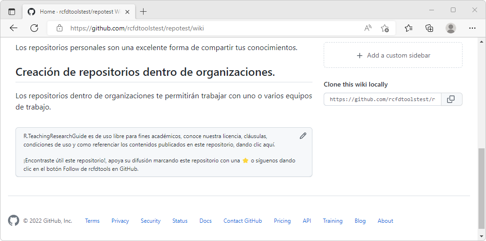

5. Para insertar una barra lateral personalizada, de clic en el botón `+ Add a custom sidebar` localizado en la parte derecha de la ventana.

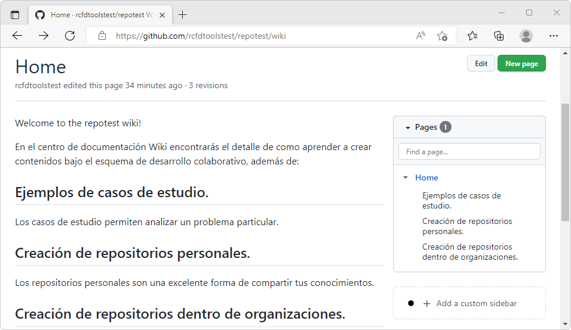

Ingrese texto, imágenes o enlaces dentro del contenido de la barra lateral, p. ej `Encuentra otros cursos [GitHub de rcfdtools](https://github.com/rcfdtools)`

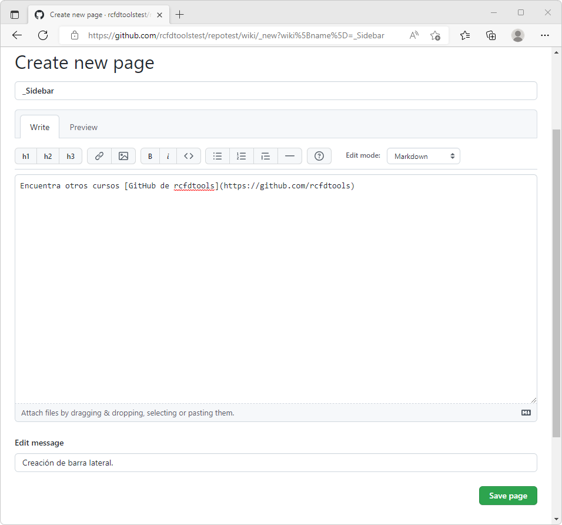

> Como observa, el archivo es creado con el nombre **_Sidebar** que es el nombre por defecto utilizado para el panel lateral global visible en la documentación.

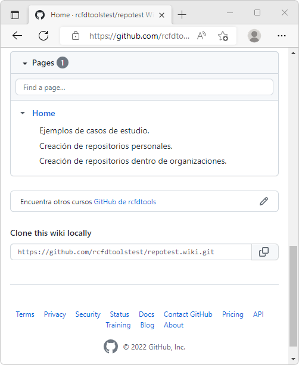

6. Para crear páginas adicionales, en la parte superior derecha del centro de documentación Wiki, de clic en el botón `New Page`, p. ej. cree una página específica donde se encontrarán los diferentes casos de estudio a evaluar.

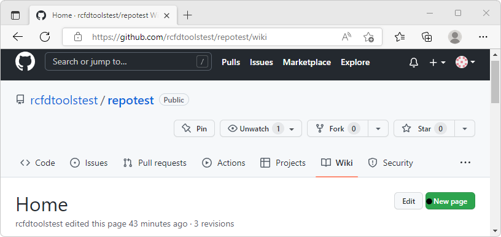
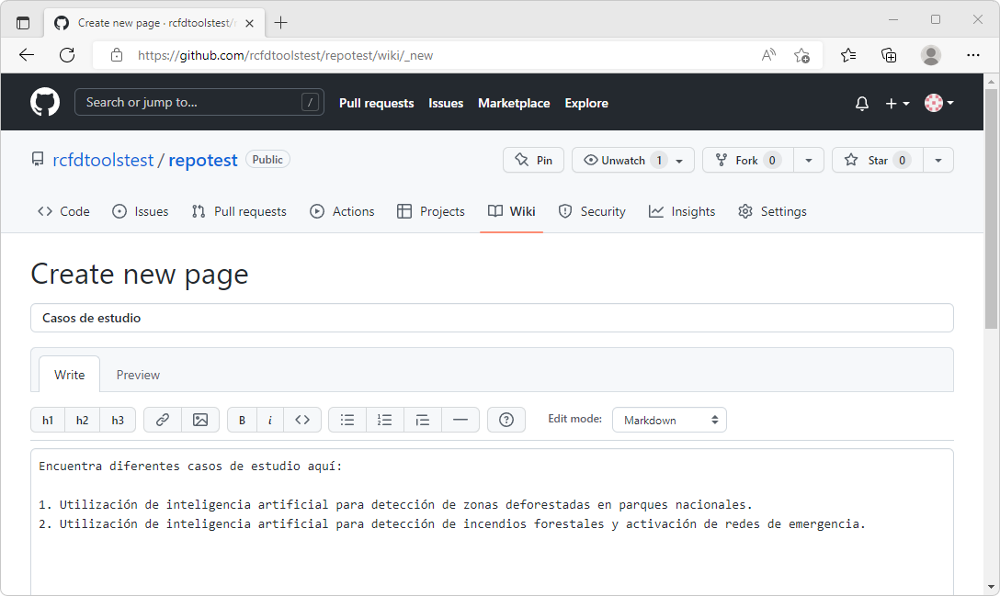
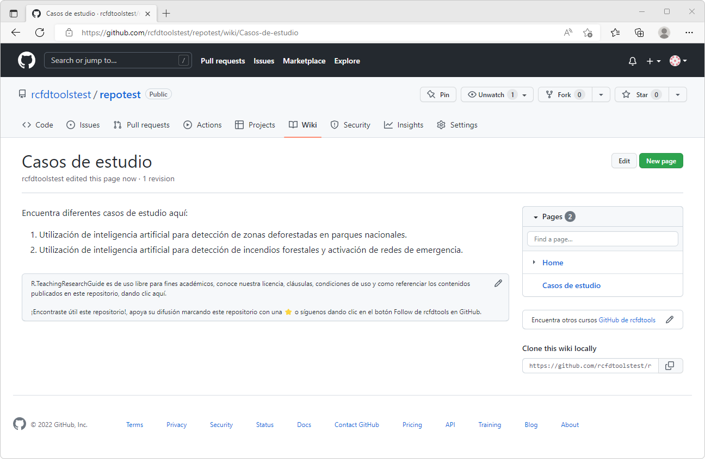

> Como observa, en la zona lateral derecha ahora encuentra diferentes enlaces para acceder a la documentación del repositorio.

En caso de no ser requerido, el centro de documentación Wiki puede ser desactivado desde la configuración general del proyecto en la sección Features.

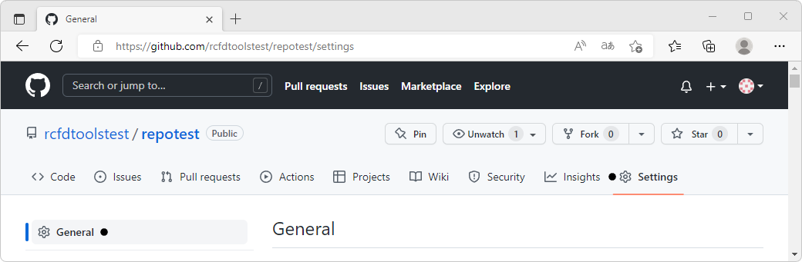
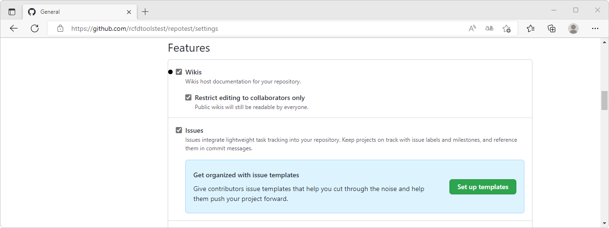


### Actividades complementarias:pencil2:

En la siguiente tabla se listan las actividades complementarias a ser desarrolladas por el estudiante.

|  #  | Alcance                                                                                                                                         |
|:---:|:------------------------------------------------------------------------------------------------------------------------------------------------|
|  1  | Active el centro de documentación Wiki e incluya documentación general de su proyecto, agregue un pié de página y personalice la barra lateral. |
|  2  | Agregue páginas adicionales al centro de documentación.                                                                                         |


### Preguntas y respuestas Q&A

| Pregunta                                                                                                        | Respuesta                                                                                                                                                                                                                                                       |
|-----------------------------------------------------------------------------------------------------------------|-----------------------------------------------------------------------------------------------------------------------------------------------------------------------------------------------------------------------------------------------------------------|
| ¿Es recomendable utilizar el centro de documentación Wiki para crear el índice de un curso virtual o un e-book? | No se recomienda debido a que los archivos del centro de documentación Wiki no son clonados junto con los archivos del repositorio principal y además por que no existe control de cambios como el que se realiza sobre los archivos del repositorio principal. |

> Ayúdame desde este [hilo de discusión](https://github.com/rcfdtools/R.TeachingResearchGuide/discussions/16) a crear y/o responder preguntas que otros usuarios necesiten conocer o experiencias relacionadas con esta actividad.


### Referencias

* https://docs.github.com/en/communities/documenting-your-project-with-wikis/about-wikis
* https://docs.github.com/en/communities/documenting-your-project-with-wikis/creating-a-footer-or-sidebar-for-your-wiki
* https://docs.github.com/en/communities/documenting-your-project-with-wikis/editing-wiki-content
* https://docs.github.com/en/communities/documenting-your-project-with-wikis/viewing-a-wikis-history-of-changes
* https://docs.github.com/en/communities/documenting-your-project-with-wikis/disabling-wikis


### Control de versiones

| Versión    | Descripción      | Autor                                      | Horas |
|------------|:-----------------|--------------------------------------------|:-----:|
| 2022.09.02 | Versión inicial. | [rcfdtools](https://github.com/rcfdtools)  |   4   |


_R.TeachingResearchGuide es de uso libre para fines académicos, conoce nuestra licencia, cláusulas, condiciones de uso y como referenciar los contenidos publicados en este repositorio, dando [clic aquí](../../LICENSE.md)._

_¡Encontraste útil este repositorio!, apoya su difusión marcando este repositorio con una ⭐ o síguenos dando clic en el botón Follow de [rcfdtools](https://github.com/rcfdtools) en GitHub._

| [Anterior](../GitHubOrganization) | [:house: Inicio](../../Readme.md) | [:beginner: Ayuda / Colabora](https://github.com/rcfdtools/R.TeachingResearchGuide/discussions/16) | [Siguiente]() |
|---------------------------------|-----------------------------------------------------------------------------|----------------------------------------------------------------------------------------------------|---------------|

[^1]: 