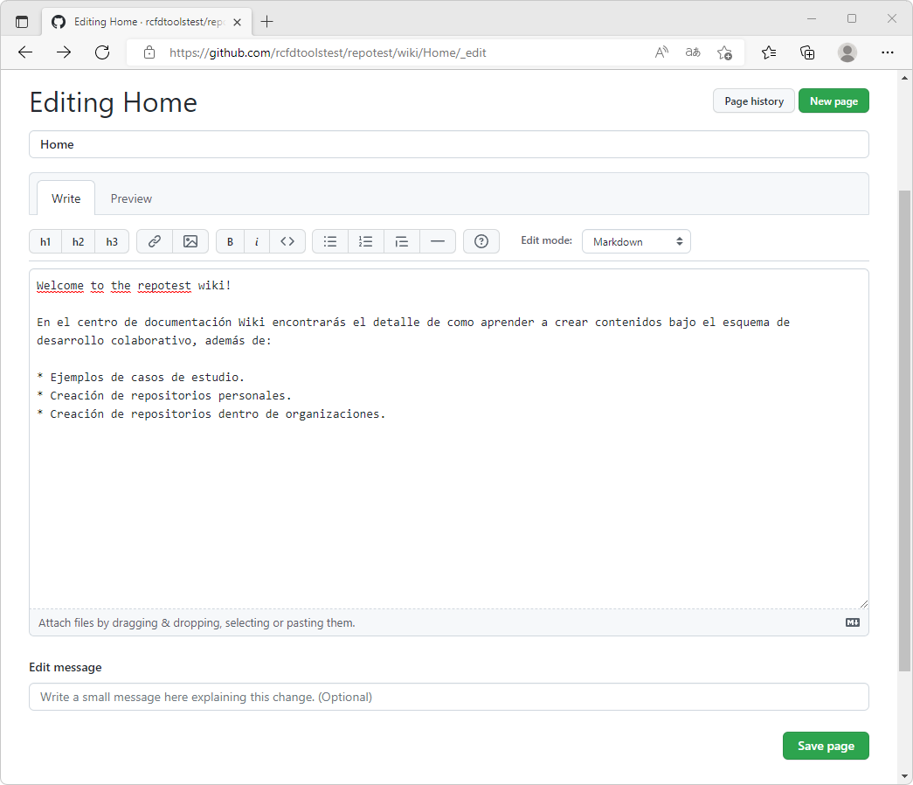

## Centro de documentación Wiki en GitHub
Keywords: `Wiki` `Documentation`

Conceptos de documentación global de proyectos orientados a desarrollo de software o App's a través de espacios wiki.

   

### Objetivos

* Crear y editar la página principal Home de Wiki.
* Crear y modificar el archivo de pie de página.

### Requerimientos

* Cuenta y repositorio GitHub. [:mortar_board:Aprender.](../../Section01/GitHubRepository) 

### Conceptos generales

Al crear un repositorio en GitHub, automáticamente se crea el centro de documentación Wiki, que comúnmente es utilizado para documentar proyectos orientados al desarrollo de software. Si bien, el centro de documentación puede ser usado para cualquier tipo de proyecto sin importar su propósito, no es recomendable usarlo para contenidos orientados a cursos y libros electrónicos, debido a que al realizar la clonación por parte de otros usuarios, los archivos Markdown embebidos dentro del espacio virtual Wiki, no son incluidos en la descarga o en la sincronización.

Otro elemento a tener en cuenta en la gestión de documentación Wiki, tiene que ver con que los elementos no son editables por otros usuarios para posteriores solicitudes de integración de cambios, causando que la actualización directa solo dependa del propietario y colaboradores directos del repositorio. Si bien, la sección Wiki de un repositorio puede ser clonada localmente por otros usuarios, esta difícilmente puede ser integrada y publicada a los repositorios principales clonados.

### Procedimiento de edición de documentos Wiki

1. En su repositorio, de clic en la pestaña Wiki localizada en la parte superior de la ventana. Por tratarse de un repositorio nuevo, aparecerá el botón `Create the first page`, de clic sobre él.

En la ventana de creación de la nueva página se incluye por defecto el nombre **Home** que corresponderá a la página principal del repositorio, cuyo propósito es similar al archivo README.md que se incluye en la raíz del repositorio principal.

Ingrese un texto descriptivo dentro la página de inicio, por defecto se incluye **Welcome to the repotest wiki!** e ingrese un mensaje de edición (similar al mensaje que se incluye al realizar _Commit_ dentro del repositorio principal). De clic en el botón `Save Page`.

Luego de crear y guardar la primera página correspondiente al Home, el centro de documentación se encontrará activado para editar los contenidos, crear nuevas páginas, adicionar el pie de página para todos los documentos, una barra lateral personalizada y además, un enlace para la clonación local del centro de documentación Wiki, que para el ejemplo es https://github.com/rcfdtoolstest/repotest.wiki.git.

2. Para editar Home, de clic en el botón `Edit` localizado en la parte derecha de la ventana. Observará que al editar la página, se activan diferentes herramientas de edición asistida del documento que le permitirán incluir títulos, enlaces, imágenes, estilos, listas y guiones; además podrá cambiar el modo de edición para que sea visualizado en diferentes estilos de escritura y el historial de cambios realizado desde la creación. Modifique la página de inicio incluyendo elementos descriptivos del repositorio como aparece en la siguiente imagen.

Realice la previsualización del documento, incluya un mensaje corto para informar acerca de los cambios realizados y de clic en el botón `Save Page`.

3. Los documentos Wiki pueden contener diferentes secciones que podrán ser visibles en el panel derecho, las cuales son definidas a partir de los niveles de títulos contenidos dentro del documento. Modifique la lista creada anteriormente y ahora cree para cada elemento subtítulos, p. ej. nivel 2 o H2, guarde y verifique en el panel derecho la inclusión de las secciones.

### Actividades complementarias:pencil2:

En la siguiente tabla se listan las actividades complementarias a ser desarrolladas por el estudiante.

|  #  | Alcance                                                                                                                                         |
|:---:|:------------------------------------------------------------------------------------------------------------------------------------------------|
|  1  | Active el centro de documentación Wiki e incluya documentación general de su proyecto, agregue un pié de página y personalice la barra lateral. |

### Preguntas y respuestas Q&A

| Pregunta | Respuesta |
|----------|-----------|
|          |           |

> Ayúdame desde este [hilo de discusión](https://github.com/rcfdtools/R.TeachingResearchGuide/discussions/9999) a crear y/o responder preguntas que otros usuarios necesiten conocer o experiencias relacionadas con esta actividad.

### Referencias

* 

### Control de versiones

| Versión    | Descripción      | Autor                                      | Horas |
|------------|:-----------------|--------------------------------------------|:-----:|
| 2022.08.22 | Versión inicial. | [rcfdtools](https://github.com/rcfdtools)  |  XX   |

_R.TeachingResearchGuide es de uso libre para fines académicos, conoce nuestra licencia, cláusulas, condiciones de uso y como referenciar los contenidos publicados en este repositorio, dando [clic aquí](../../LICENSE.md)._

_¡Encontraste útil este repositorio!, apoya su difusión marcando este repositorio con una ⭐ o síguenos dando clic en el botón Follow de [rcfdtools](https://github.com/rcfdtools) en GitHub._

| [Anterior](../GitHubRepository) | [:house: Inicio](../../Readme.md) | [:beginner: Ayuda / Colabora](https://github.com/rcfdtools/R.TeachingResearchGuide/discussions/9) | [Siguiente]() |
|---------------------------------|-----------------------------------------------------------------------------|------------------------------------------------------------------------------------------------------|---------------|

[^1]: 