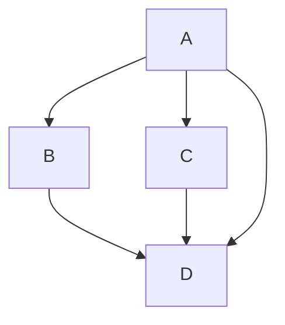

## ¿Qué es el lenguaje Markdown?
Keywords: `Markdown` `HTML` `LaTeX`

Los repositorios de GitHub utilizan para su documentación el lenguaje Markdown, que permite crear texto con formato, tablas, enlaces y utilizar elementos embebidos del lenguaje de hipertextos HTML y sin tener que definir estilos o tener conocimientos de programación. En este microcontenido encontrarás diferentes recursos para la escritura de e-Books y documentación wiki usando el lenguaje de marcas Markdown.

<div align="center">
<br><br><br>
</div>
                                                                                                                                                      

### Conceptos básicos y beneficios[^1]

Markdown es un lenguaje de marcado que facilita la aplicación de formato a un texto empleando una serie de caracteres de una forma especial. En principio, fue pensado para elaborar textos cuyo destino iba a ser la web con más rapidez y sencillez que si estuviésemos usando directamente HTML, y si bien ese suele ser el mejor uso que podemos darle, también podemos emplearlo para cualquier tipo de texto, independientemente de cuál vaya a ser su destino. Como explica [*John Gruber*](http://daringfireball.net/projects/markdown/), uno de sus creadores, Markdown es realmente dos cosas: por un lado, el lenguaje; por otro, una herramienta de software que convierte documentos .md en lenguaje HTML válido.

Algunos de los beneficios de usar Markdown son:

| Beneficio                                                                      | Alcance                                                                                                                                                                                                                                                                                                                                                                                                                                                                                                                                                                                                                                                                                                   |
|--------------------------------------------------------------------------------|-----------------------------------------------------------------------------------------------------------------------------------------------------------------------------------------------------------------------------------------------------------------------------------------------------------------------------------------------------------------------------------------------------------------------------------------------------------------------------------------------------------------------------------------------------------------------------------------------------------------------------------------------------------------------------------------------------------|
| Producir documentos web es más rápido y cómodo                                 | Una vez el creador de contenido se familiariza y conoce mínimamente la sintaxis del lenguaje, la escritura de documentos es más rápida. Si lo que hacemos regularmente, el proceso se convierte en "escritura -> revisión -> formato -> publicación", las partes de revisión y formato las podemos hacer al mismo tiempo sin abandonar el teclado. Además, la sintaxis de Markdown está pensada para que resulte más fácil de leer, es decir, que los elementos de formato no estorben la lectura, como sí ocurre en HTML.                                                                                                                                                                                |
| Es más difícil cometer errores de sintaxis                                     | El HTML básico, que es el que necesitamos para dar formato a un texto, es sumamente sencillo de usar, pero también es muy fácil cometer errores. El más habitual: olvidarse de cerrar una etiqueta de manera adecuada. Markdown hace que un error tan común como este no se produzca.                                                                                                                                                                                                                                                                                                                                                                                                                     |
| Es perfecto para usarlo con editores de texto minimalistas                     | A muchos profesionales le gusta escribir en texto plano, utilizando editores de texto o procesadores minimalistas por una cuestión de concentración: muchas veces, no necesitamos tantas herramientas como las que nos ofrece un procesador como Microsoft Word, especialmente cuando todo lo que vamos a hacer es escribir un texto con un formato básico. De hecho, en ocasiones tal cantidad de herramientas solo consiguen distraernos e inducirnos a sobre formatear el texto. Muchos de estos editores guardan los archivos en formato de texto plano. Usar Markdown nos permite que no tengamos que dejar de usar nuestra herramienta favorita para darle formato a un texto cuando sea necesario. |
| Es ideal para el entorno móvil                                                 | Si bien existen aplicaciones para dispositivos móviles que nos permiten aplicar formato a un texto, resulta bastante incómodo hacerlo por la misma naturaleza del sistema táctil. Si usamos una aplicación que soporta Markdown, tan solo se trata de escribir unos pocos caracteres más, es más rápido y ágil, especialmente si vamos aplicando el formato a medida que escribimos.                                                                                                                                                                                                                                                                                                                      |
| Herramientas Markdown                                                          | Realmente, para emplear Markdown todo lo que necesitamos es un editor de texto, como el mismo Bloc de Notas. Sin embargo, hay una segunda parte del proceso que consiste en convertir, interpretar, previsualizar y publicar el Markdown como HTML o convertirlo a otro tipo de documento.                                                                                                                                                                                                                                                                                                                                                                                                                |
| Lenguaje de escritura para documentos Readme.md y documentación wiki en Github | Los repositorios alojados en GitHub utilizan el lenguaje de marcas Markdown para documentar en archivos .md, los contenidos almacenados en cada directorio y en general para el proyecto. Para facilitar la interacción con el repositorio, la edición de los documentos .md puede ser realizada en línea.                                                                                                                                                                                                                                                                                                                                                                                                |
| Ecuaciones embebidas en formato LaTeX                                          | GitHub permite embeber ecuaciones escritas en el lenguaje LaTeX y sin el uso de complementos para su visualización, sin embargo, si correcta visualización dependerá de la versión del navegador utilizado. En algunos casos, es necesario refrescar la ventana con la tecla <kbd>F5</kbd> para que se realice la traducción y representación de la escritura LaTeX a la ecuación.                                                                                                                                                                                                                                                                                                                        |
| Generación automática de reportes .md a través de generadores de código        | Utilizando cualquier lenguaje de programación, se pueden generar fácilmente reportes en formato Markdown a partir de datos base y los resultados (textos descriptivos, tablas, gráficos) pueden publicarse y asociarse mediante objetos dentro de carpetas de publicación.                                                                                                                                                                                                                                                                                                                                                                                                                                |
| Control de versiones                                                           | Al estar embebidos y al ser interpretables por GitHub, se realiza automáticamente el seguimiento a los cambios realizados por uno o múltiples usuarios, por lo que en desarrollo colaborativo, se pueden identificar los cambios, actualizaciones e integraciones realizadas por cada usuario e incluso revertir cambios sobre el documento. Para cada nueva versión, en GitHub se pueden incluir en los _Commit_, comentarios detallados de los cambios realizados sobre el documento publicado.                                                                                                                                                                                                         |


### Ejemplos básicos de Markdown

| Ejemplo                                                | Sintaxis                                                             |
|:-------------------------------------------------------|:---------------------------------------------------------------------|
| # Título nivel 1                                       | `# Título nivel 1`                                                   |
| ## Título nivel 2                                      | `## Título nivel 1`                                                  |
| ### Título nivel 2                                     | `### Título nivel 3`                                                 |
| _Texto en itálica_                                     | `_Texto en itálica_`                                                 |
| *Texto en itálica*                                     | `*Texto en itálica*`                                                 |
| **Texto en negrilla o énfasis**                        | `**Texto en negrilla o énfasis**`                                    |
| ~~Texto tachado~~                                      | `~~Texto tachado~~`                                                  |
| `Ejemplo de código o variable`                         | ``Ejemplo de código de una línea o para resalte de palabras clave``  |
| [Hipervínculo](https://github.com/rcfdtools/)          | `[Hipervínculo](https://github.com/rcfdtools/)`                      |
| <kbd>Combinación</kbd> <kbd>de</kbd> <kbd>teclas</kbd> | `<kbd>Combinación</kbd> <kbd>de</kbd> <kbd>teclas</kbd>`             |
| > Citación de texto                                    | `> Citación de texto`                                                |
| Salto de línea<br>usando HTML                          | `Salto de línea<br>usando HTML`                                                |
|                                                        |                                                 |
|                                                        |                                                 |


#### Hiperenlace a video de youtube centrado en marco div de HTML

`<div align="center"><a href="http://www.youtube.com/watch?feature=player_embedded&v=w3jLJU7DT5E" target="_blank"></a><sub><br>https://www.youtube.com/watch?v=w3jLJU7DT5E</sub><br><br><</div>`

<div align="center"><a href="http://www.youtube.com/watch?feature=player_embedded&v=w3jLJU7DT5E" target="_blank"></a><sub><br>https://www.youtube.com/watch?v=w3jLJU7DT5E</sub><br><br></div>

> Para embeber sus propios videos, reemplace `w3jLJU7DT5E` por el código de video requerido de Youtube.


#### Ejemplo de script con múltiples líneas

Se utilizan 3 comillas invertidas al inicio y fin de las líneas de código ```

```
# Ejemplo de potenciación en Python
x = 2
y = 3
potencia = x**y
print('x^y = %d', potencia)
```

#### Mostrar una imagen

**Ilustración embebida**  
``  


**Ilustración con HTML y tamaño definido**  
``  


**Ilustración con HTML y centrado**  
`<div align="center"></div>`  
<div align="center"></div><br><br>

> Para ilustraciones embebidas utilizando únicamente el lenguaje de marcas Markdown, se utiliza el tamaño original de la imagen. En caso de que el tamaño exceda el ancho de pantalla, esta se ajusta al 100% del ancho disponible para visualización.
> 
> Para imágenes que representen íconos, diagramas de procesos y diagramas de flujo, se recomienda que el formato sea vectorial o .svg. Utilizar este formato garantiza que las imágenes no se visualicen borrosas debido a que su representación se realiza a través de vectores.


#### Ecuaciones con LaTeX[^2]

```
La potencia de la corriente se define como la energía disponible por unidad de área1:  

$P=\gamma y S_{0} V$

Donde:
$P$ = Potencia de la corriente $[N-m/s]$  
$\gamma$ = Peso específico del agua $[N/m^{3}]$  
$y$ = Profundidad de la lámina de agua $[m]$  
$V$ = Velocidad media de la corriente $[m/s]$  
$S_{0}$ = Pendiente media del fondo del lecho $[m/m]$
```

$P=\gamma y S_{0} V$

Donde:
$P$ = Potencia de la corriente $[N-m/s]$  
$\gamma$ = Peso específico del agua $[N/m^{3}]$  
$y$ = Profundidad de la lámina de agua $[m]$  
$V$ = Velocidad media de la corriente $[m/s]$  
$S_{0}$ = Pendiente media del fondo del lecho $[m/m]$  

> Tenga en cuenta que en algunos casos, es necesario refrescar la ventana con la tecla <kbd>F5</kbd> para que se realice la traducción y representación de la escritura LaTeX a la ecuación.                         

#### Creación de diagramas[^3]

Utilizando Markdown y dentro de documentos de GitHub, se pueden utilizar 3 tipos de sintaxis diferentes: mermaid, geoJSON / topoJSON y ASCII STL. Estos diagramas pueden ser embebidos dentro de GitHub Issues, GitHub Discussions, pull requests, wikis, y archivos Markdown .md.

Ejemplo simple de un diagrama de flujo con [mermaid](https://mermaid-js.github.io/mermaid/#/):

```



```topojson
{
  "type": "Topology",
  "transform": {
    "scale": [0.0005000500050005, 0.00010001000100010001],
    "translate": [100, 0]
  },
  "objects": {
    "example": {
      "type": "GeometryCollection",
      "geometries": [
        {
          "type": "Point",
          "properties": {"prop0": "value0"},
          "coordinates": [4000, 5000]
        },
          "arcs": [[1]]
        }
      ]
    }
  },
  "arcs": [[[4000, 0], [1999, 9999], [2000, -9999], [2000, 9999]],[[0, 0], [0, 9999], [2000, 0], [0, -9999], [-2000, 0]]]
}
```


#### Otras marcas

* Incluya 2 espacios en blanco al final de una sentencia o párrafo y de enter para saltar a la siguiente línea.
* Notas a pie de documento: con `[^1]` se define una nota a pie y al final del documento con `[^1]:` se define la descripción de la nota a pie o el texto descriptivo. Tenga en cuenta que una misma nota a pie puede ser llamada múltiples veces dentro de un mismo documento. 


### Preguntas y respuestas Q&A

| Pregunta                                                                 | Respuesta                                                                                                                                                                                                                                                                                                                             |
|--------------------------------------------------------------------------|---------------------------------------------------------------------------------------------------------------------------------------------------------------------------------------------------------------------------------------------------------------------------------------------------------------------------------------|
| ¿Puedo embeber dentro de un archivo Markdown .md, instrucciones de HTML? | Sí, sin embargo dentro de archivos .md alojados directamente dentro de un repositorio de GitHub no son visibles p. ej. los marcos dinámicos que permiten embeber un video de Youtube y visualizarlo desde el documento. Desde GitHub pages que utiliza también archivos .md, sí es posible reproducir directamente un video embebido. |
| ¿Puedo convertir mis documentos de Microsoft Word a Markdown?            | Sí, gráficas embebidas requerirán de su publicación dentro de una carpeta del repositorio y deberán ser vinculadas dentro del documento para que no aparezcan dentro del directorio raíz donde se encuentra el archivo .md.                                                                                                           |
| ¿Puedo crear tablas con muchas columnas y texto?                         | Sí, tablas con múltiples columnas que no sean ajustables al espacio de visualización del navegador pueden ser visibles a través de barras de desplazamiento que son generadas automáticamente.                                                                                                                                        |
| ¿Puedo crear tablas con gráficas embebidas?                              | Sí, las gráficas deben ser almacenadas en un directorio del repositorio y luego pueden ser embebidas con la marca ``.                                                                                                                                                                                      |

> Ayúdame a crear y/o responder preguntas que otros usuarios necesiten conocer desde el [hilo de discusión](https://github.com/rcfdtools/R.TeachingResearchGuide/discussions/99999) de este microcontenido.
>
> En las referencias, encontrarás diferentes repositorios con ejemplos detallados de escritura Markdown.
> 
> Escribe o comparte en el [hilo de discusión](https://github.com/rcfdtools/R.TeachingResearchGuide/discussions/4) de este microcontenido, que otras dudas, preguntas, contenidos y experiencias tienes relacionadas con desarrollo colaborativo para el enfoque en educación e investigación.


### Referencias

* [Curso de #Markdown desde cero, ProgramaTutos en Youtube](https://www.youtube.com/playlist?list=PLM4HZoZrNapsQ_f6a9275n15riyr-2AnQ)
* https://www.markdownguide.org/basic-syntax/
* https://www.markdownguide.org/extended-syntax/
* https://raw.githubusercontent.com/admnll/ecuaciones-latex-word-markdown/master/markdown.md
* https://docs.github.com/en/get-started/writing-on-github/getting-started-with-writing-and-formatting-on-github/basic-writing-and-formatting-syntax
* https://github.com/adam-p/markdown-here/wiki/Markdown-Cheatsheet
* https://github.com/tchapi/markdown-cheatsheet
* https://es.wikipedia.org/wiki/Markdown
* https://markdown.es/
* emojis https://github.com/ikatyang/emoji-cheat-sheet
* emojis https://gist.github.com/rxaviers/7360908
* emojis https://www.webfx.com/tools/emoji-cheat-sheet/


### Control de versiones

| Versión    | Descripción      | Autor                                      | Horas  |
|------------|:-----------------|--------------------------------------------|:------:|
| 2022.08.18 | Versión inicial. | [rcfdtools](https://github.com/rcfdtools)  |  1.5   |


_R.TeachingResearchGuide es de uso libre para fines académicos, conoce nuestra licencia, cláusulas, condiciones de uso y como referenciar los contenidos publicados en este repositorio, dando [clic aquí](https://github.com/rcfdtools/R.TeachingResearchGuide/wiki/License)._

_¡Encontraste útil este repositorio!, apoya su difusión marcando este repositorio con una ⭐ o síguenos dando clic en el botón Follow de [rcfdtools](https://github.com/rcfdtools) en GitHub._

| [Anterior](https://github.com/rcfdtools/R.TeachingResearchGuide/tree/main/Section01/GitFundamentals) | [:house: Inicio](https://github.com/rcfdtools/R.TeachingResearchGuide/wiki) | [:beginner: Ayuda / Colabora](https://github.com/rcfdtools/R.TeachingResearchGuide/discussions/9999) | [Siguiente](https://github.com/rcfdtools/R.TeachingResearchGuide/tree/main/Section01/GitFundamentals) |
|---------------------------------------------------------------------------------------------------|-----------------------------------------------------------------------------|------------------------------------------------------------------------------------------------------|-------------------------------------------------------------------------------------------------------|

[^1]: https://www.genbeta.com/guia-de-inicio/que-es-markdown-para-que-sirve-y-como-usarlo
[^2]: Ejemplo tomado de https://github.com/mflatouche/M.TSED/tree/main/Section01/1_Potencia
[^3]: https://docs.github.com/en/get-started/writing-on-github/working-with-advanced-formatting/creating-diagrams
