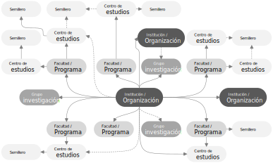
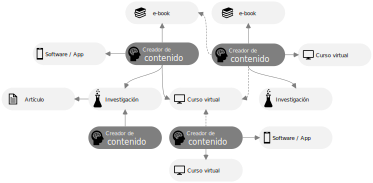

## ¿Qué es el desarrollo colaborativo?
Keywords: `Collab` `Collaborative creation` `Agility`

En esta actividad aprenderás diferentes conceptos relacionados con desarrollo colaborativo, sus beneficios y las diferencias principales entre cooperación y colaboración.

  
Esquema genérico de instituciones orientadas a producción académica y de investigación bajo enfoque colaborativo a nivel facultad y/o programa, centros de estudios, grupos de investigación y semilleros.  

### Creación de contenidos de forma individual o colectiva [^1]

Tradicionalmente, pensamos que la creación de contenidos académicos y científicos se puede realizar de manera individual y aislada de otras personas; incluso, la formación profesional que recibimos en las aulas privilegia en cierto sentido esta modalidad. Es verdad que existen tareas que se pueden desarrollar en solitario, especialmente cuando se trabaja en la producción científica de trabajos de investigación y/o profundización con un alcance particular; sin embargo, cuando el nivel de dificultad de la investigación o los contenidos de los microcurrículos aumenta, ya sea por las nuevas innovaciones tecnológicas, porque requieren de conocimiento experto de múltiples disciplinas o por avances en docencia, la creación y actualización necesariamente se tiene que desarrollar en compañía de otras personas. De esta manera, la interacción humana en el proceso de creación de contenidos de calidad es en muchas ocasiones, obligatoria.

  
Esquema genérico de creadores de contenidos asociados para producción colaborativa.  

### ¿Cuándo surgió la necesidad de trabajar colaborativamente? [^1]

Cuando iniciaron las primeras computadoras, hubo necesidad de crear programas para que estas funcionaran. En ese entonces, no existía la ingeniería de software como tal y la programación era un proceso más artesanal que metodológico. No fue hasta 1968, que la ingeniería del software surgió buscando ordenar las actividades relacionadas con la creación de programas de cómputo, orientándolas hacia la obtención de un producto de calidad, a través de un proceso repetible, que minimizará la probabilidad de fracaso. Su creación fue la respuesta a la llamada crisis del software, causada por sistemas complejos, de difícil implementación, que superan su presupuesto original, que no satisfacen los requerimientos para los que fueron creados y que demoran mucho en concluirse, o bien, no se concluyen nunca.

En la década de los ochenta y noventa, la complejidad de las aplicaciones informáticas creció todavía más y la importancia de la ingeniería de software fue evidente. Se hizo necesaria la colaboración de varias personas en proyectos de amplio alcance; sin embargo, no fue hasta el año 2001, en Utah, Estados Unidos, cuando se reconoció oficialmente que el software podía desarrollarse de mejores maneras. Se firmó el manifiesto ágil (Kent Beck et al., 2001), que significó un cambio de paradigma en la creación de programas informáticos. Se enfatizaron los aspectos humanos sobre los aspectos técnicos y se centró la atención en el software que funciona y agrega valor a quien lo usa, dejando así de lado la documentación excesiva y los procedimientos densos y tardados. A esta filosofía se le denominó “agilidad” o "agility".

### Beneficios de trabajar colaborativamente

* Los contenidos producidos combinan la experticia de los integrantes del equipo de trabajo, de la facultad o el programa académico, del grupo de investigación o del centro de estudios al cual pertenecen.
* Creación de redes colaborativas donde los repositorios de los grupos o centros es abierta y compartida dentro de los miembros de la institución y otras instituciones y cumunidades científicas.
* Interacción directa entre grupos, profesores y estudiantes a través de discusiones.
* Facilidad de desarrollo en la solución de casos de estudio debido a que los miembros de la red pueden plantear diferentes formas de abordar el problema y se pueden obtener múltiples soluciones.
* El conocimiento compartido facilita los procesos de enseñanza y aprendizaje debido a que una vez se cuenta con la línea base de conocimiento, los miembros del equipo buscan nuevas formas de transmitir este conocimiento de una forma más asertiva.

### Cooperación vs Colaboración[^2]

La cooperación y colaboración son elementos vitales en el desarrollo de procesos creativos y producción de conocimiento.

| Alcance         | Cooperación        | Colaboración         |
|:----------------|:-------------------|:---------------------|
| **Requiere**    | Respeto mutuo      | Confianza mutua      |
| **Requiere**    | Transparencia      | Vulnerabilidad       |
| **Incluye**     | Ideas compartidas  | Valor compartido     |
| **Dependencia** | Independencia      | Interdependencia     |
| **Interacción** | Corto plazo        | Largo plazo          |
| **Involucra**   | Compartir ideas    | Generar nuevas ideas |

### Agregar valor a mi organización a través de desarrollo colaborativo [^4]

El desarrollo de contenidos bajo el esquema de desarrollo colaborativo, agrega valor a tu perfil profesional, a tu equipo de trabajo y a la organización a la que perteneces.

| Valor                                                                                                            | ¿Cómo?                                                                                                                                                                                                                                                                                     |
|------------------------------------------------------------------------------------------------------------------|--------------------------------------------------------------------------------------------------------------------------------------------------------------------------------------------------------------------------------------------------------------------------------------------|
| Combina tu experticia y la experticia de los miembros de tú equipo de trabajo para crear contenidos compartidos. | En entornos educativos, múltiples profesores pueden enseñar la misma asignatura y a través del desarrollo colaborativo, pueden crear y desarrollar un curso global con un micro-currículo común que combine la experticia de los diferentes miembros del equipo.                           |
| Crea oportunamente contenidos científicos de alta calidad con actualización permanente.                          | Un equipo de trabajo organizado y multidisciplinar, estará al tanto de nuevos métodos y herramientas que podrá implementar en contenidos existentes dentro de la organización. "Encuentra las necesidades de tus usuarios y dales lo que necesitan mucho más rápido que tus competidores". |
| Busca siempre la manera de dar valor agregado a todos los contenidos en los que participes.                      | Al desarrollar una investigación, crear un curso, escribir un libro o participar en un proyecto, crea un repositorio documentado e invita a otros miembros de tu equipo y organización a colaborar.                                                                                        |
| Interactúa con los miembros de tu comunidad.                                                                     | Crea centros de discusión en cada repositorio para documentar la interacción entre los miembros y usuarios, publica frecuentemente noticias para mantener actualizada a tu comunidad.                                                                                                      |       

### Contenido audiovisual complementario recomendado

En los siguientes videos encontrarás diferentes perspectivas y conocimientos relacionadas con desarrollo colaborativo que te ayudarán a entender su importancia y necesidad dentro de equipos de trabajo y organizaciones.

| Recurso                                                                                                                                                                                                                                                                                                                                                                                                                                    | Recurso                                                                                                                                                                                                                                                                                                                                                                                                                           |
|--------------------------------------------------------------------------------------------------------------------------------------------------------------------------------------------------------------------------------------------------------------------------------------------------------------------------------------------------------------------------------------------------------------------------------------------|-----------------------------------------------------------------------------------------------------------------------------------------------------------------------------------------------------------------------------------------------------------------------------------------------------------------------------------------------------------------------------------------------------------------------------------|
| 
[Education- Collaboration](https://www.youtube.com/watch?v=Po40I4c94R0) https://www.youtube.com/watch?v=Po40I4c94R0  
                                                            | 
[The power of collaboration: Dr. Shelle VanEtten de Sánchez at TEDxABQWomen](https://www.youtube.com/watch?v=VmQVNE-MbKI) https://www.youtube.com/watch?v=VmQVNE-MbKI  
 |
| 
[The 7 Keys to Creative Collaboration](https://www.youtube.com/watch?v=2DmFFS0dqQc) https://www.youtube.com/watch?v=2DmFFS0dqQc  
                                                | 
[6 Steps Building a Collaborative Team Environment](https://www.youtube.com/watch?v=6v5dzeq7FOY) https://www.youtube.com/watch?v=6v5dzeq7FOY  
                          |
| 
[5 Things to Cover in Weekly Team Meetings / How to Run a Staff Meeting Effectively](https://www.youtube.com/watch?v=f3Fl2M-eCZc) https://www.youtube.com/watch?v=f3Fl2M-eCZc  
  | 
[Cooperation vs Collaboration: When To Use Each Approach](https://www.youtube.com/watch?v=Gr5mAboH1Kk) https://www.youtube.com/watch?v=Gr5mAboH1Kk  
                    |

### Preguntas y respuestas Q&A

| Pregunta                                                                                                                                                                                                                                                                                                                                                                                        | Respuesta                                                                                                                                                                                                                                                                                         |
|-------------------------------------------------------------------------------------------------------------------------------------------------------------------------------------------------------------------------------------------------------------------------------------------------------------------------------------------------------------------------------------------------|---------------------------------------------------------------------------------------------------------------------------------------------------------------------------------------------------------------------------------------------------------------------------------------------------|
| ¿Cómo funciona la propiedad intelectual en proyectos de desarrollo colaborativo público o privado?                                                                                                                                                                                                                                                                                              | Esto depende de las políticas y acuerdos propios de cada organización, institución, entidad o empresa.                                                                                                                                                                                            |
| ¿Qué tipos de licencia de uso se pueden utilizar?                                                                                                                                                                                                                                                                                                                                               | Existen diversas licencias que pueden ser asociadas a tus repositorios y dependen del tipo de contenido que estés desarrollando. [Más información...](https://docs.github.com/es/repositories/managing-your-repositorys-settings-and-features/customizing-your-repository/licensing-a-repository) |
| ¿Existen licencias derivadas o debo adoptar una de las licencias existentes en GitHub?                                                                                                                                                                                                                                                                                                          | Existen licencias derivadas, sin embargo, su contenido o alcance es definido por cada creador de contenido o depende de las políticas y acuerdos propios de cada organización, institución, entidad o empresa. Se recomienda consultar a un experto.                                              |
| ¿Qué sucede cuando a través del proyecto colaborativo se genera una patente?                                                                                                                                                                                                                                                                                                                    | Esto depende de las políticas y acuerdos propios de cada organización, institución, entidad o empresa.                                                                                                                                                                                            |
| ¿Cómo puedo acceder a beneficios institucionales a través de los contenidos en los que participo?                                                                                                                                                                                                                                                                                               | Esto depende de las políticas y acuerdos propios de cada organización, institución, entidad o empresa.                                                                                                                                                                                            |
| ¿Por dónde puedo iniciar si mi institución no tiene una política y lineamientos de desarrollo colaborativo?                                                                                                                                                                                                                                                                                     | Consulta directamente con tú organización, institución, entidad o empresa.                                                                                                                                                                                                                        |
| ¿El desarrollo colaborativo ayuda a fortalecer y difundir mi perfil como investigador en [Colciencias CvLAC - Colombia](https://scienti.minciencias.gov.co/cvlac), [ResearchGate](https://www.researchgate.net/), [Linkedin](https://www.linkedin.com/), [Labroots](https://www.labroots.com/), [Clarivate](https://clarivate.com/), [Mendeley](https://www.mendeley.com/) y otras plataformas? | Sí, al asociar dentro de estos servicios el enlace a los repositorios en los que has participado, podrás difundir el detalle de tu trabajo, los roles desempeñados y los usuarios externos podrán consultar la trazabilidad de tus participaciones y aportes.                                     |

> Ayúdame desde este [hilo de discusión](https://github.com/rcfdtools/R.TeachingResearchGuide/discussions/3) a crear y/o responder preguntas que otros usuarios necesiten conocer o experiencias relacionadas con esta actividad.

### Descargo de responsabilidad en licencias[^3]

El objetivo de los esfuerzos de generación de licencias de código abierto de GitHub es proporcionar un punto de partida para ayudarte a hacer una elección informada. GitHub muestra información de licencias para ayudar a los usuarios a obtener información acerca de las licencias de código abierto y los proyectos que las utilizan. Esperamos que te sea útil, pero ten presente que no somos abogados y que cometemos errores como todo el mundo. Por ese motivo, GitHub proporciona la información sobre una base hipotética de "tal cual" y no da garantías al respecto de ninguna información o licencia proporcionada en función o a través de esta. Tampoco se hace responsable de los daños que surjan por el uso de la información de la licencia. Si tienes alguna pregunta al respecto de la licencia correcta para tu código o cualquier otro problema legal relacionado con esto, siempre es mejor consultar con un profesional.

### Referencias

* [Referencias generales](../../References.md)
* [Abreviaturas y definiciones generales](../../Definitions.md)
* [Consejos y buenas prácticas de desarrollo colaborativo](../../BestPractice.md)
* [Programación colaborativa. De la necesidad de su uso a la psicología de sus interacciones](https://www.scielo.org.mx/scielo.php?pid=S2007-78902020000800028&script=sci_arttext#:~:text=El%20desarrollo%20colaborativo%20se%20refiere,inform%C3%A1tico%20funcional%20y%20de%20calidad.)
* https://www.barcelona.cat/digitalstandards/es/free-soft/0.2/collaborative-development
* https://www.euroinnova.pe/blog/que-son-los-proyectos-colaborativos
* https://www.avantel.co/blog/emprendimiento/que-es-el-trabajo-colaborativo-sus-caracteristicas-y-como-implementarlo/
* https://saasradar.net/herramientas-desarrollo-colaborativo/
* https://www.geeksforgeeks.org/software-engineering-agile-software-development/
* https://opensource.guide/es/
* https://docs.github.com/es/communities/setting-up-your-project-for-healthy-contributions/adding-a-license-to-a-repository
* https://docs.github.com/es/repositories/managing-your-repositorys-settings-and-features/customizing-your-repository/licensing-a-repository
* https://choosealicense.com/

### Control de versiones

| Versión    | Descripción                                                          | Autor                                      | Horas |
|------------|:---------------------------------------------------------------------|--------------------------------------------|:-----:|
| 2022.09.15 | Agregar valor a mi organización a través de desarrollo colaborativo. | [rcfdtools](https://github.com/rcfdtools)  |   1   |
| 2022.08.12 | Versión preliminar.                                                  | [rcfdtools](https://github.com/rcfdtools)  |   3   |

_R.TeachingResearchGuide es de uso libre para fines académicos, conoce nuestra licencia, cláusulas, condiciones de uso y como referenciar los contenidos publicados en este repositorio, dando [clic aquí](../../LICENSE.md)._

_¡Encontraste útil este repositorio!, apoya su difusión marcando este repositorio con una ⭐ o síguenos dando clic en el botón Follow de [rcfdtools](https://github.com/rcfdtools) en GitHub._

| [Anterior](../Readme.md) | [:house: Inicio](../../Readme.md) | [:beginner: Ayuda / Colabora](https://github.com/rcfdtools/R.TeachingResearchGuide/discussions/3) | [Siguiente](../CollabTools) |
|--------------------------|-----------------------------------|---------------------------------------------------------------------------------------------------|-----------------------------|

[^1]: Tomado y/o adaptado de https://www.scielo.org.mx/scielo.php?pid=S2007-78902020000800028&script=sci_arttext#:~:text=El%20desarrollo%20colaborativo%20se%20refiere,inform%C3%A1tico%20funcional%20y%20de%20calidad.
[^2]: https://www.youtube.com/watch?v=Gr5mAboH1Kk
[^3]: https://docs.github.com/es/repositories/managing-your-repositorys-settings-and-features/customizing-your-repository/licensing-a-repository
[^4]: Tomado y/o adaptado de [7 Ways To Add Value To Your Business | Brian Tracy](https://www.youtube.com/watch?v=xztW-nosYn0)