## Gestión local de múltiples proyectos desde PyCharm
Keywords: `GitHub` `Repositories`

A través de PyCharm Community, se pueden gestionar local y simultáneamente múltiples repositorios y sus centros de documentación Wiki asociados.

   

### Objetivos

* Clonar localmente el centro de documentación Wiki asociado a mi repositorio.
* Editar localmente y publicar los contenidos Wiki en GitHub.

### Requerimientos

* Cuenta y repositorio GitHub. [:mortar_board:Aprender.](../../Section01/GitHubRepository)
* PyCharm instalado y configurado con repositorio clonado localmente. [:mortar_board:Aprender.](../Setup)
* Centro de documentación Wiki en GitHub. [:mortar_board:Aprender.](../../Section01/GitHubWiki)

### Desarrollo

1. En Pycharm, de clic en el menú _Git_ y seleccione la opción _Clone_.

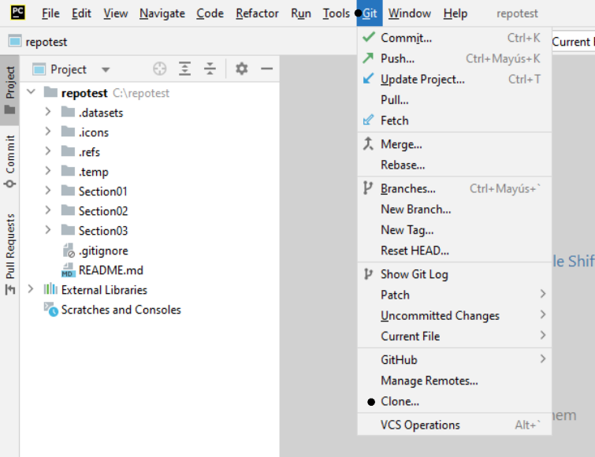

2. En la ventana de clonación, seleccione _GitHub_, podrá observar que únicamente aparece el repositorio _repotest_ que clonamos en la actividad anterior.

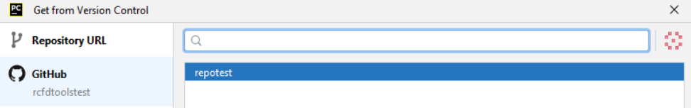

3. En la casilla de búsqueda, ingrese la dirección de clonación del centro de documentación Wiki del repositorio o el enlace de clonación de cualquier repositorio propio o repositorio clonado en su cuenta de GitHub. Para el ejemplo utilizaremos https://github.com/rcfdtoolstest/repotest.wiki.git. En la parte inferior de la ventana, ingrese el directorio local donde se clonaran los archivos, p. ej., `C:\repotest.wiki`

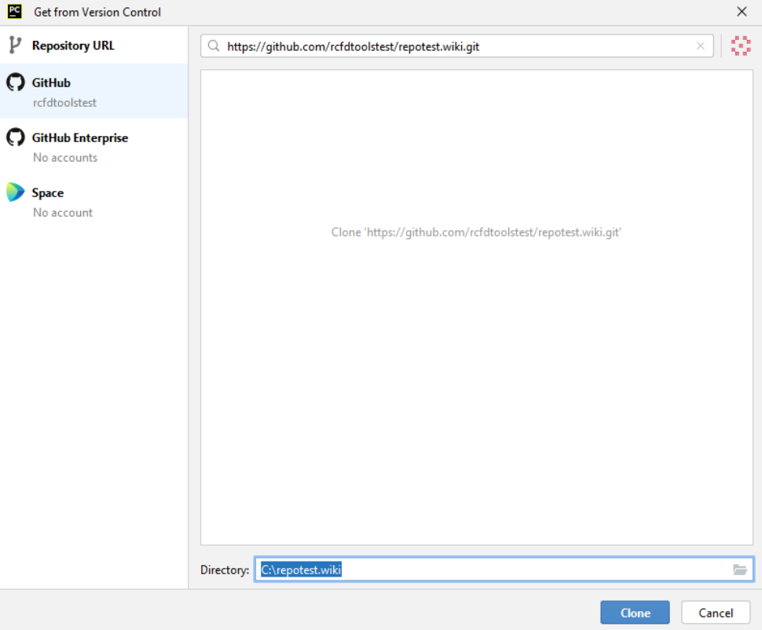

Para iniciar la clonación, de clic en el botón `Clone` y luego de clic en el botón `Trust Project`. 

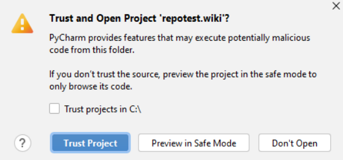

> Recuerde siempre verificar los archivos contenidos dentro de repositorios de terceros para prevenir la sincronización de archivos maliciosos.

Luego, aparecerá una ventana emergente indicando si quiere abrir el contenido del repositorio clonado en la ventana actual de PyCharm, en una nueva ventana o como proyecto adjunto, seleccione la opción _Attach_. 

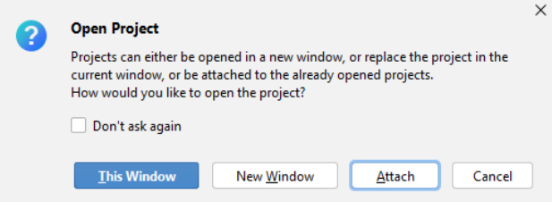

4. En la pestaña _Project_ localizada a la izquierda de PyCharm, podrá observar que ahora dispone de dos repositorios locales: _repotest_ y _repotest.wiki_. En el explorador de archivos, también podrá observar que se encuentran las carpetas `C:\repotest` y `C:\repotest.wiki` correspondientes a las rutas donde se ha realizado la clonación local de los archivos.

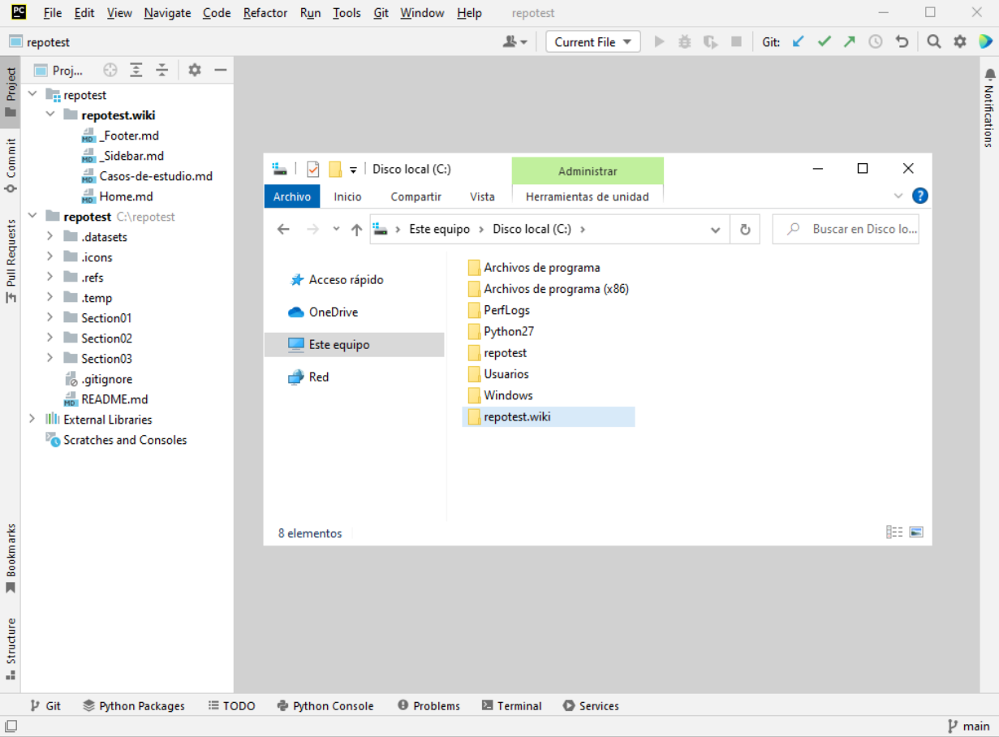

5. Desde su navegador de Internet, verifique el contenido del _Home_ dentro centro de documentación Wiki.

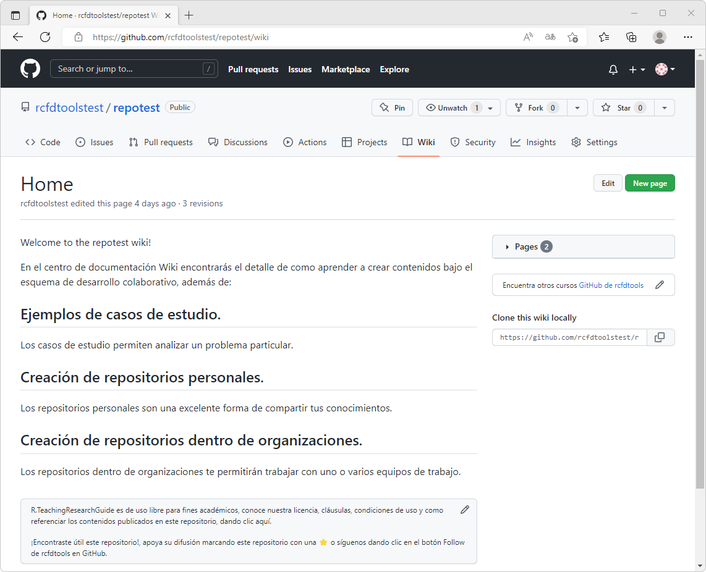

7. Desde PyCharm, modifique el archivo `Home.md` del centro de documentación Wiki, p. ej., agregue al final del archivo "Modificado localmente desde PyCharm.".

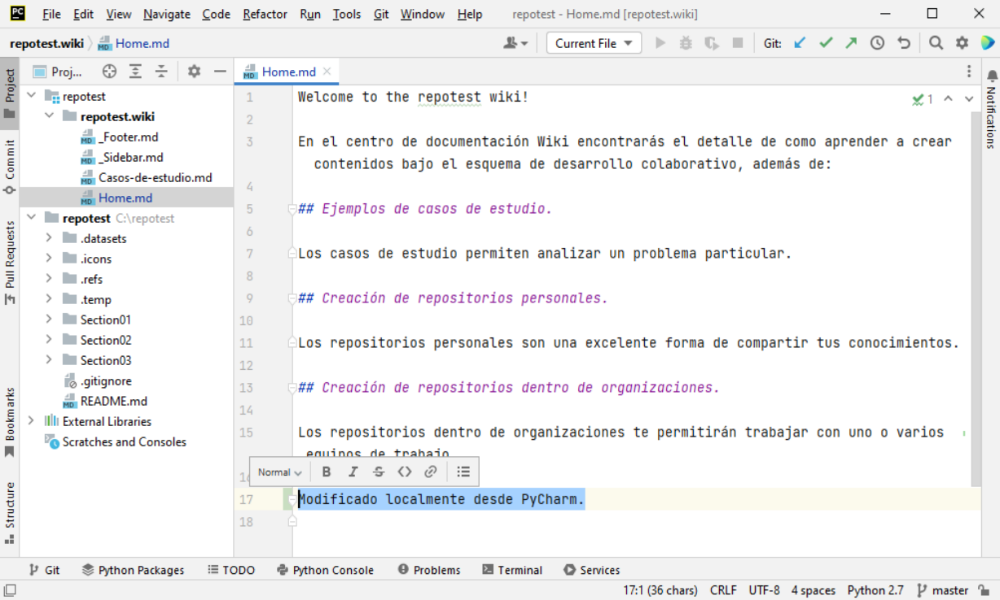

9. Desde su navegador de Internet, visualice el archivo README.md de su repositorio principal. Desde PyCharm, modifique el archivo _README.md_ del repositorio principal, p. ej., agregue al final del archivo "Modificado localmente desde PyCharm con edición simultánea de Wiki.".

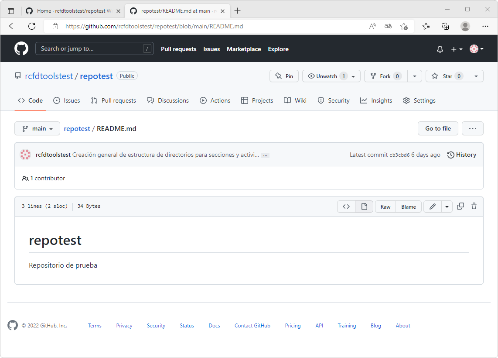
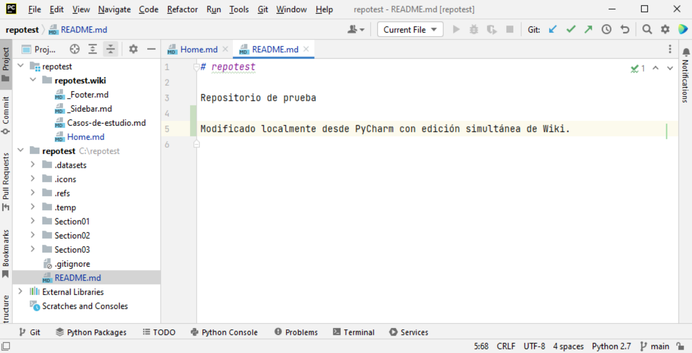

10. Realice el _Commit / Push_ oprimiendo la combinación de teclas <kbd>Ctrl</kbd>+<kbd>K</kbd> incluyendo el comentario "General update."

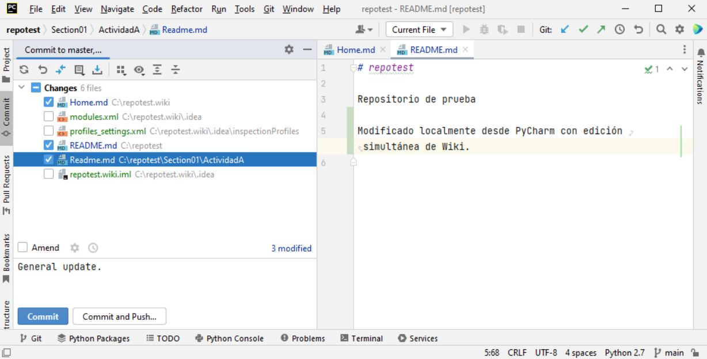
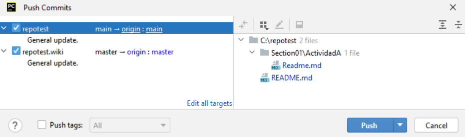

> Como observa, dentro de la ventana de sincronización se indica que se sincronizarán también los archivos contenidos en la carpeta `.idea` creada dentro del directorio local Wiki. Estos archivos se deben excluir siguiendo el mismo procedimiento presentado en la actividad anterior de esta sección del curso, correspondiente a la creación del archivo `.gitignore` y las entradas correspondientes a las carpetas y archivos de gestión local no requeridos dentro de la nube.

11. Verifique desde su navegador de Internet, las actualizaciones realizadas en el archivo _README.md_ del repositorio principal y el _Home_ de Wiki. Podrá observar que se han actualizado simultáneamente los contenidos de los repositorios utilizando un único _Push_.

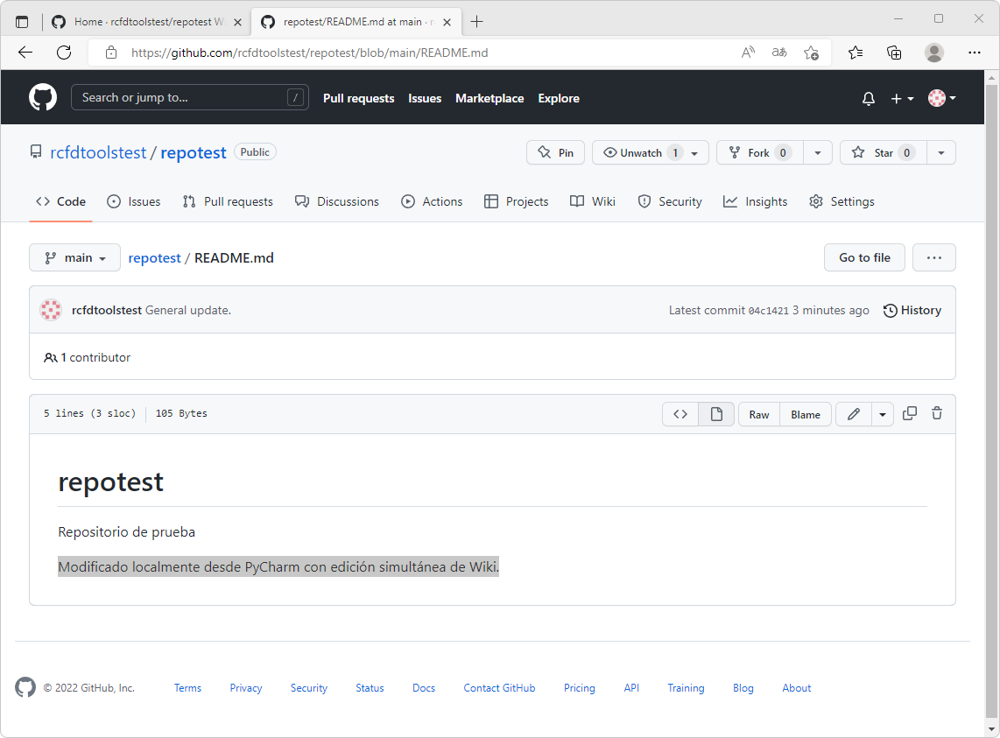
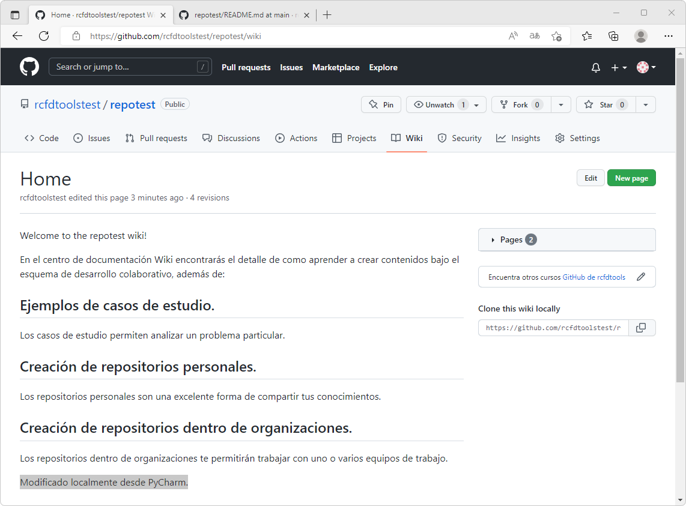

### Actividades complementarias:pencil2:

En la siguiente tabla se listan las actividades complementarias a ser desarrolladas por el estudiante.

|  #  | Alcance                                                                                                                                                    |
|:---:|:-----------------------------------------------------------------------------------------------------------------------------------------------------------|
|  1  | Clone localmente los contenidos del centro de documentación Wiki de su propio repositorio, realice cambios y publique las actualizaciones.                 |
|  2  | Clone en la nube el repositorio https://github.com/rcfdtoolstest/repotest, luego clone localmente en su equipo, realice cambios y publiquelos en la Nube.  |

### Preguntas y respuestas Q&A

| Pregunta                                                                                       | Respuesta                                                                                                               |
|------------------------------------------------------------------------------------------------|-------------------------------------------------------------------------------------------------------------------------|
| ¿Al eliminar la carpetas locales de mi equipo, se elimina mi repositorio en la nube de GitHub? | No, los archivos de GitHub se mantienen hasta que el usuario decida eliminar por completo el repositorio desde la nube. |
| ¿Si cambio de equipo local, puedo clonar nuevamente los archivos?                              | Sí, los repositorios de GitHub pueden ser clonados localmente múltiples veces.                                          |

> Ayúdame desde este [hilo de discusión](https://github.com/rcfdtools/R.TeachingResearchGuide/discussions/18) a crear y/o responder preguntas que otros usuarios necesiten conocer o experiencias relacionadas con esta actividad.

### Referencias

* https://www.jetbrains.com/help/pycharm/manage-projects-hosted-on-github.html
* https://www.jetbrains.com/help/pycharm/contribute-to-projects.html
* https://www.jetbrains.com/help/pycharm/maintain-projects-on-github.html

### Control de versiones

| Versión    | Descripción      | Autor                                      | Horas |
|------------|:-----------------|--------------------------------------------|:-----:|
| 2022.09.06 | Versión inicial. | [rcfdtools](https://github.com/rcfdtools)  |   3   |

_R.TeachingResearchGuide es de uso libre para fines académicos, conoce nuestra licencia, cláusulas, condiciones de uso y como referenciar los contenidos publicados en este repositorio, dando [clic aquí](../../LICENSE.md)._

_¡Encontraste útil este repositorio!, apoya su difusión marcando este repositorio con una ⭐ o síguenos dando clic en el botón Follow de [rcfdtools](https://github.com/rcfdtools) en GitHub._

| [Anterior](../SingleProject) | [:house: Inicio](../../Readme.md) | [:beginner: Ayuda / Colabora](https://github.com/rcfdtools/R.TeachingResearchGuide/discussions/18) | [Siguiente]() |
|------------------------------|-----------------------------------|----------------------------------------------------------------------------------------------------|---------------|

[^1]: 