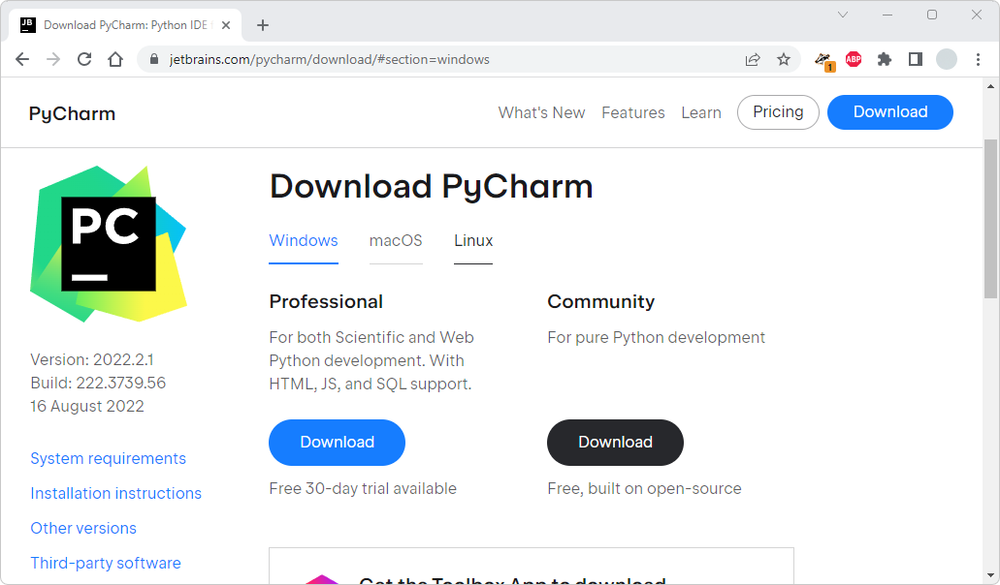
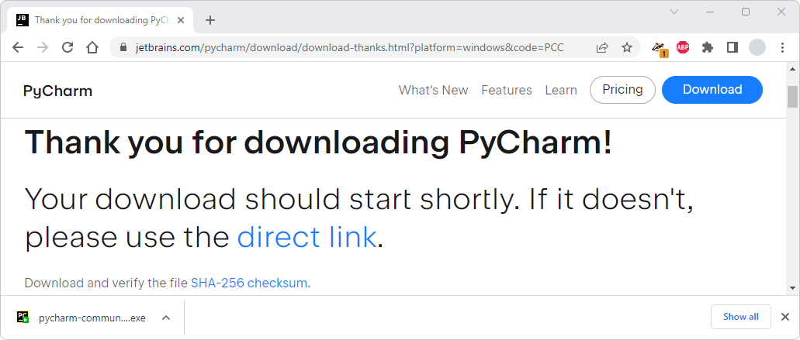
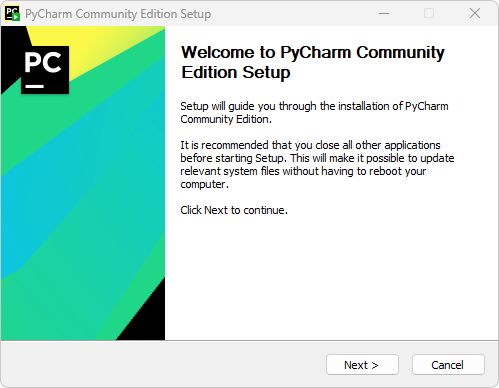
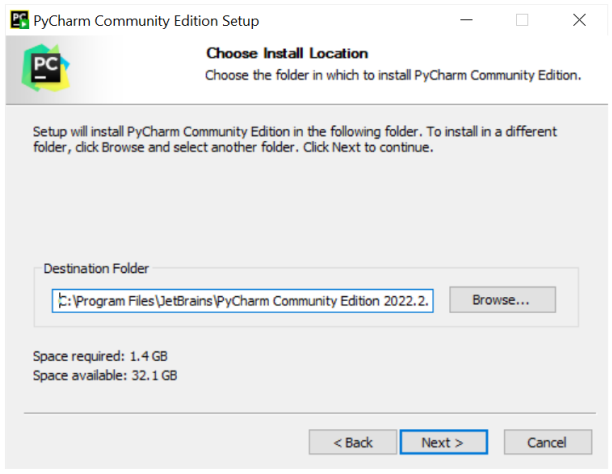
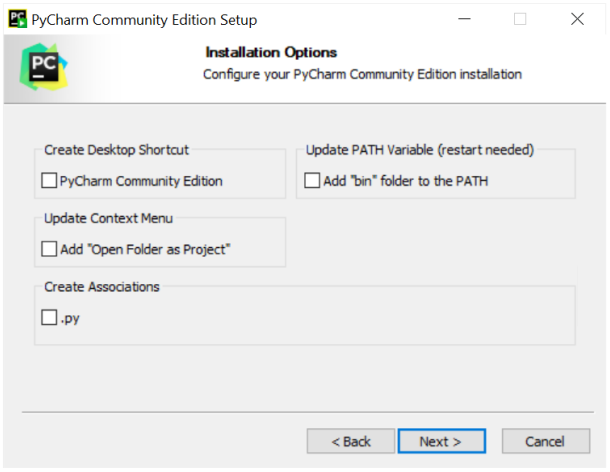
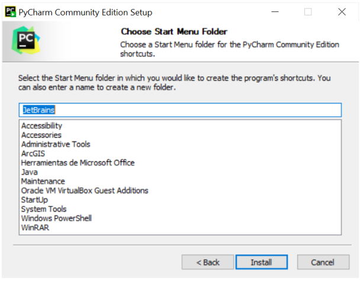
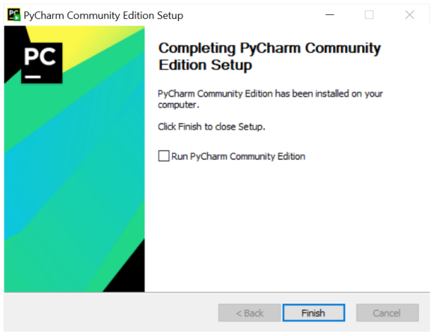
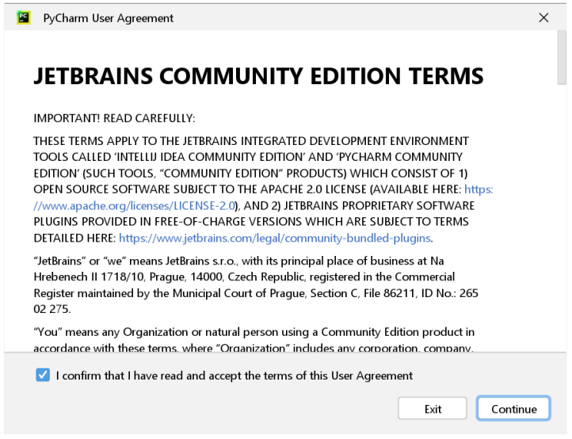

## Gestión con PyCharm
Keywords: `Desktop` `JETBRAINS`

PyCharm es un entorno de desarrollo integrado (IDE) en desktop, diseñado para la producción de proyectos basados en el lenguaje de programación Python, contiene editores avanzados y asistentes que no solamente permiten crea y editar código, sino también crear documentación en formato de marcas Markdown y gestionar los controles de cambios, publicación y actualización en GitHub.                                                                                                         

   

### Objetivos

* Instalar y configurar PyCharm.
* 

### Requerimientos

* Cuenta GitHub. [:mortar_board:Aprender.](../GitHubRepository)

### Instalación

1. Ingrese a https://www.jetbrains.com/pycharm/ y de clic en el botón _DOWNLOAD_.

2. En la página de descargas, seleccione el sistema operativo en el cual va a realizar la instalación, de clic en el botón Community / _Download_. Automáticamente iniciará la descarga. 

3. Desde la ventana de descargas de su navegador o desde la carpeta de descargas de su sistema operativo, ejecute el instalador descargado, p. ej. `pycharm-community-2022.2.1.exe `

Los requisitos para su instalación son:

* Sistema operativo de 64 bits para usuarios de Microsoft Windows 8, 10 u 11.
* 2 GB de memoria RAM libre con recomendación de 8 GB de memoria RAM en el equipo.
* 2.5 GB de espacio libre en disco y unidad de estado sólido SSD.
* Monitor con resolución mínima de 1024x768p, recomendado FHD 1920x1080p.
* Para proyectos que requieran de Python, se recomienda disponer de Python 2.7, 3.5 o superior.

De clic en el botón `Next >`

Indique la ruta de instalación, utilice la ruta por defecto y de clic en _Next_.

Establezca las opciones de instalación marcando la casilla _Create Associations .py_ y de clic en _Next_.

Defina el nombre de la carpeta en el menú inicio de su sistema operativo, por defecto _JerBrains_. De clic en _Install_, espere hasta que el proceso se complete y de clic en el botón Finish.

### Configuración

1. Desde el menú inicio o desde sus aplicaciones, ejecute _PyCharm_, acepte las condiciones de uso y de clic en `Continue`.

### Actividades complementarias:pencil2:

En la siguiente tabla se listan las actividades complementarias a ser desarrolladas por el estudiante.

|  #  | Alcance |
|:---:|:--------|
|  1  | xxx     |

### Preguntas y respuestas Q&A

| Pregunta                                                                            | Respuesta                                                                                                             |
|-------------------------------------------------------------------------------------|-----------------------------------------------------------------------------------------------------------------------|
| ¿Requiero de una versión de pago para gestionar mis proyectos GitHub desde PyCharm? | No, la versión community provee las herramientas necesarias para crear, editar, publicar y mantener tus repositorios. |

> Ayúdame a crear y/o responder preguntas que otros usuarios necesiten conocer desde el [hilo de discusión](https://github.com/rcfdtools/R.TeachingResearchGuide/discussions/9999) de este microcontenido.
>
> Escribe o comparte en el [hilo de discusión](https://github.com/rcfdtools/R.TeachingResearchGuide/discussions/9999) de este microcontenido, que otras dudas, preguntas, contenidos y experiencias tienes relacionadas con desarrollo colaborativo para el enfoque en educación e investigación.

### Referencias

* 

### Control de versiones

| Versión    | Descripción      | Autor                                      | Horas |
|------------|:-----------------|--------------------------------------------|:-----:|
| 2022.08.22 | Versión inicial. | [rcfdtools](https://github.com/rcfdtools)  |  XX   |

_R.TeachingResearchGuide es de uso libre para fines académicos, conoce nuestra licencia, cláusulas, condiciones de uso y como referenciar los contenidos publicados en este repositorio, dando [clic aquí](../../LICENSE.md)._

_¡Encontraste útil este repositorio!, apoya su difusión marcando este repositorio con una ⭐ o síguenos dando clic en el botón Follow de [rcfdtools](https://github.com/rcfdtools) en GitHub._

| [Anterior](../GitHubRepository) | [:house: Inicio](../../Readme.md) | [:beginner: Ayuda / Colabora](https://github.com/rcfdtools/R.TeachingResearchGuide/discussions/9) | [Siguiente]() |
|---------------------------------|-----------------------------------------------------------------------------|------------------------------------------------------------------------------------------------------|---------------|

[^1]: 