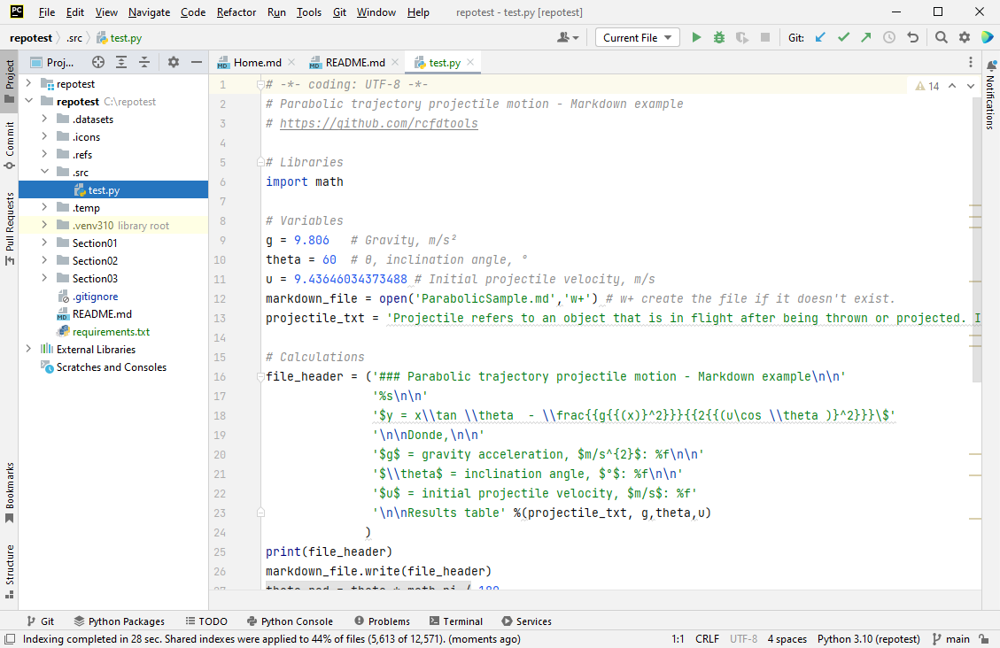
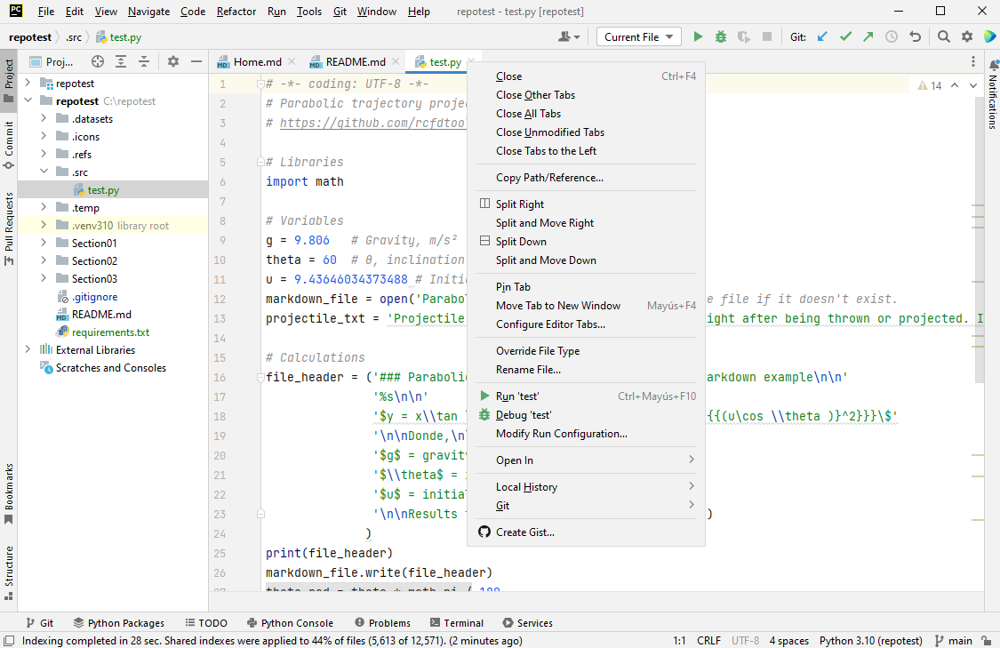
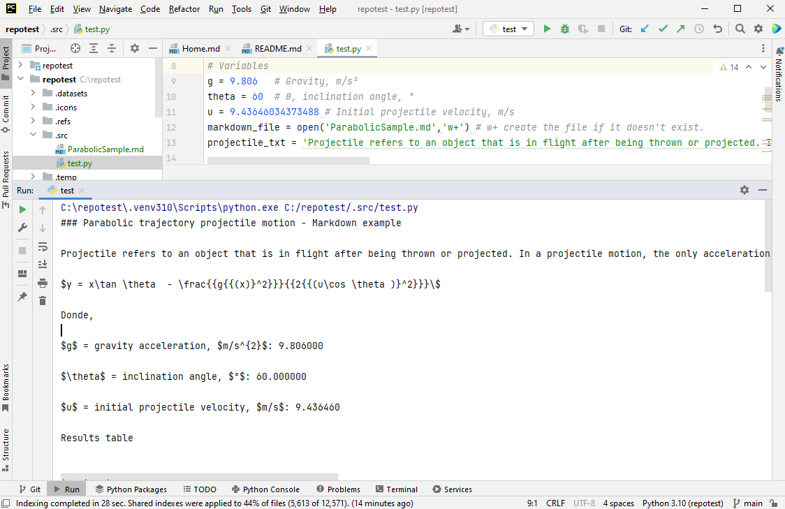
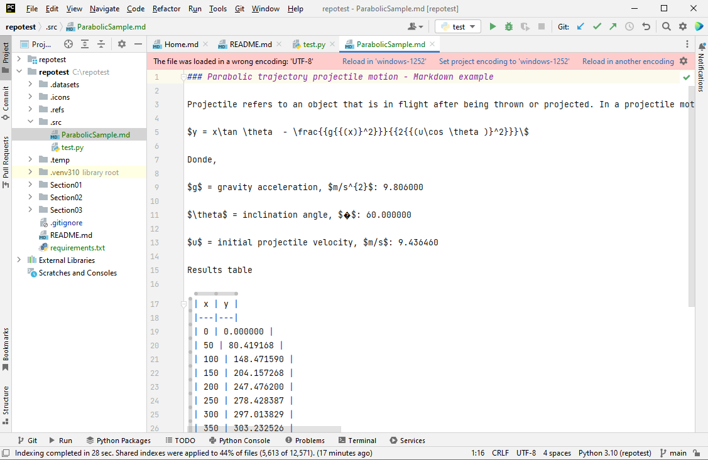
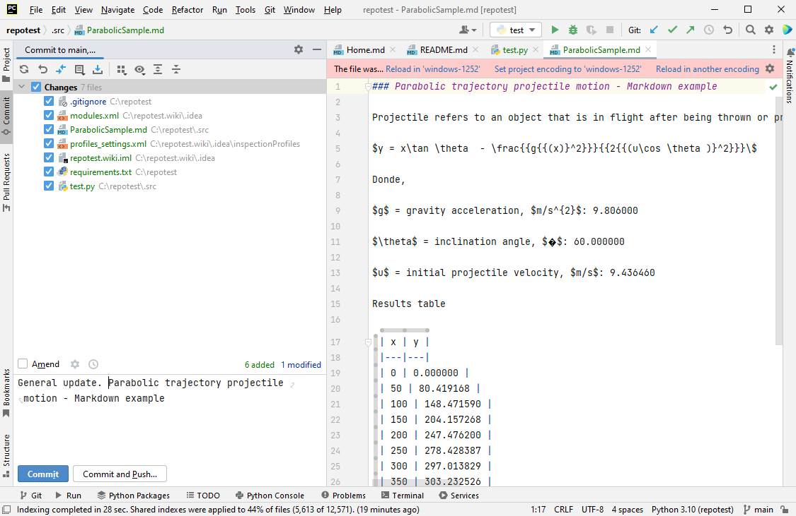
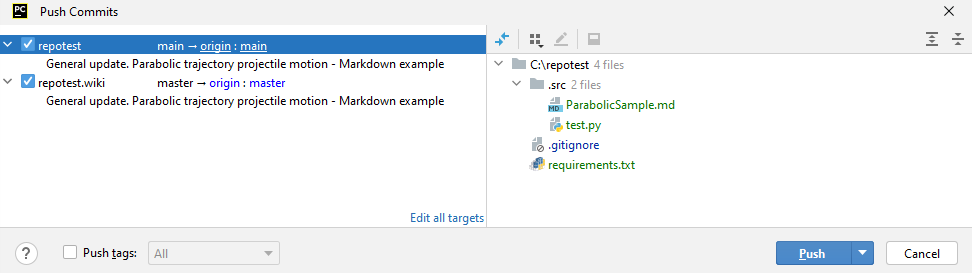
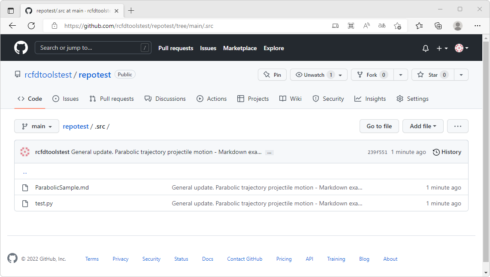
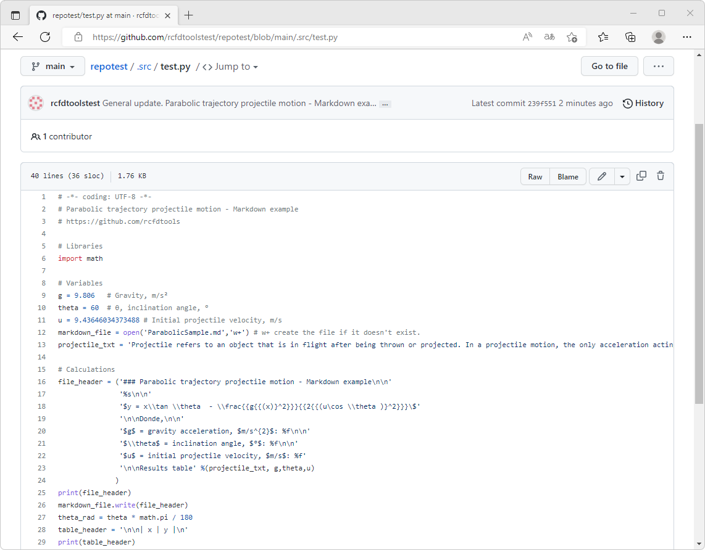
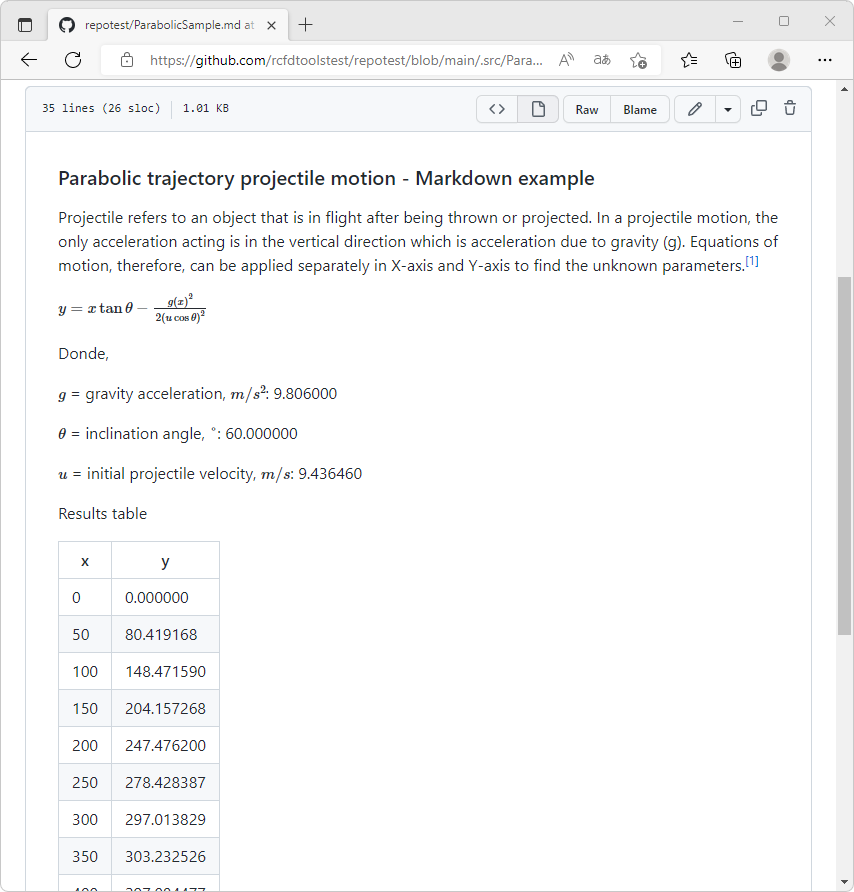

## Proyectos GitHub utilizando Python en PyCharm
Keywords: `Python` `requirements` `GitHub` `LaTeX` `CMD` `Interpreter` `Coding`

Python es un potente lenguaje de programación interpretado con licencia de código abierto que soporta orientación a objetos y es comúnmente utilizado en el desarrollo de proyectos e investigación en ingeniería.

<div align="center">
<br><br><br>
</div>


### Objetivos

* Instalar y configurar Python.
* Crear entornos virtuales en Python.
* Crear el archivo de requerimientos para la instalación de librerías.
* Ejecutar scripts en Python y generar archivos Markdown.


### Requerimientos

* Cuenta y repositorio [GitHub](https://github.com/). [:mortar_board:Aprender.](../../Section01/GitHubRepository)
* [PyCharm Community](https://www.jetbrains.com/pycharm/) instalado y configurado con repositorio clonado localmente. [:mortar_board:Aprender.](../Setup) 
* [Python 3.10](https://www.python.org/downloads/) o superior.


### Archivo de requerimientos Python

Existen diferentes alternativas para la instalación de librerías asociadas a un proyecto desarrollado en Python, desde instalar manualmente las librerías desde consola a través de gestores de paquetes o módulos como `pip`, instalación asistida desde entornos de desarrollo integrados (IDE) o a través de la creación del archivo de texto `requirements.txt`.

> Es recomendable crear el archivo de requerimientos en la raíz del repositorio antes de la asociación y creación del entorno virtual de Python. Esto permitirá que Python identifique los módulos o las librerías requeridas para el proyecto y permitirá realizar la instalación automática. 

1. En PyCharm Community, cree el archivo `requirements.txt` en la raíz del repositorio. Para ello, diríjase a la pestaña _Project_, de clic derecho en la raíz del repositorio `repotest`, seleccione la opción _New / File_


2. Ingrese el nombre `requirements.txt` y de teclee <kbd>Enter</kbd>. Automáticamente se abre el archivo para su edición.


3. En la parte superior de la ventana podrá observar que aparecen dos mensajes indicando que el archivo de requerimientos se encuentra vacío y que para el procesamiento del archivo se requiere de un Plugin. De clic en el enlace _Install Plugins_.


Active la casilla de selección del plugin Requirements y de clic en el botón `Ok`


De clic en el botón `Accept` en la ventana emergente que indica que este plugin ha sido desarrollado por un tercero y no directamente los por creadores de PyCharm.


Para verificar la correcta instalación del Plugin, en el menu _File_, seleccione la opción _Settings_ u oprima la combinación de teclas <kbd>Ctrl</kbd>+<kbd>Alt</kbd>+<kbd>S</kbd>. En la pestaña Plugins, revise que se encuentre instalado y activado _Requirements_.


4. En el archivo de requerimiento, ingrese los nombre de las librerías requeridas, p. ej.: 

```
numpy
scipy
pandas
matplotlib
seaborn
```


> Dentro del archivo de requerimientos, podrá definir la versión específica requerida de la librería a instalar o verificar, p. ej., `pandas==1.4.3`

Al ingresar las librerías requerías, podrá observar que `seaborn` ha sido resaltado en color rojo indicando que no existe en la versión actual de Python instalada en el equipo. 

> Por defecto, cuando se clona localmente con PyCharm un repositorio de GitHub, se asocia el intérprete de Python instalado y registrado en el sistema operativo.

Al dar clic en el ícono rojo de alertas localizado en la parte superior derecha de la venta de edición del archivo de requerimientos, podrá visualizar en detalle la descripción de las librerías, si existen o no y si se encuentran actualizadas.


> Debido a que realizaremos la instalación de una nueva versión de Python, no es necesario por ahora, verificar las versiones disponibles de las librerías encontradas en el entorno de Python sí este ya se encuentra instalado.


### Instalación personalizada de Python sobre Windows

1. Ingrese a www.python.org, de clic en _Downloads_ y seleccione la opción _Windows_ o seleccione su sistema operativo actual. Luego de clic en el botón de descarga, p. ej., `Python 3.10.7`


2. Desde la carpeta _Descargas_ de su equipo, de clic derecho sobre el instalador de Python descargado, seleccione la opción _Ejecutar como administrador._  


3. En la ventana de instalación, marque las casillas _Install launcher for all users_ y _Add Python 3.10 to PATH_ seleccione _Customize Installation_ para personalizar las opciones de instalación.


> _Install launcher for all users_ permitirá que cualquier usuario local ejecute la versión de Python instalada y _Add Python 3.10 to PATH_ creará la asociación de Python en las variables del sistema que facilitará su ejecución desde consola.

4. En Optional Features, marque todas las casillas disponibles para incluir: Documentación, gestor de paquetes, las opciones de creación de interfases gráficas con [tkinter](https://docs.python.org/3/library/tk.html), las librerías de prueba y el lanzador automático de scripts .py.


5. En la ventana de opciones avanzadas, modifique la ruta de instalación de su usuario local, p. ej., `C:\Users\R\AppData\Local\Programs\Python\Python310` a `C:\Python310` y marque las casillas disponibles. Para finalizar, de clic en el botón `Install`.


En la ventana final, de clic en la opción _Disable path length limit_ que le permitirá utilizar rutas con más de 260 caracteres.


### Verificación de Python por consola CMD de Windows

1. En Windows, oprima las teclas <kbd>Windows</kbd>+<kbd>R</kbd> para acceder a la ventana de ejecución. Ingrese el comando `cmd` y teclee <kbd>Enter</kbd> para acceder a la consola de comandos.


2. En la consola, ingrese el comando `Python --version` y verifique que la versión instalada corresponde a la versión descargada. Para el ejemplo, corresponde a la versión 3.10.7.


> En el evento de que la versión devuelta no corresponda a la versión de Python instaladas, ingresar el comando `cd c:\Python310` y luego el comando `Python --version`.


### Asociación local de Python en PyCharm Community

1. En PyCharm, oprima la combinación de teclas <kbd>Ctrl</kbd>+<kbd>Alt</kbd>+<kbd>S</kbd> para acceder a la configuración general. En la ventana de configuración, seleccione la pestaña _Project_ y la opción _Python Interpreter_


> Como observa en la ilustración, previamente al clonar el repositorio _repotest_ desde GitHub, se asoció una versión antigua de Python instalada en el equipo. 

2. En la parte superior derecha de la ventana, de clic en la opción _Add Interpreter_, seleccione _Add Local Interpreter..._


3. En la ventana de inclusión de intérpretes, seleccione a la izquierda la opción _Virtualenv Environment_, seleccione la casilla _New_, ingrese la localización, p. ej., `C:\repotest\.venv310`, el intérprete base de Python de los disponibles y registrados en el sistema, p. ej., `C:\Python310\Python.exe`. Para finalizar, de clic en el botón `OK`

> Dentro de un proyecto se pueden definir y asociar múltiples entornos virtuales, debido a esto, es recomendable que el nombre de la carpeta a crear dentro del entorno virtual, se modifique de `venv` a `.venv310` para que dentro del directorio principal, esta aparezca al inicio (debido al punto) y el usuario conozca que la versión asociada de Python es la 3.10.
> 
> Dependiendo de si en su versión de Python ha instalado previamente librerías o módulos, podrá seleccionar la casilla _Inherit global site-packages_ para incluir estas librerías en el entorno virtual. Se recomienda no marcar la casilla para instalar nuevamente las librerías y versiones requeridas para el proyecto.


Una vez finalizada la creación del entorno virtual, en la ventana principal de configuración de intérpretes, podrá observar las librerías base asociadas Python.


> Recuerde que el directorio `.venv310` debe ser incluido en el archivo de exclusiones _.gitignore_ localizado en la raíz del repositorio.


4. En la ventana principal de configuración de intérpretes, de clic en los botones `Apply` y `OK`. Al regresar a la ventana principal de PyCharm, obtendrá una notificación indicando si desea descargar la herramienta de pre-construcción de índices compartidos que le permitirá reducir el tiempo de indexación y uso de CPU al incluir nuevas librerías o paquetes dentro del entorno virtual. De clic en el botón `Always download`. 


5. Dando clic en el ícono de alertas disponible en la parte superior derecha de la ventana de edición del archivo requirements.txt, verifique los mensajes obtenidos, podrá observar que para la versión 3.10 de Python, no se encuentran instalas las librerías requeridas.


6. Para instalar las librerías requeridas a partir del archivo de requerimientos, en la parte inferior de la ventana, seleccione la pestaña `Terminal`.

Dependiendo de la versión de su sistema operativo y de si ha modificado previamente las plantillas administrativas de grupo para permitir la ejecución de scripts .ps1 de PowerShell, podrá obtener el siguiente mensaje.


Para activar la ejecución de scripts de sistema, en Windows oprima las teclas <kbd>Windows</kbd>+<kbd>R</kbd> y en la ventana de ejecución ingrese el comando `gpedit.msc` que le permitirá ingresar al administrador de directivas de grupo local. 


En el grupo de opciones de _Configuración del equipo / Plantillas administrativas / Componentes de Windows / PowerShell_, de doble clic sobre la opción _Activar la ejecución de scripts_   


En la ventana _Activar la ejecución de scripts_, marque la casilla _Habilitada_ y en opciones seleccione _Permitir todos los scripts_, de clic en los botones `Aplicar` y `Aceptar`. Cierre las ventanas del editor de directivas.


Cierre y abra nuevamente Pycharm, podrá observar que la ventana de la Terminal ya no despliega errores y que al lado izquierdo se indica que la ejecución de la consola se está realizando desde el entorno virtual `.venv310`.


En la Terminal, ingrese el comando `pip install -r requirements.txt`


7. Luego de finalizada la instalación de las librerías requeridas, oprima <kbd>Ctrl</kbd>+<kbd>Alt</kbd>+<kbd>S</kbd> para ingresar a la configuración del sistema, verifique si las librerías requeridas han sido instaladas. 


Como observa, las librerías requeridas han sido instaladas y se encuentran disponibles para su uso. La instalación de _seaborn_ requirió de la instalación de múltiples librerías adicionales a las definidas en el archivo de requerimientos.

> En la ventana del intérprete podrá observar las versiones instaladas en su equipo y las versiones más recientes disponibles en la nube. Por ejemplo, en el caso de la librería _pip_ la versión instalada es la 21.3.1 y la versión más reciente es 22.2.2. Para actualizar esta librería, puede ejecutar desde la Terminal el comando `C:\repotest\.venv310\Scripts\python.exe -m pip install --upgrade pip` o desde el administrador de paquetes de la ventana de configuración, puede dar doble clic en la librería _pip_ y desde la ventana de paquetes disponibles, instalar la versión más reciente dando clic en el botón `Install Package`.


### Creación y ejecución de scripts Python

Luego de definido el ambiente virtual de trabajo y la instalación de diferentes librerías, podremos ejecutar o crear scripts de Python directamente desde PyCharm. Complementariamente, definiremos en el archivo de requerimientos, que es requerida la instalación de la librería, p. ej., `requests` que permite descargar archivos desde Internet.

1. En PyCharm, modifique el archivo `requirements.txt` incluyendo la librería `requests`


2. En el panel _Project_ localizado a la izquierda de la ventana de PyCharm, de clic derecho en la raíz del repositorio `repotest`, seleccione la opción _New / Directory_ y cree un directorio con el nombre `.src`


3. De clic en la carpeta `.src`, seleccione la opción _New / Python File_ y nombre como `test.py`


En la parte superior izquierda de la ventana de edición del nuevo script, podrá observar que el requerimiento definido en el archivo `requirements.txt` para el paquete `request`, no se ha completado debido a que la librería requerida no se encuentra instalada. En la parte superior derecha de la ventana, de clic en la opción _Install requirement_ para instalar automáticamente la librería requerida.


> Como observó en instrucciones anteriores, las librerías requeridas pueden ser instaladas a través del gestor `pip` utilizando el archivo de requerimientos, manualmente desde el gestor de paquetes PyCharm asociado al intérprete de Python o automáticamente desde la creación de cualquier archivo en Python.

4. Para el script de prueba, calcularemos la trayectoria de un lanzamiento parabólico, imprimiremos el resultado en la consola de comandos y escribiremos los resultados en un archivo Markdown en formato de tabla.

<div align="center">

$y = x\tan \theta  - \frac{{g{{(x)}^2}}}{{2{{(u\cos \theta )}^2}}}\$

</div>

Donde,

$g$ = gravity acceleration, $m/s^{2}$  
$\theta$ = inclination angle, $°$  
$u$ = initial projectile velocity, $m/s$  

Copie y pegue en el archivo _test.py_, las siguientes instrucciones Python:

Código ejemplo: [ParabolicSample.py](ParabolicSample.py)  
Resultado Markdown: [ParabolicSample.md](ParabolicSample.md)
```
# -*- coding: UTF-8 -*-
# Parabolic trajectory projectile motion - Markdown example
# https://github.com/rcfdtools

# Libraries
import math

# Variables
g = 9.806   # Gravity, m/s²
theta = 60  # θ, inclination angle, °
u = 9.43646034373488 # Initial projectile velocity, m/s
markdown_file = open('ParabolicSample.md','w+') # w+ create the file if it doesn't exist.
projectile_txt = 'Projectile refers to an object that is in flight after being thrown or projected. In a projectile motion, the only acceleration acting is in the vertical direction which is acceleration due to gravity (g). Equations of motion, therefore, can be applied separately in X-axis and Y-axis to find the unknown parameters.[^1]'

# Calculations
file_header = ('### Parabolic trajectory projectile motion - Markdown example\n\n'
               '%s\n\n'
               '$y = x\\tan \\theta  - \\frac{{g{{(x)}^2}}}{{2{{(u\cos \\theta )}^2}}}\$'
               '\n\nDonde,\n\n'
               '$g$ = gravity acceleration, $m/s^{2}$: %f\n\n'
               '$\\theta$ = inclination angle, $°$: %f\n\n'
               '$u$ = initial projectile velocity, $m/s$: %f'
               '\n\nResults table' %(projectile_txt, g,theta,u)
              )
print(file_header)
markdown_file.write(file_header)
theta_rad = theta * math.pi / 180
table_header = '\n\n| x | y |\n'
print(table_header)
markdown_file.write(table_header)
table_row_sep = '|---|---|\n'
print(table_row_sep)
markdown_file.write(table_row_sep)
for x in range (0, 750, 50):
    y = x * math.tan(theta_rad) - (g / (2 * (u ** 2 * math.cos(theta_rad)) ** 2)) * x ** 2
    table_row = ('| %d | %f |\n' %(x,y))
    print(table_row)
    markdown_file.write(table_row)

markdown_file.write('\n[^1]: https://www.toppr.com/guides/physics/motion-in-a-plane/projectile-motion/')
```


5. Dando clic derecho sobre la pestaña del archivo _test.py_, seleccione la opción _Run 'test'_ u oprima la combinación de teclas <kbd>Ctrl</kbd>+<kbd>Shift</kbd>+<kbd>F10</kbd> para ejecutar el script.



Automáticamente, se desplegará el panel de ejecución mostrando la impresión en consola definida en el script.



6. Durante la ejecución, el script _test.py_ ha creado dentro de la misma carpeta de ejecución, el archivo Markdown denominado _ParabolicSample.md_. Desde el panel _Project_, abra y visualice el contenido del archivo.



7. Para publicar los resultados en la nube de GitHub, realice el _Commit / Push_.




8. Visualice los resultados desde https://github.com/rcfdtoolstest/repotest/tree/main/.src






### Actividades complementarias:pencil2:

En la siguiente tabla se listan las actividades complementarias a ser desarrolladas por el estudiante.

|  #  | Alcance                                                                                                                                          |
|:---:|:-------------------------------------------------------------------------------------------------------------------------------------------------|
|  1  | Descargue, instale y configure Python.                                                                                                           |
|  2  | Asocie la versión de Python como intérprete de comandos del proyecto o repositorio.                                                              |
|  3  | Cree un script en Python para el cálculo de funciones trigonométricas que genere una tabla con múltiples columnas dentro de un archivo Markdown. |
|  4  | Comente, publique y visualice los resultados en GutHub.                                                                                          |


### Preguntas y respuestas Q&A

| Pregunta                                                                                                                                       | Respuesta                                                                                                                                                                                                        |
|------------------------------------------------------------------------------------------------------------------------------------------------|------------------------------------------------------------------------------------------------------------------------------------------------------------------------------------------------------------------|
| ¿Luego de instalar con `pip` las librerías definidas en el archivo de requerimientos, puedo incluir nuevas librerías para que sean instaladas? | Sí, automáticamente al asociar el intérprete de Python y al abrir un archivo .py, PyCharm identifica el nuevo requerimiento e informa al usuario para la instalación de la librería requerida.                   |
| ¿Puedo eliminar librerías instaladas en el entorno virtual e instalar librerías de versiones anteriores?                                       | Sí, desde la Terminal a través del comando `pip unistall <paquete>` o desde las opciones de configuración del intérprete asociado, se pueden desinstalar librerías para luego instalar las versiones requeridas. |

> Ayúdame desde este [hilo de discusión](https://github.com/rcfdtools/R.TeachingResearchGuide/discussions/19) a crear y/o responder preguntas que otros usuarios necesiten conocer o experiencias relacionadas con esta actividad.


### Referencias

* https://www.python.org/
* https://docs.python.org/3/library/venv.html
* https://learnpython.com/blog/python-requirements-file/
* https://docs.microsoft.com/en-us/powershell/module/microsoft.powershell.core/about/about_execution_policies?view=powershell-7.2
* https://www.toppr.com/guides/physics/motion-in-a-plane/projectile-motion/
* https://appgametutoriales.com/en/python-math-sin-cos-tangent/
* https://www.activestate.com/resources/quick-reads/how-to-uninstall-python-packages/


### Control de versiones

| Versión    | Descripción                                                                                                                                                                                                                                       | Autor                                      | Horas |
|------------|:--------------------------------------------------------------------------------------------------------------------------------------------------------------------------------------------------------------------------------------------------|--------------------------------------------|:-----:|
| 2022.09.09 | Creación y ejecución de scripts Python, ecuación LaTeX. Actividades complementarias.                                                                                                                                                              | [rcfdtools](https://github.com/rcfdtools)  |   3   |
| 2022.09.08 | Versión inicial. Archivo de requerimientos Python. Instalación personalizada de Python sobre Windows. Verificación de Python por consola CMD de Windows. Asociación local de Python en PyCharm Community. Creación y ejecución de scripts Python. | [rcfdtools](https://github.com/rcfdtools)  |   8   |

_R.TeachingResearchGuide es de uso libre para fines académicos, conoce nuestra licencia, cláusulas, condiciones de uso y como referenciar los contenidos publicados en este repositorio, dando [clic aquí](../../LICENSE.md)._

_¡Encontraste útil este repositorio!, apoya su difusión marcando este repositorio con una ⭐ o síguenos dando clic en el botón Follow de [rcfdtools](https://github.com/rcfdtools) en GitHub._

| [Anterior](../MultipleProject) | [:house: Inicio](../../Readme.md) | [:beginner: Ayuda / Colabora](https://github.com/rcfdtools/R.TeachingResearchGuide/discussions/19) | [Siguiente]() |
|--------------------------------|-----------------------------------|----------------------------------------------------------------------------------------------------|---------------|

[^1]: 