## Edición local de proyectos con PyCharm y publicación en la nube
Keywords: `PyCharm` `Commit` `Push` `Image` `Title` `Table`

Luego de realizada la clonación local del repositorio creado en GitHub, es necesario modificar la estructura de directorios, agregar nuevos archivos y editar o actualizar los archivos existentes.                                                                                                        
<div align="center">
<br><br><br>
</div>


### Objetivos

* Crear y/o modificar el archivo de exclusiones .gitignore.
* Modificar y actualizar la estructura de directorios del proyecto.
* Crear nuevos archivos.
* Edición local de archivos Markdown .md.
* Comentar y publicar en la nube los cambios realizados.


### Requerimientos

* PyCharm instalado y configurado con repositorio clonado localmente. [:mortar_board:Aprender.](../Setup)


### Exclusión de directorios de control de cambios

Previamente en la sección 1 de este curso, creamos un repositorio que contenía diferentes carpetas generales y en la actividad anterior clonamos esta carpeta localmente como `C:\repotest`. Al revisar la estructura de directorios local, la disponible en la nube y la gestionada por PyCharm, podremos observar que las estructuras son similares, excepto por la carpeta `.idea`, que ha sido generada localmente por PyCharm para el control de configuración del repositorio local.

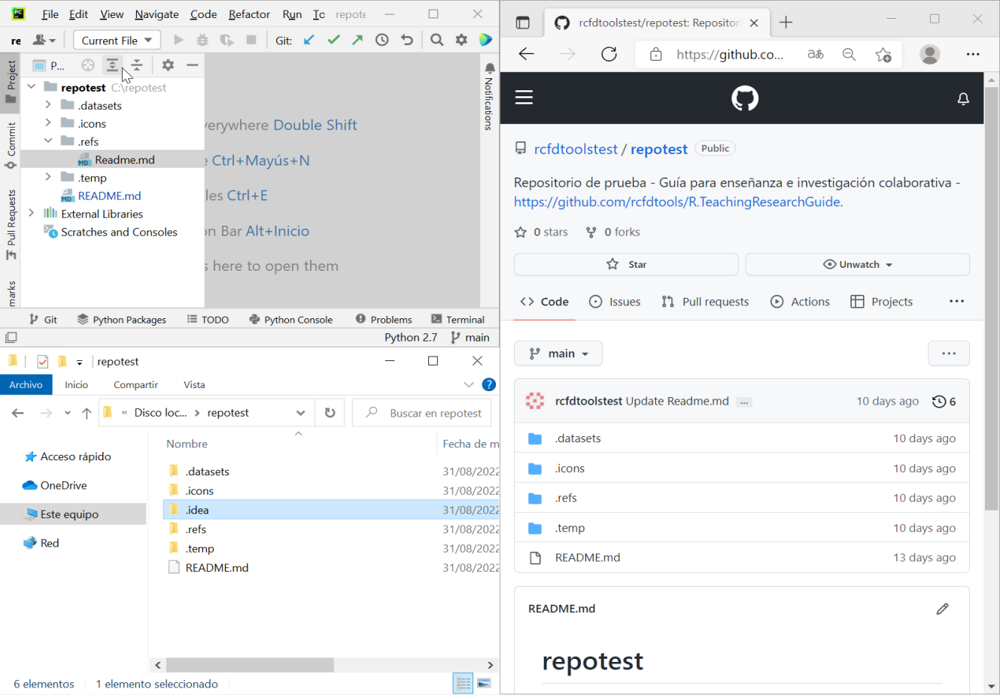

Para evitar que la carpeta `.idea` sea sincronizada en la nube, es necesario crear y editar el archivo `.gitignore` y agregar esta exclusión. En PyCharm, de clic derecho en la raíz del repositorio `repotest`, seleccione la opción _New / File_, ingrese el nombre `.gitignore` y presione la tecla <kbd>Enter</kbd>. 

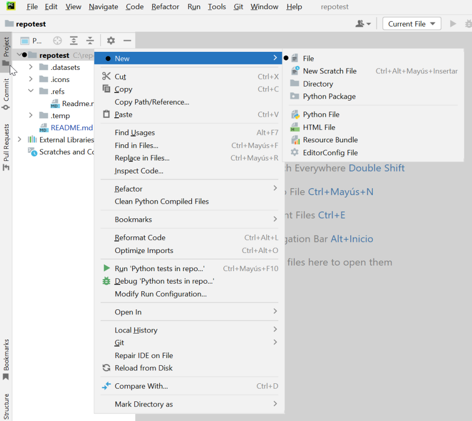
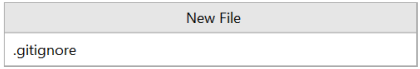

Luego de creado el archivo, PyCharm le preguntará si quiere adicionar el archivo a la lista de archivos Git que se incluirán en la sincronización con GitHub, de clic en el botón _Add_ y el archivo quedará abierto para su edición.

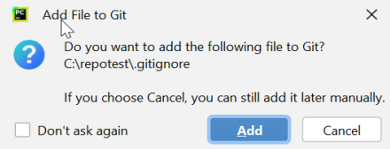

Dentro del archivo, agregue las siguientes exclusiones:

```
.idea/
.git/
.venv/
```

> La exclusión `.git/` descartará la sincronización de los archivos temporales locales de control de cambios de Git. La exclusión `.venv/` evitará que los archivos de entornos virtuales de Python creados en el directorio raíz, se sincronicen en la nube.
> 
> Si requiere incluir comentarios dentro del archivo _.gitignore_, utilice almohadilla # al inicio de la línea, p. en. `# Exclusiones generales`.

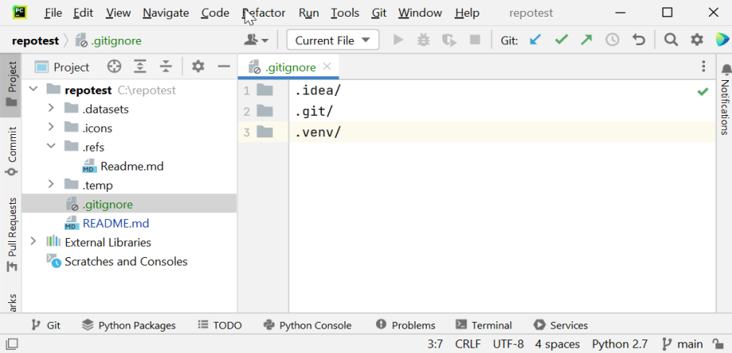

> En PyCharm, los cambios en los archivos son almacenados automáticamente al cerrar el archivo. Los cambios globales realizados en todos los archivos modificados pueden ser guardados oprimiendo <kbd>Ctrl</kbd>+<kbd>S</kbd>.

> Recuerde que todos los archivos creados localmente que superen un tamaño de 100 MB, deberán ser excluidos de la sincronización o ser comprimidos en múltiples partes de 95 MB.

Para sincronizar el archivo en la nube de GitHub, de clic en el botón `Commit` (ícono verde de aprobación ✓ localizado en la parte superior derecha de la pantalla) u oprima la combinación de teclas <kbd>Ctrl</kbd>+<kbd>K</kbd>. Ingrese comentarios para documentar los cambios realizados en el repositorio y para finalizar de clic en el botón `Commit and Push...`.

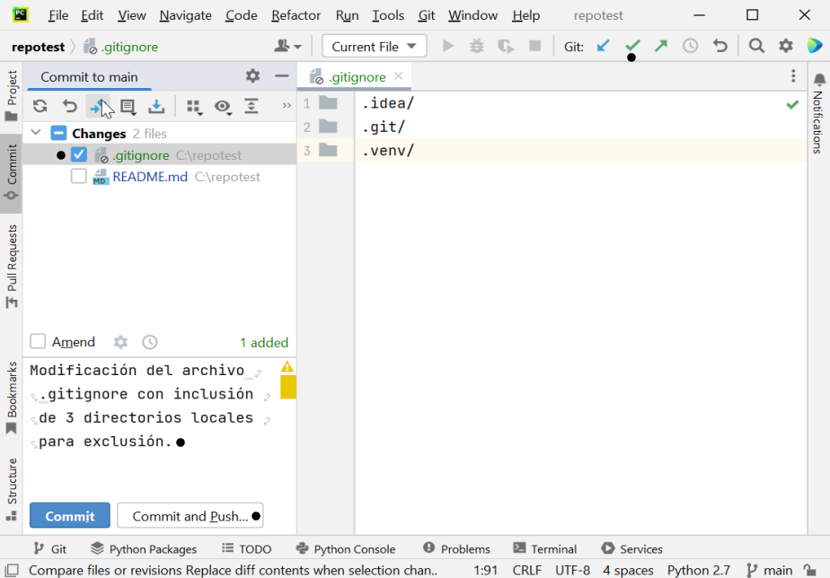

PyCharm solicitará que indique el nombre del usuario que realizará la publicación de cambios y su correo electrónico. Ingrese el nombre de su perfil de GitHub, el correo electrónico asociado a su cuenta y de clic en el botón `Set and Commit`.

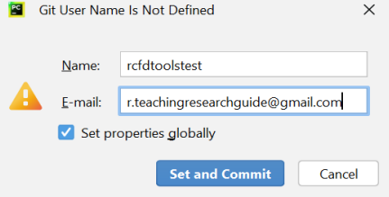

En la ventana emergente de publicación de comentarios y cargue de archivos, podrá observar que se incluirá en la nube el archivo `.gitignore` localizado en `C:\repotest`. De clic en Push.

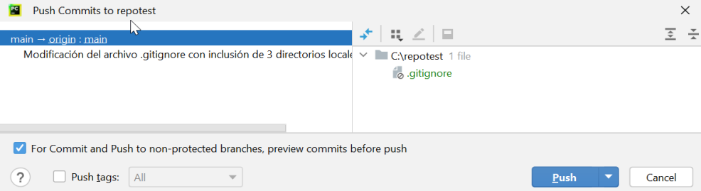

Luego de lanzar el _Push_, podrá observar un mensaje indicando que se ha publicado la modificación.  

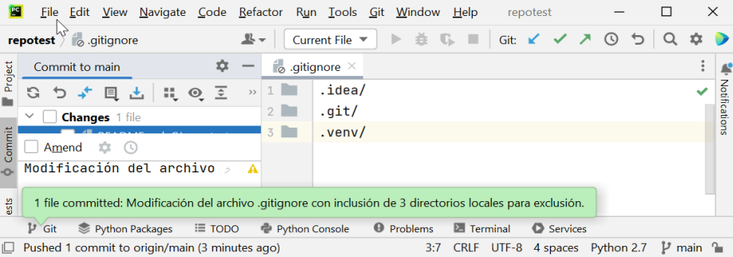

En la parte inferior de la ventana de PyCharm, de clic en el ícono _Git_ que le permitirá visualizar el registro histórico detallado de los cambios realizados por Git dentro del repositorio.

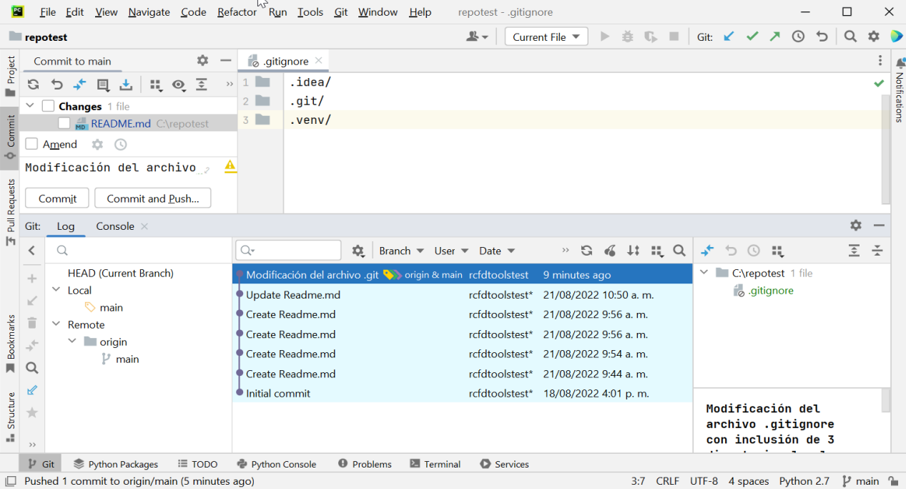

Para verificar los cambios realizados en el repositorio, desde su navegador de Internet, verifique el contenido de los archivos del proyecto en la pestaña `<> Code`, podrá observar que se encuentra publicado el nuevo archivo `.gitignore`, los comentarios de la modificación realizada y hace cuanto realizó los cambios.


De clic en el archivo `.gitignore` y visualice su contenido.

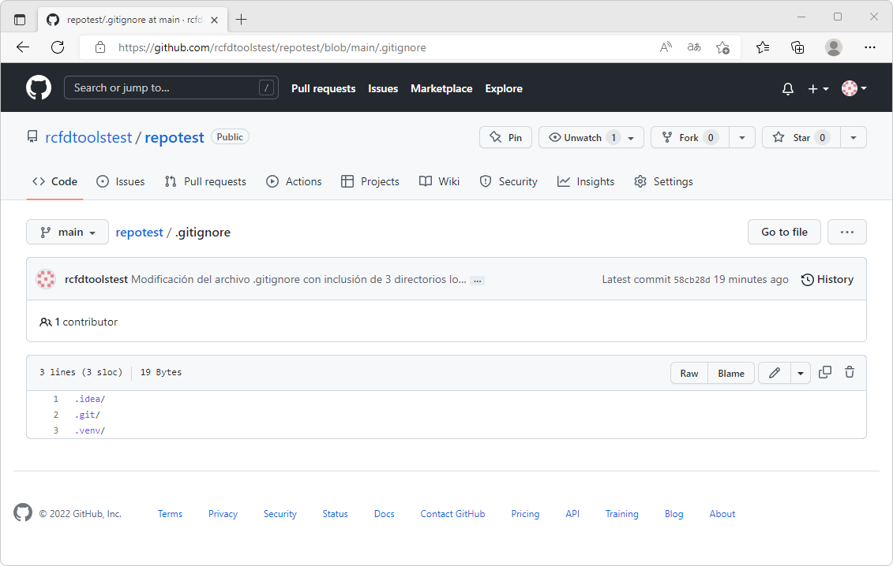

> Como pudo observar, no ha sido necesario el uso de la consola de comandos, ni conocer los comandos Git para la modificación y publicación en la nube de los cambios realizados en el repositorio.


### Modificación y/o complementación de la estructura de directorios

Para agregar una carpeta nueva, en la raíz del repositorio o en una carpeta específica, de clic derecho, seleccione la opción _New / Directory_, ingrese el nombre del directorio y teclee <kbd>Enter</kbd>. 

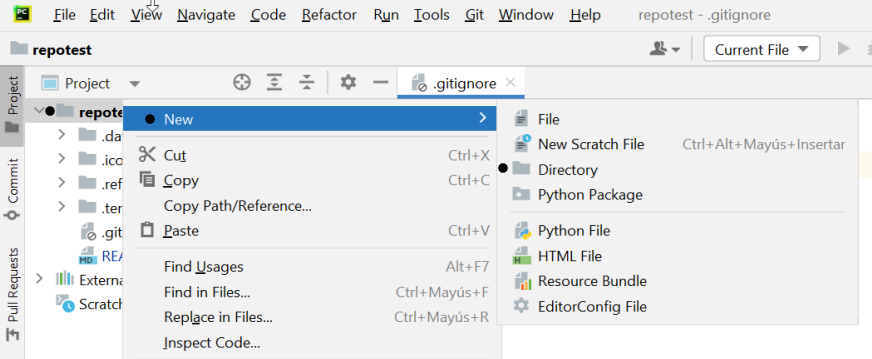

Cree 3 directorios y nombre como `Section01`, `Section02` y `Section03`.

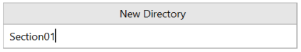

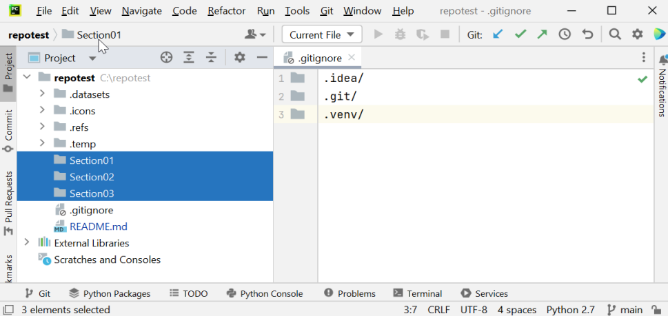

> Por defecto, los directorios locales que no contienen archivos, no son sincronizados dentro de GitHub cuando se realiza _Commit y Push_.

Dentro de cada sección, crearemos las siguientes carpetas, subcarpetas y archivos Readme.md sin utilizar PyCharm, para ello, desde el explorador de archivos de su sistema operativo, cree la estructura dentro de Section01 y luego copie y pegue la estructura de actividades dentro de Section02 y Section03:

> Para la creación de los archivos Readme.md, en el explorador de archivo, active la visualización de extensiones de archivos. Cree archivos de texto Readme.txt y renombre a Readme.md.

* ActividadA
  * Readme.md
  * Graph
    * Readme.md
  * Screenshot
    * Readme.md
* ActividadB
  * Readme.md
  * Graph
    * Readme.md
  * Screenshot
    * Readme.md
* ActividadC
  * Readme.md
  * Graph
    * Readme.md
  * Screenshot
    * Readme.md

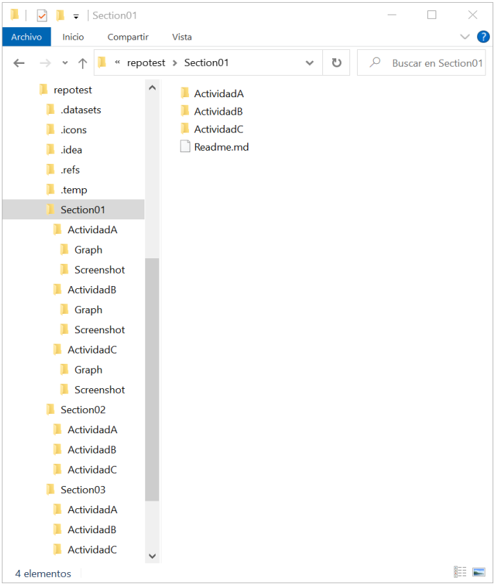

> El proceso de creación de la estructura de directorios se simplifica si es realizado desde el explorador de archivos del sistema operativo, ya que al crear la estructura general de una sección, esta puede ser copiada y pegada a las demás secciones.  

Debido a que la creación de la estructura fue realizada externamente, GitHub desplegará una ventana indicando si quiere visualizar los nuevos archivos creados y si siempre quiere adicionar archivos creados fuera de la IDE. De clic en `Always Add`.

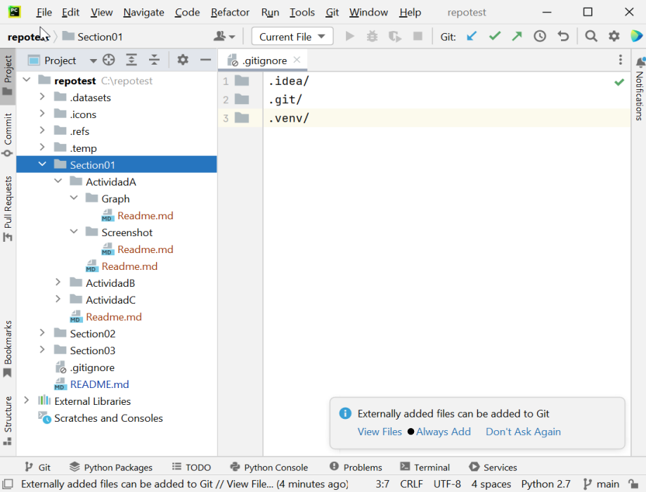

> En el panel izquierdo de proyecto, podrá observar toda la estructura creada y cada carpeta contiene un documento Readme.md de Markdown.

Comente los cambios realizados mediante `Commit` y de clic en `Push` para publicar la estructura y los archivos creados.

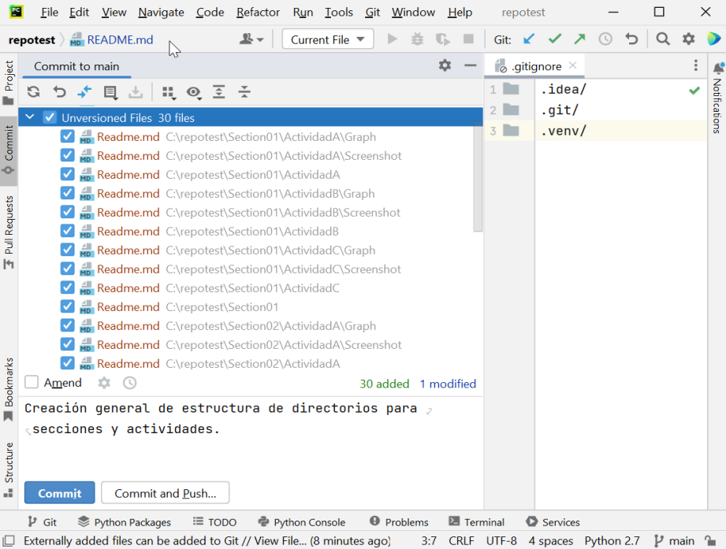
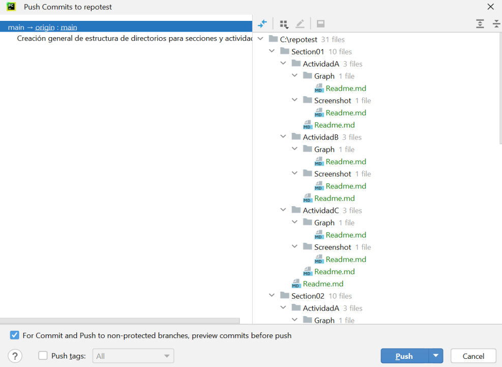

Visualice la estructura creada en la nube desde su navegador de Internet.

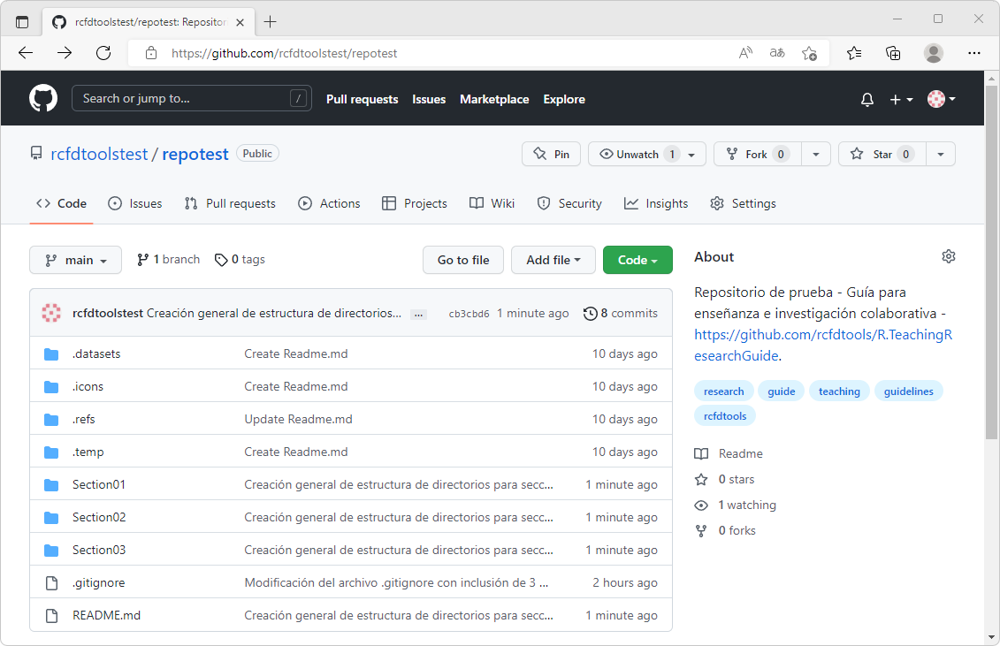
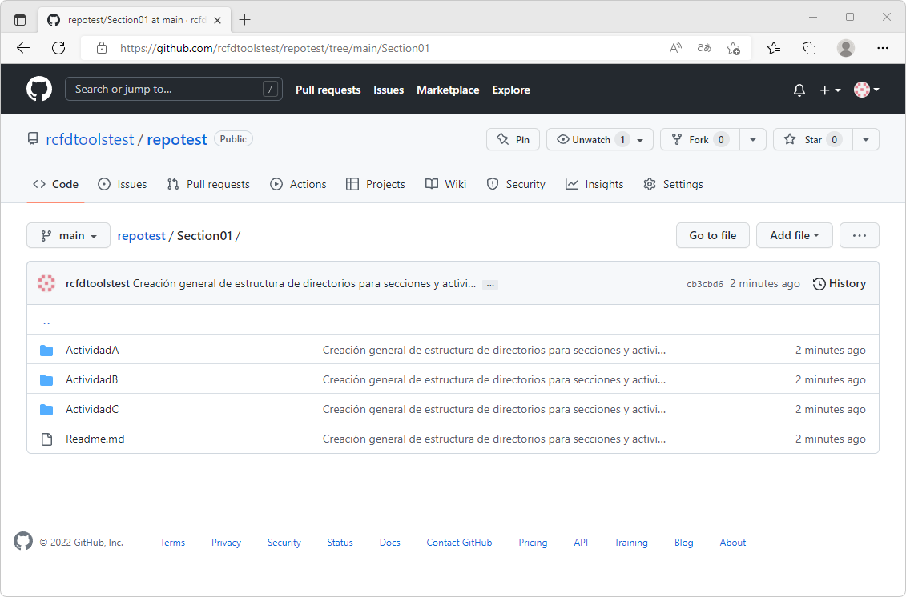
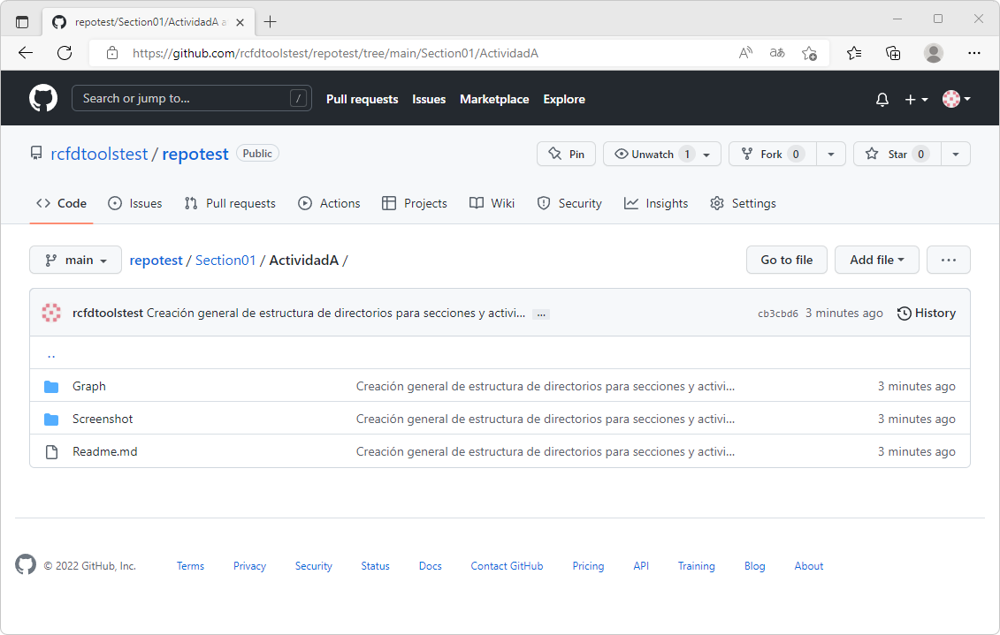


### Edición local de archivos Markdown .md

PyCharm dispone de herramientas de edición de archivos Markdown que facilitan la elaboración de los documentos o las actividades de un repositorio o un proyecto. Para este ejemplo, crearemos una actividad dentro del archivo Readme.md localizado en la carpeta `Section01/ActividadA/` que contendrá algunos de los siguientes elementos:

| Elemento                             | Descripción                                                                                                                                                                                                                                                                                                                                                                                              | Nivel jerárquico / Formato                                            |
|:-------------------------------------|:---------------------------------------------------------------------------------------------------------------------------------------------------------------------------------------------------------------------------------------------------------------------------------------------------------------------------------------------------------------------------------------------------------|:----------------------------------------------------------------------|
| Título de actividad                  | Nombre o título de la actividad.                                                                                                                                                                                                                                                                                                                                                                         | `Nivel ##`                                                            | 
| Keywords / Topics                    | Palabras clave relacionadas con el contenido de la actividad.                                                                                                                                                                                                                                                                                                                                            | Utilizar la notación de código de Markdown                            |
| Imagen cabecera                      | Ilustración, ícono o gráfico que ilustre el alcance de la actividad.                                                                                                                                                                                                                                                                                                                                     | Centrar con marco flotante DIV de HTML                                |
| Alcance                              | Texto descriptivo del alcance general de la actividad.                                                                                                                                                                                                                                                                                                                                                   | Sin título y texto convencional sin nivel jerárquico                  |
| Objetivos                            | Listado de objetivos específicos de la actividad.                                                                                                                                                                                                                                                                                                                                                        | `Nivel ###` Usar viñetas `*`                                          |
| Requerimientos                       | Listado de requerimientos específicos como conceptos y habilidades requeridas, herramientas computacionales, cuentas de usuario, paquetes de datos, actividades preliminares y demás elementos a utilizar durante el desarrollo de la actividad.                                                                                                                                                         | `Nivel ###` Usar viñetas `*`                                          |
| Diagrama general de procesos         | Diagrama de procedimiento o esquema explicando el procedimiento general a seguir. Opcional para clases teóricas y requerido para clases con componente práctico. Puede incluir texto descriptivo general explicando el diagrama.                                                                                                                                                                         | `Nivel ###`                                                           | 
| Conceptos y definiciones generales   | Para clases teóricas este elemento es requerido. Para clases con componente práctico o aplicado, puede incluir opcionalmente la explicación general de conceptos.                                                                                                                                                                                                                                        | `Nivel ###` para título principal y `####` para subniveles siguientes | 
| Procedimiento general o detallado    | Explicación de procedimientos paso a paso para explicar un fenómeno, un procedimiento, una rutina o cualquier subgrupo de actividades que requieran de una secuencia específica. Se desarrollan de forma similar a la secuencia explicada en el diagrama general de procedimiento.                                                                                                                       | `Nivel ###`                                                           | 
| Actividades complementarias:pencil2: | Listado de actividades adicionales a la desarrolladas en clase que deben ser desarrolladas por cada estudiante. Se relacionan en una tabla indicando un orden consecutivo.                                                                                                                                                                                                                               | `Nivel ###`                                                           | 
| Preguntas y respuestas Q&A           | Preguntas y respuestas generales sobre los contenidos de la activad o el microcontenido.                                                                                                                                                                                                                                                                                                                 | `Nivel ###`                                                           | 
| Referencias                          | Referencias bibliográficas o documentales generales mediante la citación de libros, enlaces, repositorios, artículos, manuales, normas y demás elementos relacionados con la actividad. Puede incluir citaciones a discusiones donde se ha resuelto un fallo o se ha dado respuesta a una solicitud específica.                                                                                          | `Nivel ###`                                                           | 
| Control de versiones y autores       | En este elemento se relacionan en una tabla las versiones de creación y actualización del contenido de la actividad o clase, incluyendo una descripción general de las nuevas implementaciones, correcciones, adendos; también se citan el autor principal o los autores cuando el contenido es desarrollado por varios profesores y se indica el total en horas dedicadas en cada fecha por cada autor. | `Nivel ###`                                                           | 
| Textos a pie                         | Citación de licencia, cláusula y condiciones de uso. Invitación a seguir el curso y al autor principal.                                                                                                                                                                                                                                                                                                  | Texto en cursiva                                                      | 
| Panel de navegación                  | Anterior / Inicio / Ayuda / Siguiente. El botón _Inicio_ dirige al estudiante a la raíz de la documentación _Wiki_, el botón _Ayuda_ dirije al estudiante a la entrada específica de la discusión para preguntas y respuestas. Los enlaces _Anterior_ y _Siguiente_ dirigen al estudiante a las actividades inmediatas.                                                                                  | Tabla de una línea                                                    | 
| Notas a pie                          | Listado de notas a pie citadas dentro de la actividad. Para citar utilice `[^1]` y para la descripción de la citación al pie del documento utilice `[^1]:` cambiando 1 por el número del consecutivo de la citación.                                                                                                                                                                                     | No requiere formato, se aplica automáticamente                        |

1. Para incluir el título de la actividad, ingrese el texto _"Actividad A - Edición de archivos Markdown" o _"Actividad 1 - Edición de archivos Markdown", seleccione el texto y ubique el puntero del Mouse sobre el texto, aparecerá una barra de herramientas flotante que le permitirá definir los siguientes estilos de texto:

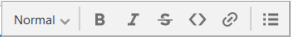

| Formato               | Descripción      | Atajo                                         |
|-----------------------|------------------|-----------------------------------------------|
| normal, H1, H2.... H6 | Nivel de título  |                                               |
| **B**                 | Negrilla         | <kbd>Ctrl</kbd>+<kbd>B</kbd>                  |
| _I_                   | Itálica          | <kbd>Ctrl</kbd>+<kbd>I</kbd>                  |
| ~~S~~                 | Tachado          | <kbd>Ctrl</kbd>+<kbd>Shift</kbd>+<kbd>S</kbd> |
| <>                    | Código           | <kbd>Ctrl</kbd>+<kbd>Shift</kbd>+<kbd>C</kbd> |
| :link:                | Hiperenlace      | <kbd>Ctrl</kbd>+<kbd>Shift</kbd>+<kbd>U</kbd> |
| List                  | Listas sin orden |                                               |

Seleccione subtítulo H2, podrá observar que automáticamente se incluyen las marcas ## correspondientes al nivel de título 2 de HTML y que el texto cambia de color a púrpura y la marca ## a color azul. En la parte superior derecha de la ventana de edición del archivo Readme.md, encontrará 3 formas de visualizar el documento: visualización de fuente, visualización de fuente con vista preliminar y solo vista preliminar.

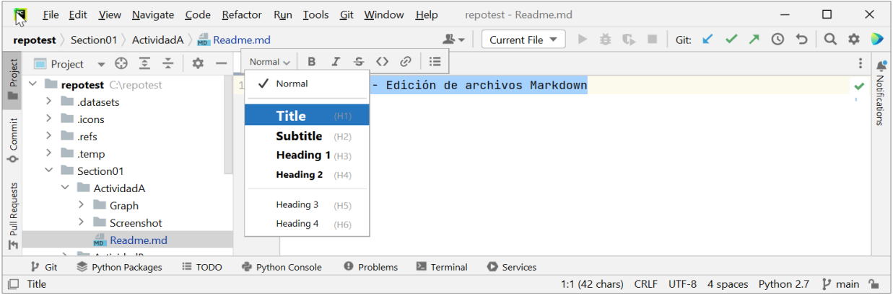
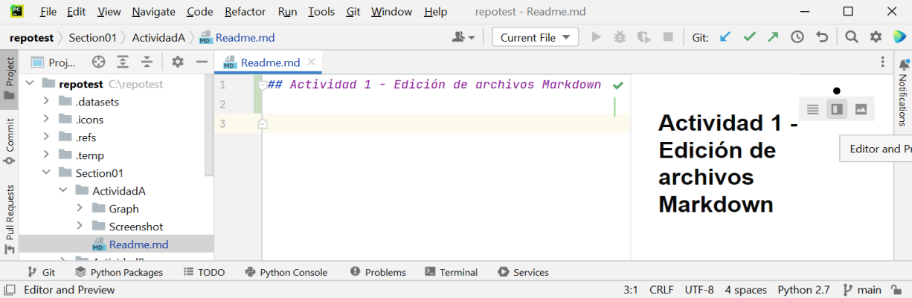

2. Para incluir las palabras clave, al final del título ingrese dos espacios y teclee <kbd>Enter</kbd> para crear un salto de línea sencillo de Markdown sin tener que utilizar el salto de línea `<br>` de HTML. Escriba la palabra "Keywords:", luego agregue diferentes palabras que describan la actividad sin separarlas con comas, p. ej.: Markdown Title Table Hyperlink Image. Seleccione la primera palabra y oprima <kbd>Ctrl</kbd>+<kbd>Shift</kbd>+<kbd>C</kbd>, repita este procedimiento para cada palabra o de doble clic en la palabra para que esta se resalte y seleccione `<>`.

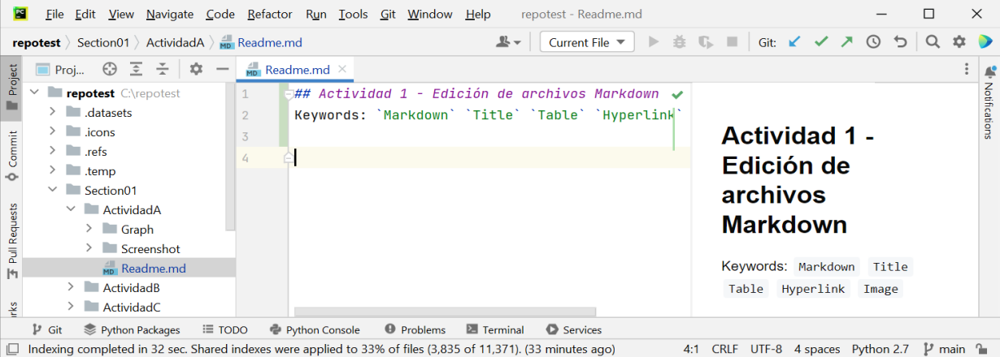

> Como puede observar, cada tipo de marca Markdown es representada en colores que facilitan la interpretación y escritura del documento. Para formato de código simple, el color de representación es verde.

Durante el proceso de edición, el texto puede superar el ancho del espacio de edición en la ventana, lo que impide que no se visualice completamente el contenido del documento. Para ajustar el contenido al ancho disponible en pantalla, en el menú `View` u oprimiendo <kbd>Ctrl</kbd>+<kbd>V</kbd>, de clic en el grupo de opciones _Active Editor_ y active _Soft-Wrap_. Cuando esté editando código, podrá también activar _Show Whitespaces_ para visualmente identificar las indentaciones.

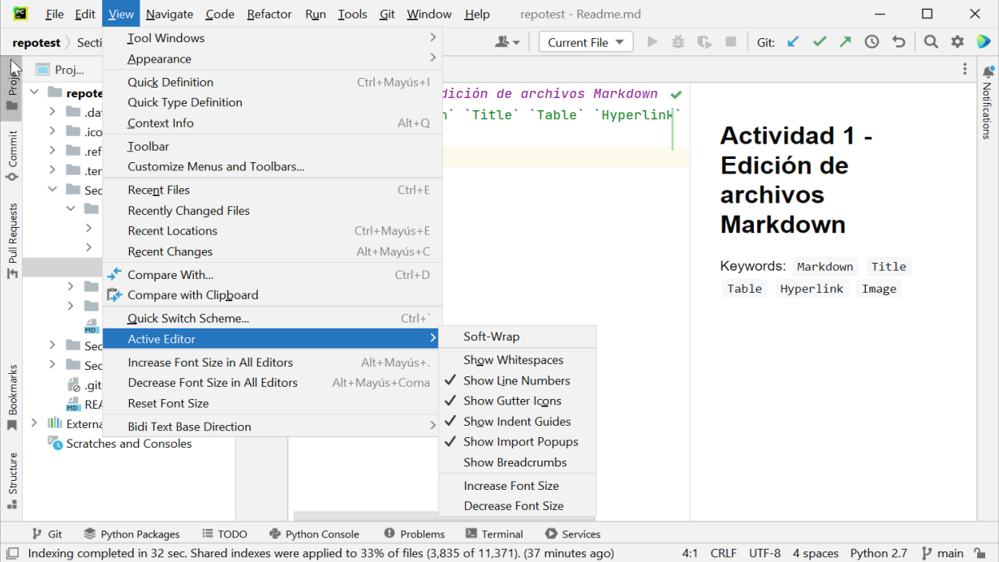

Ahora podrá visualizar todo el texto ajustado a la ventana.  
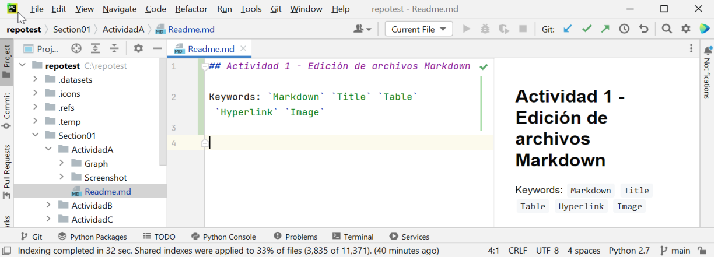

3. La inserción de imágenes puede ser realizada con <kbd>Alt</kbd>+<kbd>Insert</kbd> e Image o con <kbd>Ctrl</kbd>+<kbd>U</kbd>. Para el ejemplo, insertaremos una imagen localizada en Internet en la ruta https://archive.org/details/C-1995-2394.

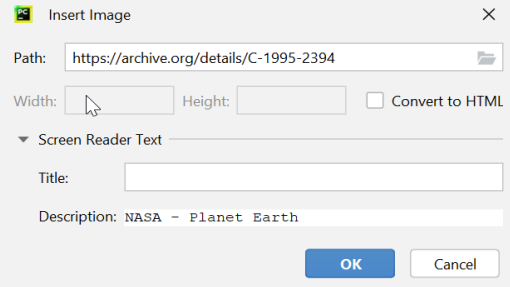
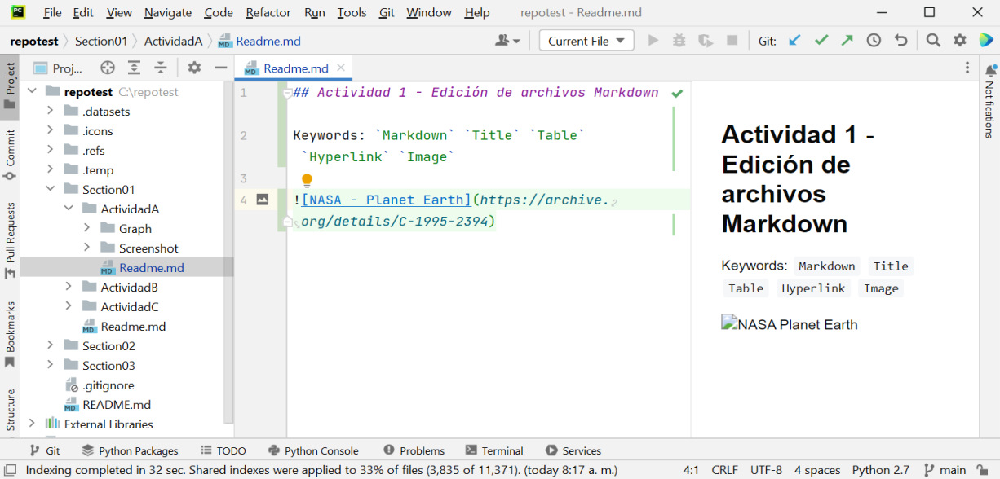

> Como observa en pantalla, la imagen remota no puede ser previsualizada debido a que se encuentra en Internet. PyCharm permite la previsualización de imágenes que se encuentran almacenadas localmente en disco a partir de rutas absolutas o relativas.

Desde https://archive.org/details/C-1995-2394, descargue la imagen en el formato disponible JPEG. Guarde la imagen en la ruta 

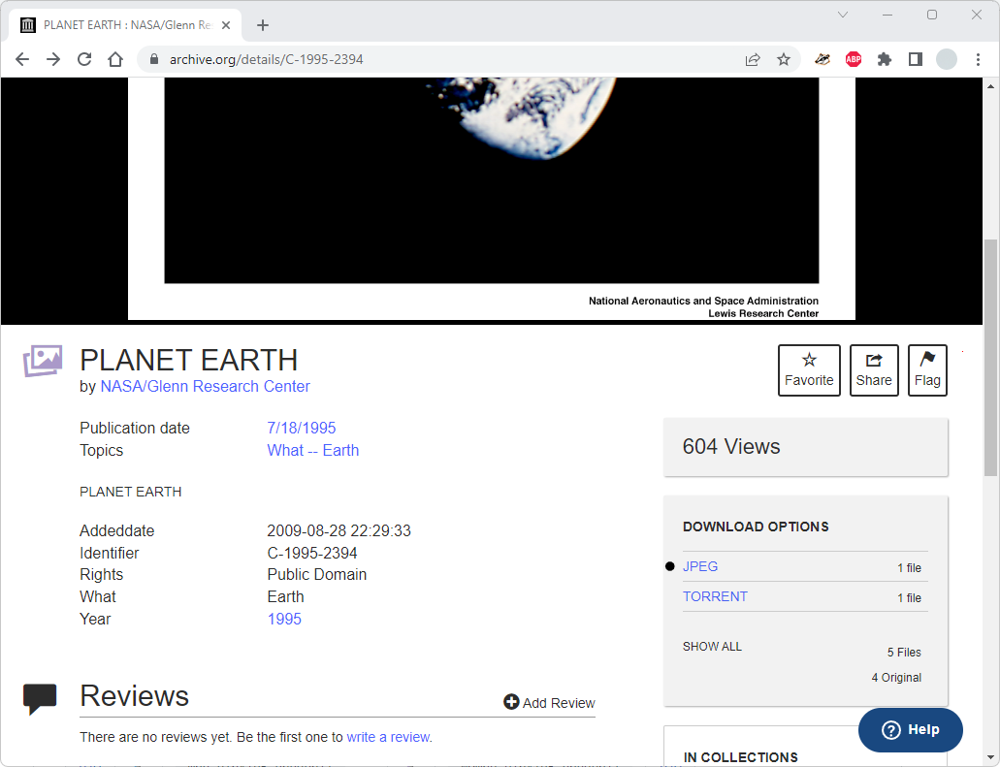
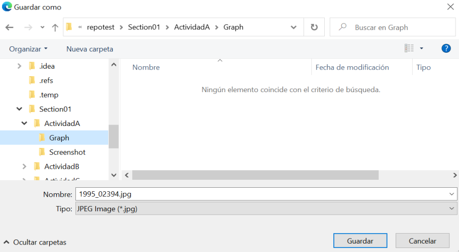

> Se recomienda el uso de rutas relativas para que al clonar el repositorio, la vinculación a las imágenes corresponda a las del clon y no a las del repositorio original.

En el archivo Readme.md, modifique 

``

por 

``

Al final de la línea de texto de la imagen, teclee dos veces <kbd>Enter</kbd> para insertar un salto de línea y una línea nueva, verifique la previsualización.

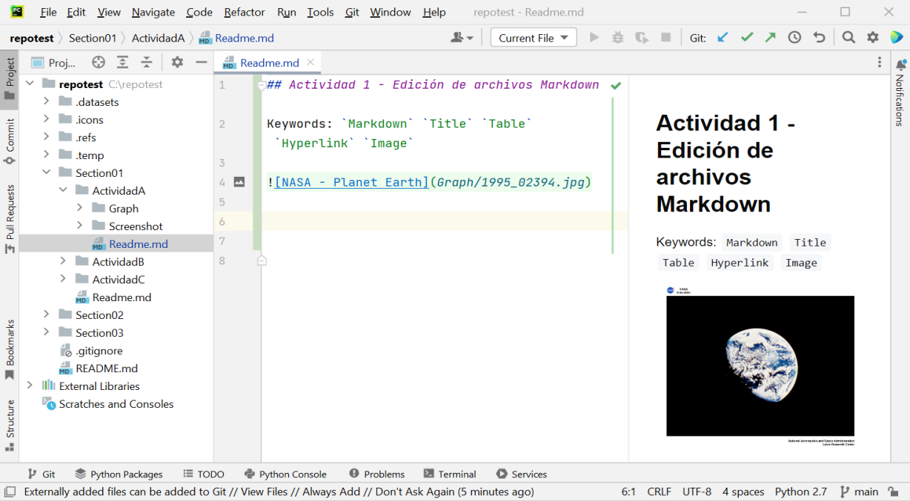

> Si la imagen se encuentra en un nivel superior dentro del árbol de directorios, con `../` podrá regresar al directorio anterior. Para este ejemplo, `../` regresaría a la raíz de Section01 y `../../` a la raíz principal del repositorio. 

Para ajustar el ancho de la imagen p. ej. a 200 píxeles de ancho, podrá utilizar el llamado de HTML ``

> En HTML, los tamaños pueden ser definidos en diferentes unidades, p. ej. en píxeles `200p` o en porcentajes `50%`.

Para centrar la imagen en pantalla, el código de Markdown o de HTML, deberá incluirse dentro de un marco flotante de HTML o `<div>`, así:

```
<div align="center">

</div>
```

Para incluir el texto de referencia de la fuente original de la imagen, podrá utilizar saltos de línea `<br>` y subíndices `<sub>` de HTML, así:

```
<div align="center">
<br>
<sub>Planet Earth / Nasa Aeronautics and Space Administration / Lewis Research Center / https://archive.org/details/C-1995-2394</sub>
</div>
```

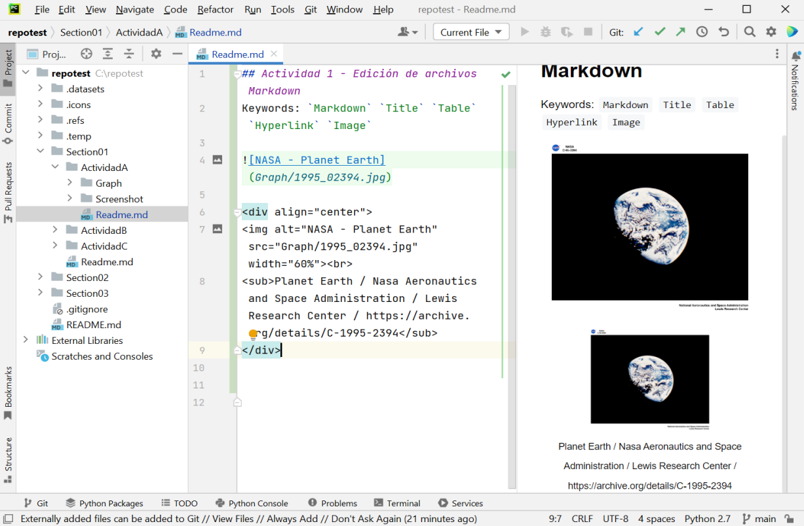

Realice el Commit / Push de Git y previsualice el resultado en su navegador de Internet.

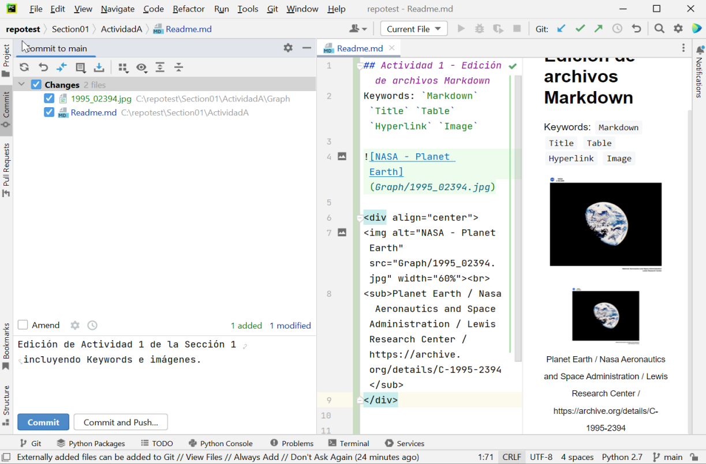
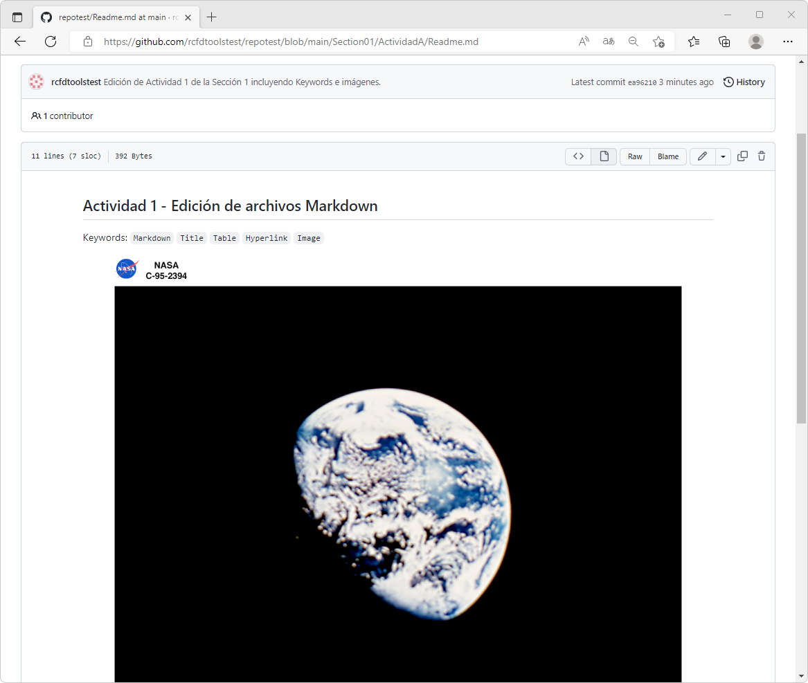
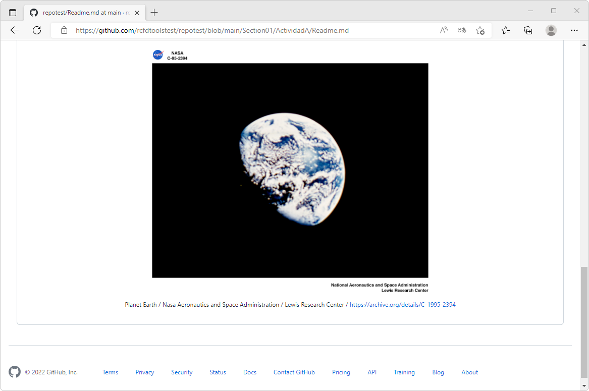

4. Para insertar tablas oprima <kbd>Alt</kbd>+<kbd>Insert</kbd> y seleccione `Table`, defina con el puntero del mouse el número de filas y columnas, p. ej. 3x2 para crear una lista de actividades a desarrollar.

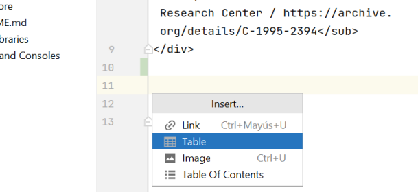
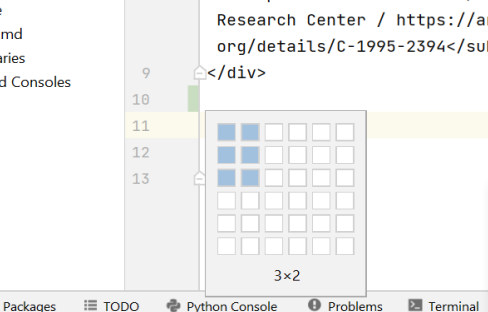
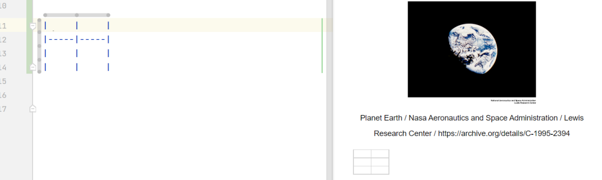

Modifique la tabla ingresando los textos ejemplo presentados en la siguiente imagen.

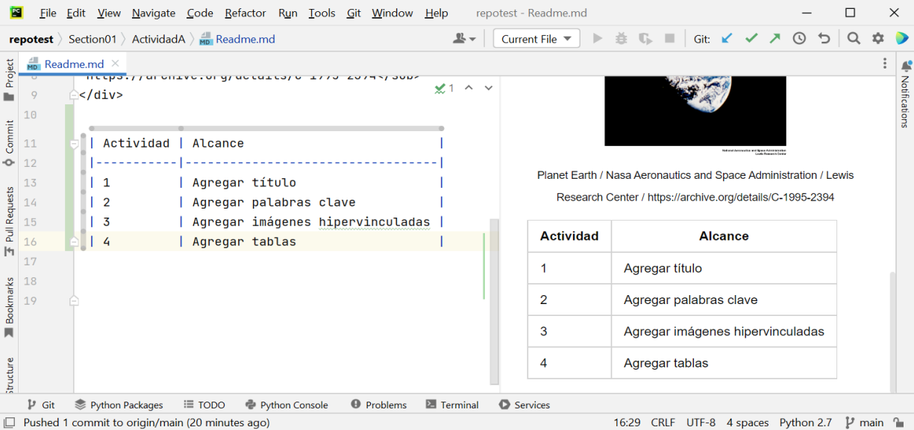

Publique y visualice en GitHub.


### Actividades complementarias:pencil2:

En la siguiente tabla se listan las actividades complementarias a ser desarrolladas por el estudiante.

|  #  | Alcance                                                                                                                                                                                                                 |
|:---:|:------------------------------------------------------------------------------------------------------------------------------------------------------------------------------------------------------------------------|
|  1  | Cree una actividad que incluya varias imágenes, tablas, listas de objetivos, lista de requerimientos y lista de referencias.                                                                                            |
|  2  | A través de una tabla, cree una barra o panel de navegación que permita ir a la actividad anterior, inicio del repositorio y actividad siguiente.                                                                       |
|  3  | Utilizando cualquier herramienta de diagramación (Draw.io, Microsoft Visio, PowerPoint), cree un diagrama de flujo o de procesos, convierta a formato Portable Network Graphic .png e inserte como una imagen centrada. |


### Preguntas y respuestas Q&A

| Pregunta                                                                                                                                                                   | Respuesta                                                                                                                                                                                                                                                                                                                                                                                                                                                                              |
|----------------------------------------------------------------------------------------------------------------------------------------------------------------------------|----------------------------------------------------------------------------------------------------------------------------------------------------------------------------------------------------------------------------------------------------------------------------------------------------------------------------------------------------------------------------------------------------------------------------------------------------------------------------------------|
| ¿Luego de ejecutado un _Commit / Push_, puedo deshacer los cambios en el repositorio y retornar a una versión previa?                                                      | Sí, desde el gestor de Git localizado en la parte inferior izquierda de PyCharm, se pueden revertir o eliminar las modificaciones realizadas y publicadas cronológicamente. Es importante tener en cuenta que la reversión o la eliminación de cambios afectará el repositorio local y el repositorio en la nube, una vez se vuelva a publicar un nuevo cambio. Se recomienda crear una copia comprimida de la carpeta local del repositorio, antes de realizar este tipo de acciones. |
| Incluí en mi repositorio un archivo de más de 100 MB y al realizar el _Push_ GitHub devuelve un error indicando que no puede actualizar los cambios. ¿Cuál es la solución? | Lo primero es crear una copia comprimida local del repositorio, luego revertir o eliminar el _Commit / Push_ donde se incluyó el archivo, luego incluir el archivo en la lista de archivos a ignorar dentro de `.gitignore`, comprimir el archivo en partes de 95 MB y volver a realizar el _Push_ para cargar los archivos comprimidos.                                                                                                                                               | 

> Ayúdame desde este [hilo de discusión](https://github.com/rcfdtools/R.TeachingResearchGuide/discussions/15) a crear y/o responder preguntas que otros usuarios necesiten conocer o experiencias relacionadas con esta actividad.


### Referencias

* https://www.jetbrains.com/help/pycharm/jupyter-notebook-support.html#get-started


### Control de versiones

| Versión    | Descripción                                                                                                                        | Autor                                      | Horas |
|------------|:-----------------------------------------------------------------------------------------------------------------------------------|--------------------------------------------|:-----:|
| 2022.09.01 | Edición local de archivos Markdown .md. Actividades complementarias.                                                               | [rcfdtools](https://github.com/rcfdtools)  |   4   |
| 2022.08.31 | Versión inicial. Exclusión de directorios de control de cambios. Modificación y/o complementación de la estructura de directorios. | [rcfdtools](https://github.com/rcfdtools)  |   4   |

_R.TeachingResearchGuide es de uso libre para fines académicos, conoce nuestra licencia, cláusulas, condiciones de uso y como referenciar los contenidos publicados en este repositorio, dando [clic aquí](../../LICENSE.md)._

_¡Encontraste útil este repositorio!, apoya su difusión marcando este repositorio con una ⭐ o síguenos dando clic en el botón Follow de [rcfdtools](https://github.com/rcfdtools) en GitHub._

| [Anterior](../Setup) | [:house: Inicio](../../Readme.md) | [:beginner: Ayuda / Colabora](https://github.com/rcfdtools/R.TeachingResearchGuide/discussions/15) | [Siguiente]() |
|----------------------|-----------------------------------|----------------------------------------------------------------------------------------------------|---------------|

[^1]: 