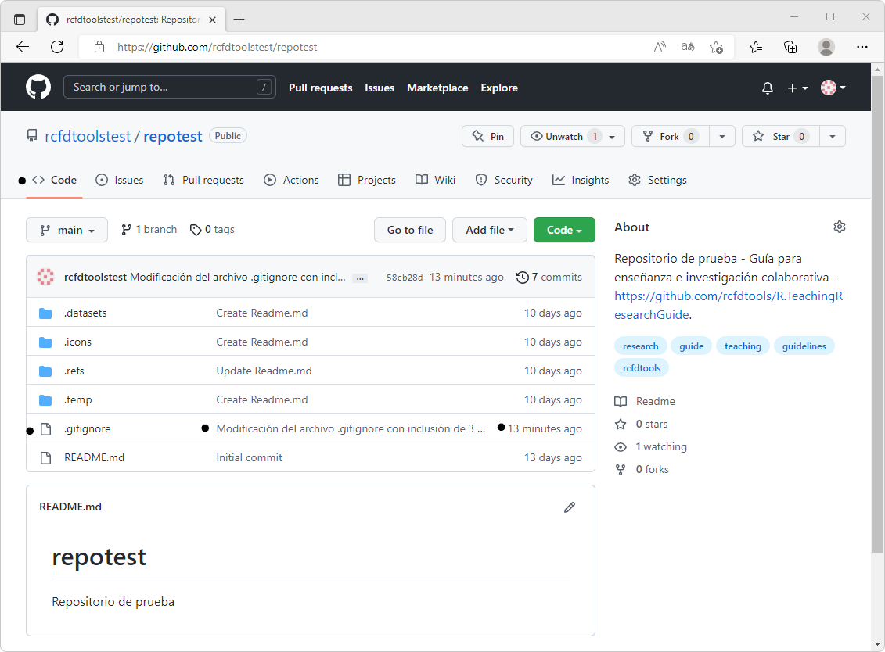

## Edición local de proyectos con PyCharm y publicación en la nube
Keywords: `PyCharm` `Commit` `Push`

Luego de realizada la clonación local del repositorio creado en GitHub, es necesario modificar la estructura de directorios, agregar nuevos archivos y editar o actualizar los archivos existentes.                                                                                                        

<div align="center">
<br><br><br>
</div>


### Objetivos

* Crear y/o modificar el archivo de exclusiones .gitignore.
* Modificar y actualizar la estructura de directorios del proyecto.
* Modificar los archivos Readme.md existentes.
* Crear nuevos archivos.
* Comentar y publicar los cambios realizados.


### Requerimientos

* PyCharm instalado y configurado con repositorio clonado localmente. [:mortar_board:Aprender.](../Setup)


### Exclusión de directorios de control de cambios

Previamente en la sección 1 de este curso, creamos un repositorio que contenía diferentes carpetas generales y en la actividad anterior clonamos esta carpeta localmente como `C:\repotest`. Al revisar la estructura de directorios local, la disponible en la nube y la gestionada por PyCharm, podremos observar que las estructuras son similares, excepto por la carpeta `.idea`, que ha sido generada localmente por PyCharm para el control de configuración del repositorio de forma local.


Para evitar que la carpeta `.idea` sea sincronizada en la nube, es necesario crear y editar el archivo `.gitignore` y agregar esta exclusión. En PyCharm, de clic derecho en la raíz del repositorio `repotest`, seleccione la opción _New / File_, ingrese el nombre `.gitignore` y presione la tecla <kbd>Enter</kbd>. 


Luego de creado el archivo, PyCharm le preguntará si quiere adicionar el archivo a la lista de archivos Git que se incluirán en la sincronización con GitHub, de clic en el botón _Add_ y el archivo quedará abierto para su edición.


Dentro del archivo, agregue las siguientes exclusiones:

```
.idea/
.git/
.venv/
```

> La exclusión `.git/` descartará la sincronización de los archivos temporales locales de control de cambios de Git. La exclusión `.venv/` evitará que los archivos de entornos virtuales de Python creados en el directorio raíz, se sincronicen en la nube.
> 
> Si requiere incluir comentarios dentro del archivo _.gitignore_, utilice almohadilla # al inicio de la línea, p. en. `# Exclusiones generales`.


> En PyCharm, los cambios en los archivos son almacenados automáticamente al cerrar el archivo. Los cambios globales realizados en todos los archivos modificados pueden ser guardados oprimiendo <kbd>Ctrl</kbd>+<kbd>S</kbd>.

> Recuerde que todos los archivos creados localmente que superen un tamaño de 100 MB, deberán ser excluidos de la sincronización o ser comprimidos en múltiples partes de 95 MB.

Para sincronizar el archivo en la nube de GitHub, de clic en el botón `Commit` (ícono verde de aprobación ✓ localizado en la parte superior derecha de la pantalla) u oprima la combinación de teclas <kbd>Ctrl</kbd>+<kbd>K</kbd>. Ingrese comentarios para documentar los cambios realizados en el repositorio y para finalizar de clic en el botón `Commit and Push...`.


PyCharm solicitará que indique el nombre del usuario que realizará la publicación de cambios y su correo electrónico. Ingrese el nombre de su perfil de GitHub, el correo electrónico asociado a su cuenta y de clic en el botón `Set and Commit`.


En la ventana emergente de publicación de comentarios y cargue de archivos podrá observar que se incluirá en la nube el archivo `.gitignore` localizado en `C:\repotest`. De clic en Push.


Luego lanzar el _Push_, podrá observar un mensaje indicando que se ha publicado la modificación.  


En la parte inferior de la ventana, de clic en el ícono _Git_ que le permitirá visualizar el registro histórico detallado de los cambios realizados por Git dentro del repositorio.


Para verificar los cambios realizados en el repositorio, desde su navegador de Internet, verifique el contenido de los archivos del proyecto en la pestaña `<>Code`, podrá observar que se encuentra publicado el nuevo archivo `.gitignore`, los comentarios de la modificación realizada y hace cuanto realizó los cambios.



De clic en el archivo `.gitignore` y visualice su contenido.


> Como pudo observar, no ha sido necesario el uso de la consola de comandos, ni conocer los comandos Git para la modificación y publicación en la nube de los cambios realizados en el repositorio.


### Modificación y/o complementación de la estructura de directorios

Para agregar una carpeta nueva, en la raíz del repositorio o en una carpeta específica, de clic derecho, seleccione la opción _New / Directory_, ingrese el nombre del directorio y teclee <kbd>Enter</kbd>. 


Cree 3 directorios y nombre como `Section01`, `Section02` y `Section03`.


> Por defecto, los directorios locales que no contienen archivos, no son sincronizados dentro de GitHub cuando se realiza Commit y Push.

Dentro de cada sección, crearemos las siguientes carpetas, subcarpetas y archivos Readme.md sin utilizar PyCharm, para ello, desde el explorador de archivos de su sistema operativo, cree la estructura dentro de Section01 y luego copie y pegue la estructura de actividades dentro de Section02 y Section03:

> Para la creación de los archivos Readme.md, en el explorador de archivo, active la visualización de extensiones de archivos. Cree archivos de texto Readme.txt y renombre a Readme.md.

* ActividadA
  * Readme.md
  * Graph
    * Readme.md
  * Screenshot
    * Readme.md
* ActividadB
  * Readme.md
  * Graph
    * Readme.md
  * Screenshot
    * Readme.md
* ActividadC
  * Readme.md
  * Graph
    * Readme.md
  * Screenshot
    * Readme.md


> El proceso de creación de la estructura de directorios se simplifica si es realizado desde el explorador de archivos del sistema operativo, ya que al crear la estructura general de una sección, esta puede ser copiada y pegada a las demás secciones.  

Debido a que la creación de la estructura fue realizada externamente, GitHub desplegará una ventana indicando si quiere visualizar los nuevos archivos creados y si siempre quiere adicionar archivos creados fuera de la IDE. De clic en `Always Add`.


> En el panel izquierdo de proyecto, podrá observar toda la estructura creada y cada carpeta contiene un documento Readme.md de Markdown.

Comente los cambios realizados mediante `Commit` y de clic en `Push` para publicar la estructura y los archivos creados.


Visualice la estructura creada en la nube desde su navegador de Internet.


### Actividades complementarias:pencil2:

En la siguiente tabla se listan las actividades complementarias a ser desarrolladas por el estudiante.

|  #  | Alcance                                                                                                                 |
|:---:|:------------------------------------------------------------------------------------------------------------------------|
|  1  |   |


### Preguntas y respuestas Q&A

| Pregunta                                                                                     | Respuesta                                                                                                                                                                                                                                                              |
|----------------------------------------------------------------------------------------------|------------------------------------------------------------------------------------------------------------------------------------------------------------------------------------------------------------------------------------------------------------------------|
| x       | x |

> Ayúdame desde este [hilo de discusión](https://github.com/rcfdtools/R.TeachingResearchGuide/discussions/15) a crear y/o responder preguntas que otros usuarios necesiten conocer o experiencias relacionadas con esta actividad.


### Referencias

* https://www.jetbrains.com/help/pycharm/jupyter-notebook-support.html#get-started


### Control de versiones

| Versión    | Descripción                                                                                                                          | Autor                                      | Horas |
|------------|:-------------------------------------------------------------------------------------------------------------------------------------|--------------------------------------------|:-----:|
| 2022.08.31 | Versión inicial. | [rcfdtools](https://github.com/rcfdtools)  |  x  |

_R.TeachingResearchGuide es de uso libre para fines académicos, conoce nuestra licencia, cláusulas, condiciones de uso y como referenciar los contenidos publicados en este repositorio, dando [clic aquí](../../LICENSE.md)._

_¡Encontraste útil este repositorio!, apoya su difusión marcando este repositorio con una ⭐ o síguenos dando clic en el botón Follow de [rcfdtools](https://github.com/rcfdtools) en GitHub._

| [Anterior](../Setup) | [:house: Inicio](../../Readme.md) | [:beginner: Ayuda / Colabora](https://github.com/rcfdtools/R.TeachingResearchGuide/discussions/15) | [Siguiente]() |
|------------------|-----------------------------------------------------------------------------|----------------------------------------------------------------------------------------------------|---------------|

[^1]: 