## Edición local de repositorios GitHub con VS Code
Keywords: `VS-Code` `Markdown` `GitHub-Repositories` `GitHub-Pull-Requests-and-Issues`

Luego de realizada la instalación y configuración, podrás gestionar localmente repositorios de GitHub, revisar los controles de cambios realizados sobre los archivos de los proyectos, comentar y publicar las actualizaciones en la nube.

   

### Objetivos

* Abrir repositorios remotos.
* Modificar archivos, revisar el control de cambios, comentar y publicar cambios en la nube.  

### Requerimientos

* Cuenta y repositorio [GitHub](https://github.com/). [:mortar_board:Aprender.](../../Section01/GitHubRepository)
* Instalación y configuración de VS Code. [:mortar_board:Aprender.](../Setup)

### Procedimiento general

1. En VS Code, de clic en el ícono `Open a Remote Window` localizado en la esquina inferior izquierda de la ventana, luego en la parte superior, seleccione la opción `Open Remote Repository` y en las opciones emergentes seleccione `Open Repository from GitHub`

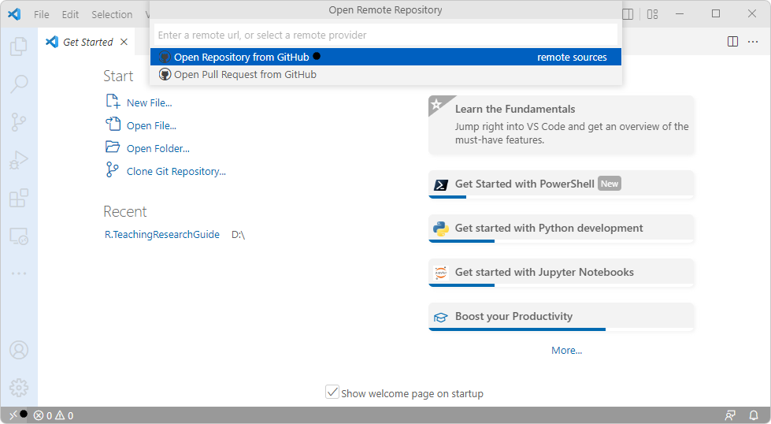

La extensión instalada previamente requiere de la autorización del usuario para realizar la conexión, de clic en el botón `Allow`

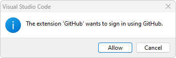

En la ventana del navegador de Internet, de clic en el botón Authorize Visual-Studio-Code.

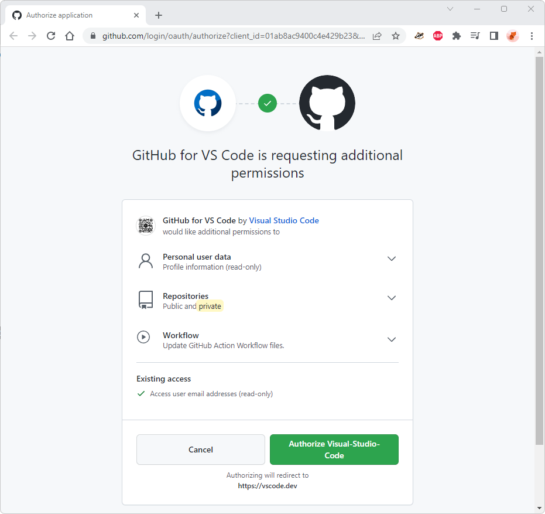

Luego, de clic en el botón `Use GitHub Mobile` para realizar la autorización desde su teléfono móvil a través de la App de GitHub.

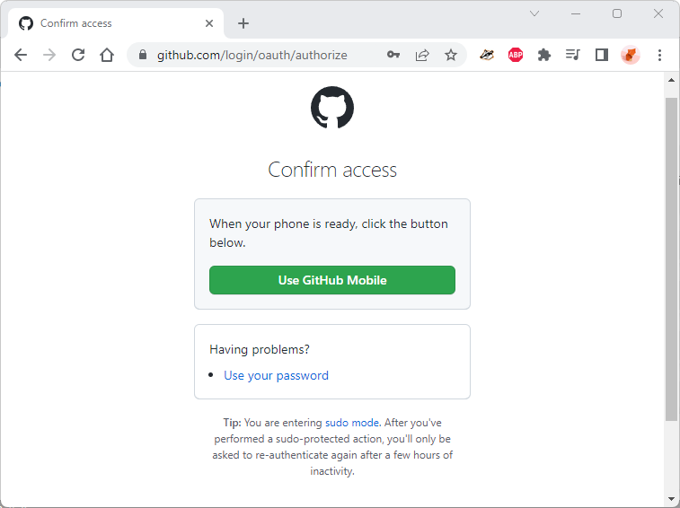

Ingrese el código de verificación en su teléfono

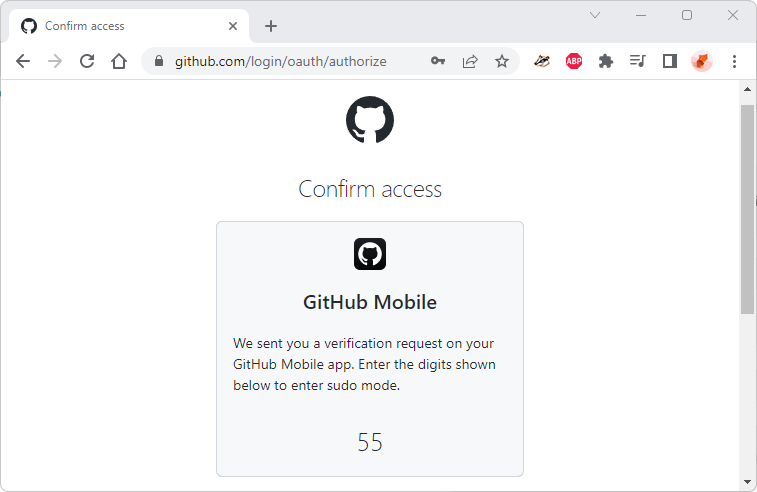

Una vez realice la verificación retornará automáticamente a VS Code y podrá visualizar los repositorios disponibles de su usuario.

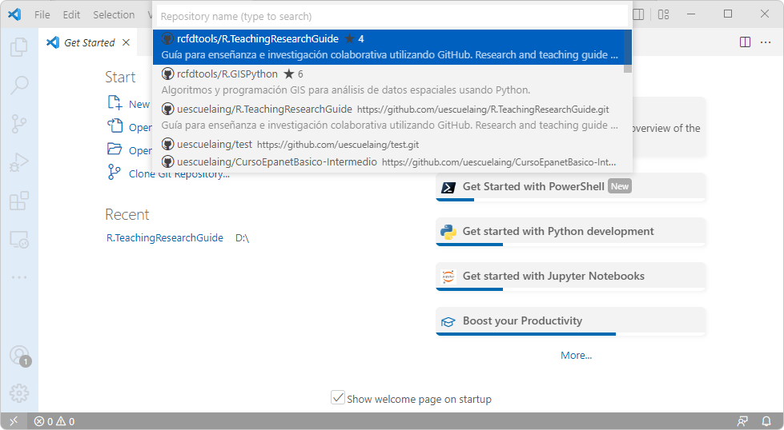

Para el ejemplo, he accedido a los repositorios de mi cuenta de usuario [rcfdtools](https://github.com/rcfdtools) de GitHub, en caso de que requiera acceder a una cuenta diferente, en la ventana principal de CS Code, de clic en el botón de usuarios localizado a la izquierda y de clic en `Sign Out`

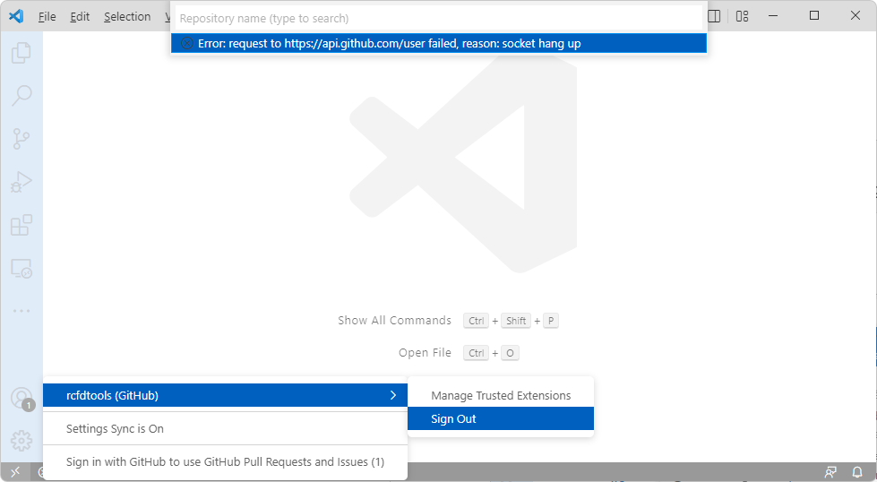

Luego, de clic en el botón de usuario y seleccione la opción `Sign in to Sync Settings`.

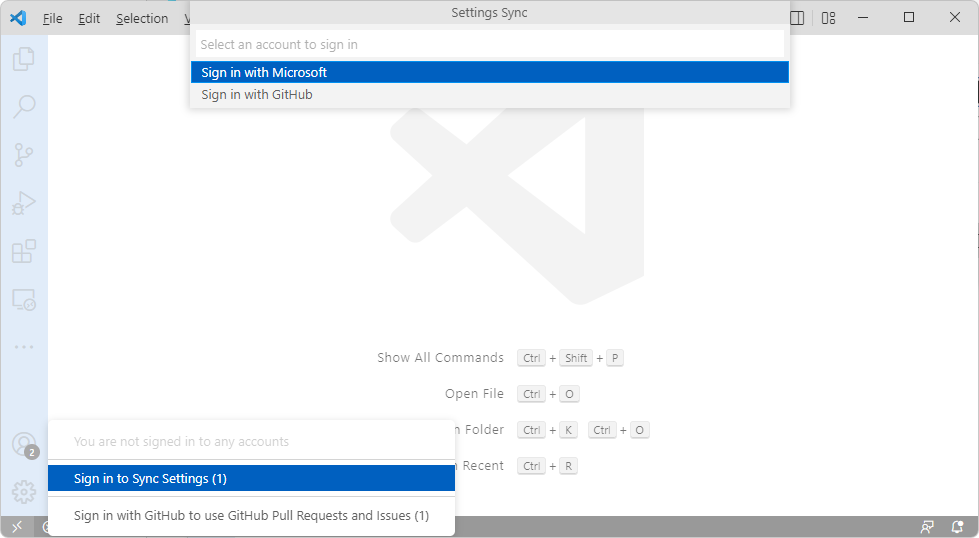

En la parte superior, de clic en la opción `Sign in with Github`

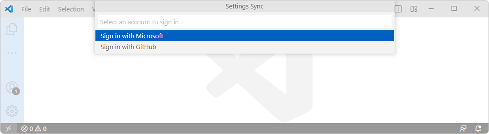

En la ventana de autorización para el usuario `rcfdtoolstest` de clic en `Authorize Visual-Studio-Code`

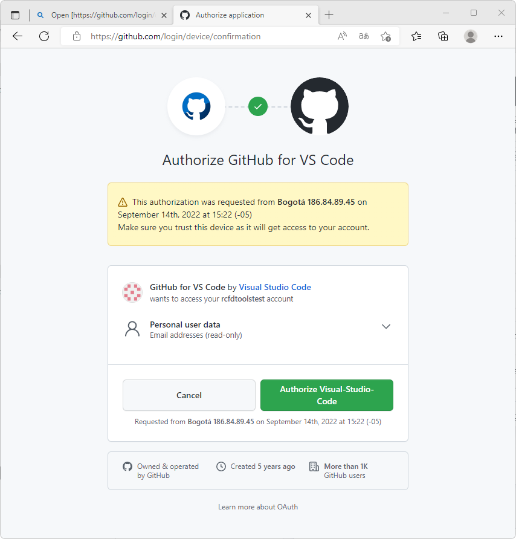
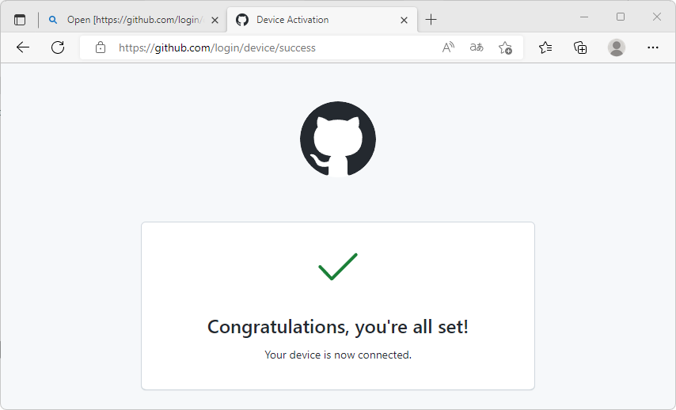

> En caso de que sea redirigido a su cuenta principal en el navegador de Internet, establezca por defecto otro navegador, ingrese a GitHub con su cuenta de prueba y luego vuelva a realizar la autorización de ingreso desde VS Code cancelando la verificación de acceso y seleccionando la opción de verificación de forma alternativa desde el enlace https://github.com/login/device. 

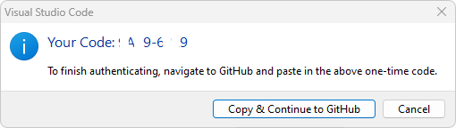
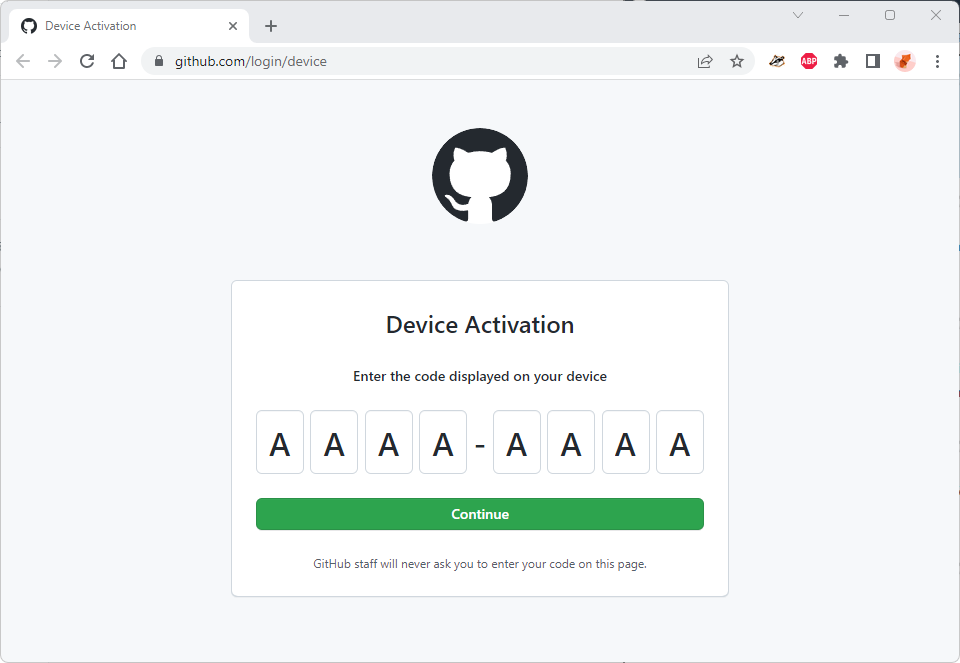

Verifique el acceso a su cuenta 

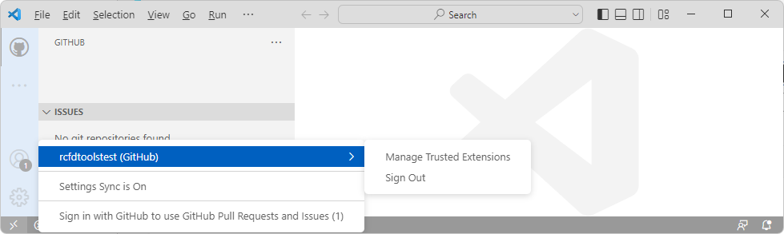

Nuevamente, de clic en el ícono `Open a Remote Window` localizado en la esquina inferior izquierda de la ventana, luego en la parte superior, seleccione la opción `Open Remote Repository` y en las opciones emergentes seleccione `Open Repository from GitHub`. Seleccione el repositorio `rcfdtoolstest`

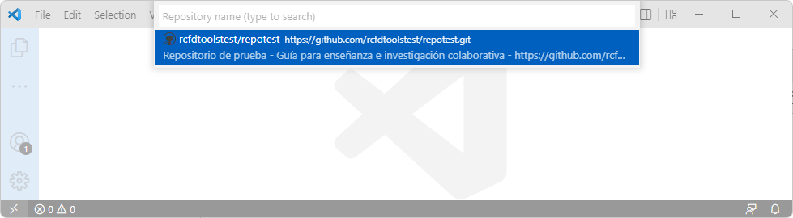

De clic en el botón `Trust Folder & Continue`, podrá observar que ahora se visualizan en el explorador de proyecto, todos los archivos y directorios del repositorio.

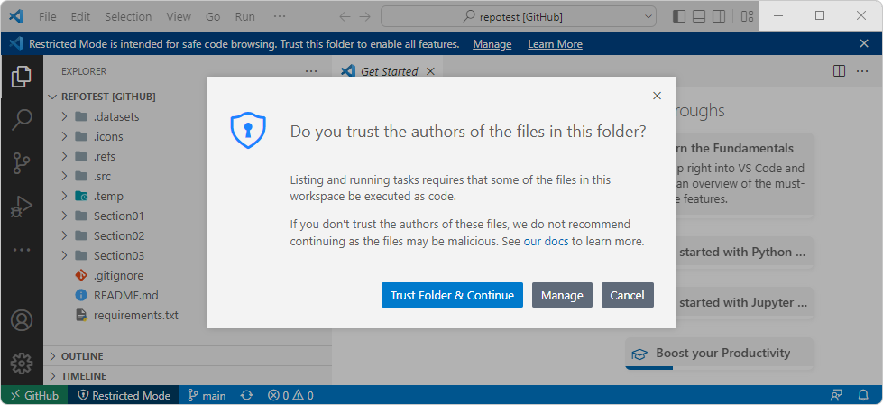

2. Abra el archivo principal README.md, verifique su contenido.

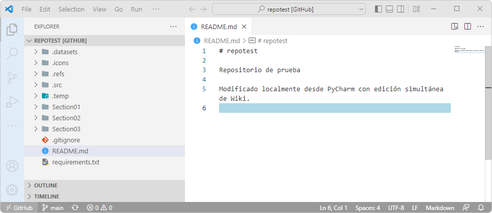

Verifique el contenido publicado del archivo desde Internet a través de la dirección https://github.com/rcfdtoolstest/repotest

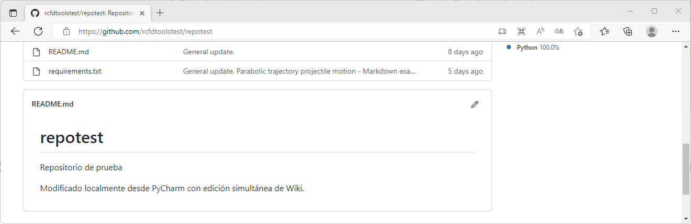

3. Ingrese al final del texto existente "Modificado localmente desde VS Code." y oprima <kbd>Ctrl</kbd>+<kbd>S</kbd> para guardar los cambios.

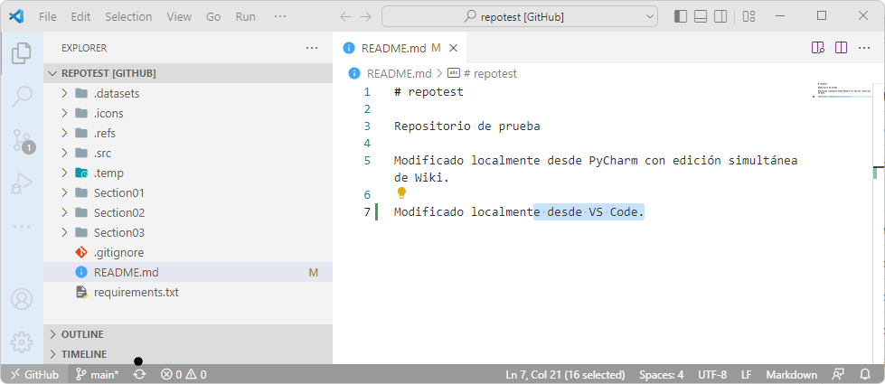

4. En la parte inferior izquierda de la ventana de VS Code, podrá observar que se encuentra trabajando en un proyecto GitHub y que se encuentra en la rama principal o _main_. De clic en el botón Sync (Pull & Push) cuyo ícono tiene la apariencia de dos flechas semicirculares. Automáticamente, podrá observar que en las opciones de control de archivos fuente, aparece el archivo README.md con las modificaciones realizadas.

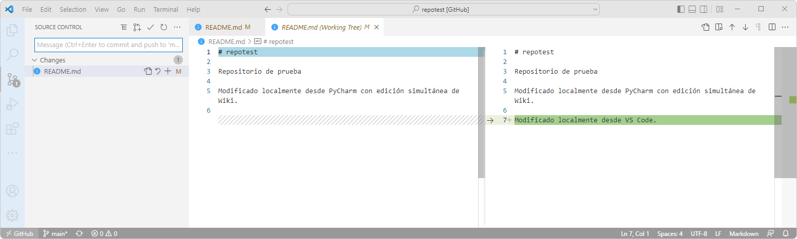

5. En la parte superior del panel _Source Control_, ingrese los comentarios de actualización y luego oprima las teclas <kbd>Ctrl</kbd>+<kbd>Enter</kbd> para realizar la publicación comentada de cambios en GitHub.

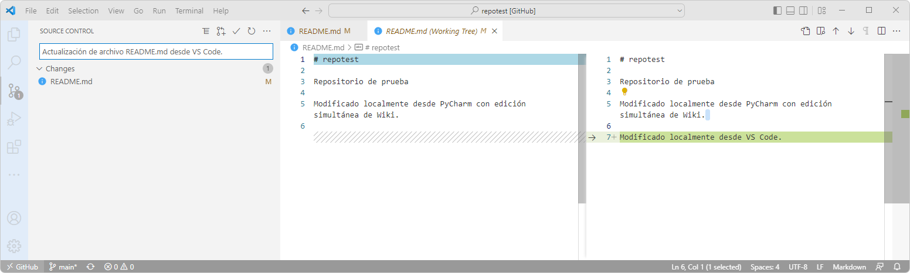

Verifique el contenido actualizado del archivo desde Internet a través de la dirección https://github.com/rcfdtoolstest/repotest

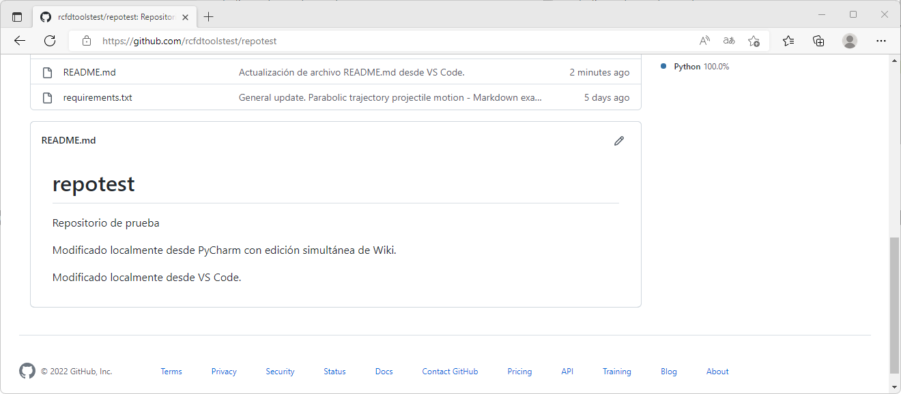

De esta forma podrá modificar, comentar y actualizar cualquier archivo de sus repositorios.

### Actividades complementarias:pencil2:

En la siguiente tabla se listan las actividades complementarias a ser desarrolladas por el estudiante.

|  #  | Alcance                                                                                                      |
|:---:|:-------------------------------------------------------------------------------------------------------------|
|  1  | Realice la conexión remota a uno o varios repositorios.                                                      |
|  2  | Edite archivos Markdown, revise los controles de cambios, comente y publique las actualizaciones realizadas. |

### Preguntas y respuestas Q&A

| Pregunta                                                                  | Respuesta                                                                                                                                                                                                                                                                                 |
|---------------------------------------------------------------------------|-------------------------------------------------------------------------------------------------------------------------------------------------------------------------------------------------------------------------------------------------------------------------------------------|
| ¿Se pueden gestionar simultáneamente múltiples cuentas GitHub de usuario? | No, VS Code solo permite la gestión de todos los repositorios asociados a una única cuenta, sin embargo, podrá cerrar la sesión de la cuenta de usuario, cerrar el editor y las carpetas de proyecto vinculadas e ingresar desde otra cuenta para realizar cambios en otros repositorios. |

> Ayúdame desde este [hilo de discusión](https://github.com/rcfdtools/R.TeachingResearchGuide/discussions/25) a crear y/o responder preguntas que otros usuarios necesiten conocer o experiencias relacionadas con esta actividad.

### Referencias

* [Referencias generales](../../References.md)
* [Abreviaturas y definiciones generales](../../Definitions.md)
* [Consejos y buenas prácticas de desarrollo colaborativo](../../BestPractice.md)
* https://marketplace.visualstudio.com/publishers/GitHub
* https://code.visualstudio.com/docs/editor/github

### Control de versiones

| Versión    | Descripción                             | Autor                                      | Horas |
|------------|:----------------------------------------|--------------------------------------------|:-----:|
| 2022.09.14 | Versión inicial. Procedimiento general. | [rcfdtools](https://github.com/rcfdtools)  |   3   |

_R.TeachingResearchGuide es de uso libre para fines académicos, conoce nuestra licencia, cláusulas, condiciones de uso y como referenciar los contenidos publicados en este repositorio, dando [clic aquí](../../LICENSE.md)._

_¡Encontraste útil este repositorio!, apoya su difusión marcando este repositorio con una ⭐ o síguenos dando clic en el botón Follow de [rcfdtools](https://github.com/rcfdtools) en GitHub._

| [Anterior](../Setup) | [:house: Inicio](../../Readme.md) | [:beginner: Ayuda / Colabora](https://github.com/rcfdtools/R.TeachingResearchGuide/discussions/25) | [Siguiente]() |
|----------------------|-----------------------------------|----------------------------------------------------------------------------------------------------|---------------|

[^1]: 