# 1.5. Creación y gestión en línea de repositorios y documentos en GitHub
Keywords: `Markdown` `HTML` `Repository` `.gitignore` `Readme.md` `Insights` `Community Standards`

En esta actividad aprenderá a crear y gestionar repositorios en GitHub directamente desde el navegador de Internet.

<div align="center">
<br><br><br>
</div>
                                                                                                                                                      

## Objetivos

* Crear y administrar una cuenta en Github.
* Crear y configurar mi primer repositorio.
* Crear la estructura básica de carpetas de un repositorio dependiendo de su propósito.
* Crear y editar en línea archivos Markdown Readme.md.
* Participar colaborativamente en la creación de un archivo de referencias de otro proyecto.


## Requerimientos

* Cuenta de correo personal.
* Micro-currículo de un curso o una investigación organizado en dos niveles.
* Conceptos generales del lenguaje de marcas Markdown. [:mortar_board:Aprender.](../Markdown)


## Creación de usuario

1. Ingrese a https://github.com/ y de clic en la opción `Sign up`


2. En la ventana de registro, ingrese su dirección de correo electrónico, establezca una contraseña segura, defina su nombre de usuario, indique con `y/n` si desea recibir notificaciones por correo y de clic en el botón `Continue`. Para este ejemplo, crearé la cuenta de usuario `rcfdtoolstest`.

> En la ventana de creación aparecerán mensajes indicando si la cuenta de correo utilizada ya está siendo utilizada por otro usuario, password válido y nombre disponible para la creación del usuario GitHub.  
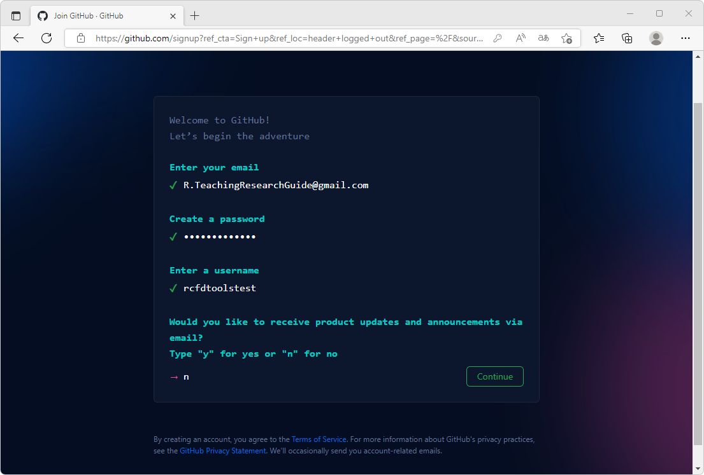

> **Recomendación de correo asociado**: debido a que su cuenta de GitHub es personal y el ingreso de sesión y recuperación de contraseñas estará regido por su dirección de correo, se recomienda crear una cuenta de correo personal en Outlook o Gmail y crear su cuenta GitHub utilizando esta dirección. Luego de generada la cuenta, podrá asociar su cuenta de correo corporativo desde la [configuración de cuenta de correo](https://github.com/settings/emails).
> 
> **Recomendación para nombre de usuario**: utilice un nombre corto que describa su identidad profesional o su especialidad, p. ej. si ud es experto en proyectos relacionados con física cuántica, su nombre de usuario podrá ser algo como `quantumphysicsprj`, siempre y cuando este nombre no haya sido tomado por otro usuario. Por privacidad y para dar un carácter más profesional a su espacio colaborativo en GitHub, **No es recomendable usar su nombre** o información personal. Si es propietario de una empresa, no utilice el nombre corporativo para crear su perfil, cree un espacio compartido colaborativo a través de una Organización de GitHub.  

3. Para terminar con la creación de cuenta, verifique la creación de su cuenta seleccionando o solucionando el rompecabezas que aparece en pantalla y de clic en el botón `Create account`. Será enviado un código de verificación a su cuenta de correo.


4. Ingrese el código de verificación recibido en su cuenta de correo, automáticamente será dirigido a la raíz de su espacio GitHub.

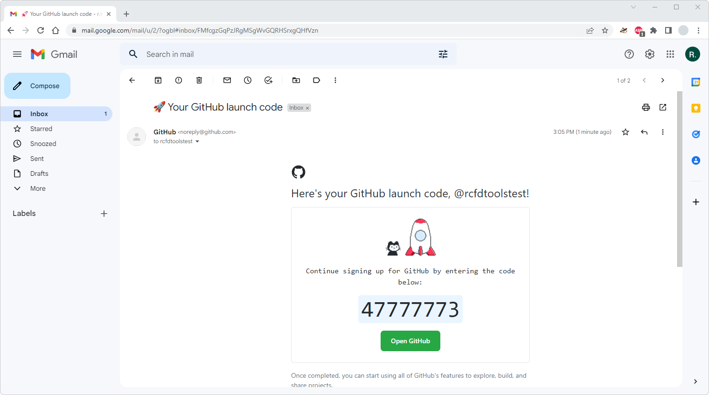
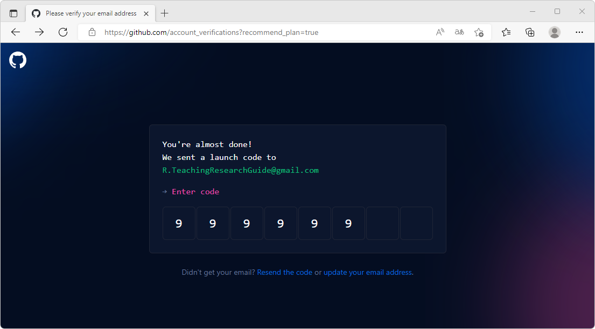


5. Para visualizar su espacio personal y los repositorios creados asociados, ingrese su nombre de usuario después del nombre de dominio `https://github.com/rcfdtoolstest`

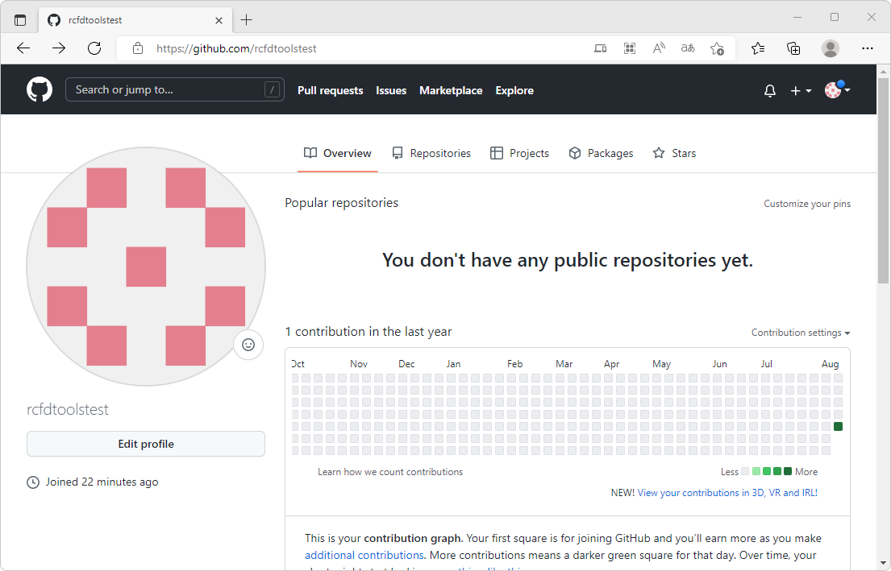

En la parte superior de su tablero de control de usuario encontrará las secciones:


| Sección      | Utilidad                                                                                                                                                                                                                                                     |
|--------------|--------------------------------------------------------------------------------------------------------------------------------------------------------------------------------------------------------------------------------------------------------------|
| Overview     | Resumen general de las actividades realizadas por el usuario. Es dinámico y depende de las acciones realizadas.                                                                                                                                              |
| Repositories | Repositorios creados o clonados por el usuario.                                                                                                                                                                                                              |
| Projects     | Esta sección permite crear una especie de libro electrónico donde se crean actividades y se designan equipos y responsables, que permiten realizar un seguimiento a los avances del proyecto. Se pueden filtrar, ordenar y agrupar por diferentes criterios. |
| Packages     | Paquetes incorporados al usuario.                                                                                                                                                                                                                           |
| Stars        | Repositorios favoritos. Pueden ser propios, clonados o directos de otros usuarios.                                                                                                                                                                           |


## Creación de mi primer repositorio

1. En la parte superior derecha de su ventana de GitHub, de clic en el botón `+` y, seleccione la opción `New repository`.

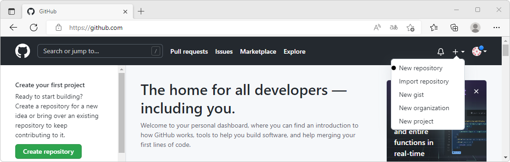

2. En la ventana de creación de repositorio nuevo, ingrese el nombre del repositorio, p. ej. `repotest` e ingrese una descripción general de su propósito.

Defina si el repositorio será de uso Público o Privado, si es público, cualquier usuario de Internet podrá visualizar, clonar o descargar la información contenida dentro del respositorio; si es privado, usted podrá decidir quien o quienes pueden acceder al respositorio.

> Para los dos tipos de repositorio, el creador podrá decidir si integra o no las modificaciones que los usuarios propongan a través de commit's.

Para inicializar un repositorio, uste puede decidir si quiere incluir el primer archivo de documentación `Readme.md` en formato Markdown sobre la raíz. También podrá incluir el archivo de exclusiones `.gitignore` que le permitirá realizar exclusiones de archivos y directorios que no hacen parte de la información pública que se sincronizará desde unidades locales cuando la gestión del repositorio se realiza con una herramienta externa directamente desde su equipo. Para este ejemplo incluiremos estas dos opciones sin definir una plantilla prototipo para `.gitignore`.

> En caso de que no cree el archivo Readme.md y .gitingore, estos podrán ser creados manualmente.
> 
> Github dispone de múltiples plantillas que contiene los archivos que no deben ser sincronizados y publicados en su proyecto, p. ej. para proyectos creados en Python en los cuales se han creado ambientes virtuales, no se debe sincronizar la carpeta `.venv` ni los archivos precompilados `.pyc` de librerías propias contenidas en `__pycache__`. Para la gestión desde Desktop, p. ej. a través de PyCharm o de Visual Studio Code, no se incluyen la carpeta `.idea` y demás archivos de gestión utilizados por los administradores de contenido o herramientas de gestión Git.

Opcionalmente, podrá seleccionar el tipo de licencia a utilizar entre diferentes licencias disponibles orientadas a desarrollo de software o a producción de contenido audiovisual. Generalmente, los usuarios seleccionan la [Licencia MIT](https://opensource.org/licenses/MIT) debido a que confiere uso abierto completo pero sin ningún tipo de garantía o responsabilidad.

> Para este ejemplo no especificaremos una licencia debido a que utilizaremos una licencia derivada que será documentada desde la raíz del repositorio. 

Para finalizar la creación del repositorio, de clic en el botón `Create repository`

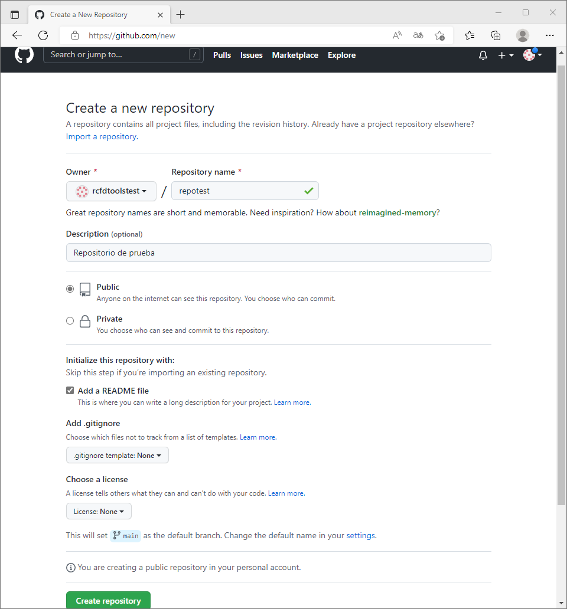

[Ejemplo de licencia MIT](https://opensource.org/licenses/MIT)

```
Copyright <YEAR> <COPYRIGHT HOLDER>

Permission is hereby granted, free of charge, to any person obtaining a copy of this software and associated documentation files (the "Software"), to deal in the Software without restriction, including without limitation the rights to use, copy, modify, merge, publish, distribute, sublicense, and/or sell copies of the Software, and to permit persons to whom the Software is furnished to do so, subject to the following conditions:

The above copyright notice and this permission notice shall be included in all copies or substantial portions of the Software.

THE SOFTWARE IS PROVIDED "AS IS", WITHOUT WARRANTY OF ANY KIND, EXPRESS OR IMPLIED, INCLUDING BUT NOT LIMITED TO THE WARRANTIES OF MERCHANTABILITY, FITNESS FOR A PARTICULAR PURPOSE AND NONINFRINGEMENT. IN NO EVENT SHALL THE AUTHORS OR COPYRIGHT HOLDERS BE LIABLE FOR ANY CLAIM, DAMAGES OR OTHER LIABILITY, WHETHER IN AN ACTION OF CONTRACT, TORT OR OTHERWISE, ARISING FROM, OUT OF OR IN CONNECTION WITH THE SOFTWARE OR THE USE OR OTHER DEALINGS IN THE SOFTWARE.
```

[Ejemplo de licencia embebida en R.TeachingResearchGuide.](../../LICENSE.md)

3. Luego de creado el repositorio, será dirigido automáticamente `repotest` y podrá visualizar el contenido del Archivo `Readme.md`


> Recuerde que la documentación del proyecto principalmente se realiza a través de archivos Markdown en formato .md, y GitHub puede interpretar y mostrar en pantalla el contenido del archivo con su traducción a HTML para su visualización.

En la dirección de su navegador podrá observar el nombre de su cuenta de usuario y el nombre del repositorio creado `https://github.com/rcfdtoolstest/repotest`. Desde este momento, el repositorio se encuentra visible en Internet y puede ser consultado por cualquier usuario debido a que es público.

Para clonar o descargar el repositorio, en el botón `Code` encontrará opciones para generar una URL de clonación, [GitHub command line - CLI](https://cli.github.com/), apertura y sincronización desde [GitHub Desktop](https://desktop.github.com/) y descarga en formato .zip. Para este proyecto, la URL de clonación es `https://github.com/rcfdtoolstest/repotest.git` que corresponde al nombre que aparece en la barra del navegador más la terminación `.git`


Al encontrarse su sesión de usuario abierta en el navegador, ingresando https://github.com/, podrá observar que en el panel izquierdo aparece su repositorio en recientes.


## Opciones predeterminadas disponibles para repositorios nuevos


En la parte superior de la ventana del repositorio, podrá encontrar las siguientes secciones:

| Sección      | Utilidad                                                                                                                                                                                                                                                                                                                                                                                                                                                                                                                              |
|--------------|---------------------------------------------------------------------------------------------------------------------------------------------------------------------------------------------------------------------------------------------------------------------------------------------------------------------------------------------------------------------------------------------------------------------------------------------------------------------------------------------------------------------------------------|
| <> Code      | Ventana principal del repositorio donde se encuentran los archivos y carpetas del proyecto, investigación, e-book. Por defecto, todos los archivos se encuentran en el `main` del repositorio y pueden existir múltiples ramas o `branch`.                                                                                                                                                                                                                                                                                            |
| Issues       | Los Issues son utilizados para reportar errores que necesitan ser ajustados en nuevas versiones, solicitar nuevas funcionalidades, referenciar otras fuentes o métodos y en general se convierten en la lista de tareas pendientes que se deben ir solucionando. Issues permite la creación de plantillas para facilitar el reporte por parte de los usuarios. Al clonar un repositorio público, los registros contenidos en Issues no son incluidos dentro del repositorio clonado.                       |
| Pull request | Cuando un usuario o un colaborador clona el repositorio y realiza ajustes, correcciones, actualizaciones, nuevas implementaciones; estas pueden ser incorporadas a través de peticiones de incorporación o Pull request. Una vez el propietario o colaborador directo revisa los cambios, estos pueden ser incorporados al main del proyecto y quedan documentados a través de Commit's.                                                                                                                                              |
| Actions      | GitHub actions permite crear, probar y depurar el código creado a través de flujos de procesos. Durante las acciones se pueden documentar las revisiones, administrar las diferentes ramas de prueba y clasificar los problemas encontrados para colocarlos en la lista de pendientes de Issues.                                                                                                                                                                                                                                      |
| Projects     | Esta herramienta permite crear una especie de libro electrónico donde se crean actividades y se designan equipos y responsables, que permiten realizar un seguimiento a los avances del proyecto. Se pueden filtrar, ordenar y agrupar por diferentes criterios.                                                                                                                                                                                                                                                                      |
| Wiki         | Wikis es el lugar donde se crea la documentación general del repositorio, permite incluir múltiples archivos Markdown. Generalmente es utilizado para crear documentación de aplicaciones y software y no es común su uso en el desarrollo de cursos o libros electrónicos debido a que el contenido wiki no es clonable directamente en la nube con los archivos principales del repositorio. La documentación wiki puede ser clonada localmente en la unidad de disco local por cualquier usuario cuando el repositorio es público. |
| Security     | Desde esta pestaña se establecen las políticas generales y recomendaciones de seguridad, además de la configuración de herramientas para detectar vulnerabilidades.                                                                                                                                                                                                                                                                                                                                                                   |
| Insights     | Esta pestaña permite monitorear todo lo que sucede en el repositorio, p. ej. el total de incorporaciones realizadas, las incorporaciones pendientes, los problemas identificados y resueltos, las acciones realizadas, los contribuidores, el tráfico hacia el repositorio como el número de veces que ha sido clonado o visitado, la frecuencia con la que se trabaja en el repositorio, gráficas de dependencia y linea de tiempo.                                                                                                  |
| Settings     | Configuración general del repositorio, definición de colaboradores, opciones de moderación, administración de ramas, definición de etiquetas, acciones, ambientes, páginas, integraciones y otros.                                                                                                                                                                                                                                                                                                                                    |

> Por defecto, en las opciones disponibles para el repositorio no se encuentran las Discusiones, cuyo funcionamiento es similar al de un foro de ayuda y soporte, y es el mejor canal de comunicación entre los creadores y los usuarios. Su activación se realiza desde las opciones de configuración o Settings a través del grupo de opciones General. Al clonar un repositorio público, los registros contenidos en Discussions no son incluidos dentro del repositorio clonado, estas permanecen siempre asociadas al repositorio original.

En la parte derecha encontrará la sección acerca de o `About` que presenta un resumen general del repositorio, su descripción, usuarios que han marcado el repositorio como favorito, usuarios que se encuentran visualizando, número de clonaciones y secciones con la liberación de nuevas versiones (cuando se trata de un software) y paquetes liberados. Desde el ícono de configuración localizado en la parte superior derecha, podrá actualizar los detalles generales, tales como el texto resumen, las palabras clave y desactivar los Releases, Packages & Environments.

<div align="center">


</div>

De clic en las opciones de configuración del panel lateral About, podrá observar que también puede asociar un Website creado a través de [GitHub Pages](https://pages.github.com/). Realice los siguientes ajustes:

* Actualice la descripción del repositorio a "Repositorio de prueba - Guía para enseñanza e investigación colaborativa - https://github.com/rcfdtools/R.TeachingResearchGuide."
* Topics: research teaching guide guidelines rcfdtools (ingresar en minúscula y separados por un espacio)
* Desactive: Releases, Packages & Environments

> Para su propio repositorio, ingrese una descripción que resuma su alcance y propósito. Ingrese las palabras clave más representativas de todas las actividades, clases o herramientas contenidas en el repositorio. En caso de que su repositorio corresponda a un proyecto de investigación a través del cual se van a crear scripts, herramientas, módulos, paquetes; mantenga activas las opciones Releases, Packages & Environments.

<div align="center">

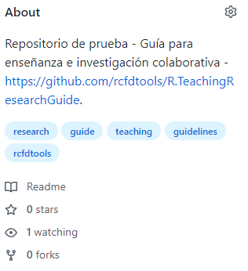

</div>


## Estructura genérica de un curso, una investigación, un e-book o un repositorio orientado a desarrollo de software

Las estructuras de directorios de un repositorio en GitHub, dependen del tipo de proyecto a realizar, p. ej.:

| Tipo de proyecto                                | Descripción                                                                                                                                                                                                                                                                                                    |
|:------------------------------------------------|:---------------------------------------------------------------------------------------------------------------------------------------------------------------------------------------------------------------------------------------------------------------------------------------------------------------|
| Repositorio orientado al desarrollo de software | Su estructura depende de los requerimientos y entornos de desarrollo propios de cada lenguaje de programación.                                                                                                                                                                                                 |
| Libro electrónico o e-Book                      | Su estructura general se puede definir a través de capítulos y sub-capítulos más directorios comunes para referencias, iconografía y gráficos.                                                                                                                                                                 |
| Investigación / Profundización                  | Se puede utilizar una combinación entre la estructura general de un libro electrónico y desarrollo de software, cuando la investigación incluye la creación de scripts, herramientas, módulos, paquetes. Son requeridas carpetas complementarias para almacenamiento de conjuntos de datos y archivos comunes. |
| Curso teórico                                   | Su estructura general se puede definir a través de secciones o temas y clases, más directorios comunes para referencias, iconografía y gráficos.                                                                                                                                                               |
| Curso práctico                                  | Su estructura general se puede definir a través de secciones y actividades, más directorios comunes para conjuntos datos, referencias, iconografía y gráficos.                                                                                                                                                 |
| Curso teórico / práctico                        | Su estructura general se puede definir a través de secciones y actividades, más directorios comunes para conjuntos datos, referencias, iconografía y gráficos.                                                                                                                                                 |

Para la estructura general de los cursos, es recomendable utilizar únicamente dos niveles para facilitar la navegabilidad entre los contenidos y la administración de los directorios o carpetas asociadas. 

| Tipología                      | Jerarquía interna         | Caso de estudio / Aplicabilidad                                                    |
|:-------------------------------|:--------------------------|:-----------------------------------------------------------------------------------|
| Curso teórico                  | Temas y clases            | Ejemplos teóricos                                                                  |
| Curso teórico y práctico       | Secciones y actividades   | Caso de estudio general y/o casos de estudios particulares por sección o actividad |
| Investigación / Profundización | Capítulos y sub-capítulos | Caso de estudio único                                                              |
| e-book                         | Capítulos y sub-capítulos | Ejemplos teóricos y prácticos                                                      |

Estructura ejemplo para un curso teórico y práctico:  

* Sección 1
  * Actividad A
  * Actividad B
  * Actividad C
* Sección 2
  * Actividad A
  * Actividad B
  * Actividad C
* Sección 3
  * Actividad A
  * Actividad B
  * Actividad C

> Dentro de la estructura de carpetas se nombran y numeran las secciones de forma consecutiva debido a que enmarcan contenidos y actividades que se relacionan entre ellas. Respecto a las actividades, estás no se numeran, indexan o se ordenan de manera sucesiva debido a que su estructura interna y ordenamiento puede modificarse o ajustarse por inclusión de nuevas actividades intermedias, actividades complementarias o el retiro de actividades que dentro de la gestión del curso se consideran obsoletas o han sido reemplazadas por una nueva actividad con contenidos actualizados.  
>
> Tenga en cuenta que las actividades de un curso o una investigación pueden ser utilizadas o citadas transversalmente en otros cursos o investigaciones y que al ser incluida numeración consecutiva, esta no coincidirá con la establecida. Por tal motivo no se recomienda numerar las actividades. 
> 
> Respecto al nombre de las secciones y actividades, se recomienda utilizar un nombre corto que no incluya espacios, tildes, eñes, apóstrofes ni caracteres especiales como #$&*/|\{}[]. 


## Carpetas de archivos comunes

Para la gestión de los recursos compartidos del repositorio, es necesario crear diferentes carpetas en el directorio principal que faciliten su llamado. Las carpetas en la raíz del repositorio utilizarán como prefijo un punto, se escriben en minúscula y utilizan nombres cortos, excepto aquellas que correspondan al nombre genérico de una herramienta específica, por ejemplo HECGeoHMS.

Ejemplo:

| Carpeta   | Descripción                                                                                             | Formatos ejemplo                                                                                   |
|-----------|:--------------------------------------------------------------------------------------------------------|:---------------------------------------------------------------------------------------------------|
| .datasets | Contiene datos base que puedan ser convertidos en tablas, series o bases de datos.                      | .xls, xlsx, .txt, .dbf, .asc, .csv, .db, .mdb no espacial, .accdb no espacial, .sqlite no espacial |
| .graph    | Gráficas y esquemas comunes. Incluye archivos fuente de diagramas y diseño gráfico.                     | .png, .svg, .cdr, .vsdx                                                                            |
| .github   | Almacenamiento de plantillas Issue del repositorio                                                      | .md                                                                                                |
| .icons    | Iconografía general. Incluye archivos fuente de diseño gráfico.                                         | .ico, .png, .svg (recomendado)                                                                     |
| .refs     | Archivos de referencias bibliográficas de uso libre recopiladas                                         | .pdf, .md, .doc, .docx, .epub                                                                      |
| .src      | Scripts de uso común                                                                                    | .py, .bas, .sh                                                                                     |
| .temp     | Carpeta para volcado de archivos temporales de aplicaciones. Archivos de prueba. Versiones preliminares | Cualquier formato                                                                                  |

> Todos los directorios contendrán un archivo Readme.md en formato Markdown con las especificaciones detalladas de los contenidos de las carpetas.

Dentro de una sección, una actividad o clase, pueden existir carpetas específicas para gestión de datos, p. ej. la carpeta `.datasets` con archivos particulares que únicamente se utilizan en esa sección o actividad. Dentro de cada sección es necesario incluir las siguientes carpetas:

| Carpeta    | Descripción                                                                                                                 | Formatos ejemplo  |
|------------|:----------------------------------------------------------------------------------------------------------------------------|:------------------|
| Graph      | Gráficos generados o exportados, diagramas, esquemas, ilustraciones y archivos fuente de diseño gráfico                     | .cdr, .svg, .vsdx |
| Screenshot | Capturas y recortes de pantalla que son utilizados como ejemplo en el desarrollo de la actividad, subtema, clase o lección. | .png              |


## Creación de carpetas comunes y archivos Readme.md

1. Desde su navegador de Internet y en el repositorio creado previamente (p. ej. rcfdtoolstest/repotest), de clic en el botón `Add file` y seleccione la opción `Create new file`

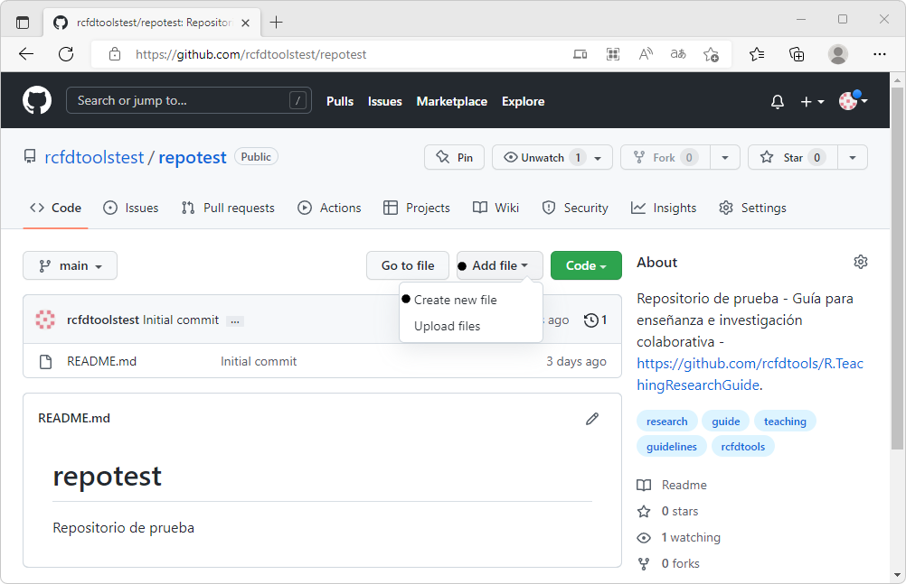

2. Cree la carpeta `.datasets` con su respectivo archivo Readme.md. Para crear carpetas, ingrese después de `repotest/` el nombre de la carpeta y el nombre del archivo readme. p. ej.: `.datasets/Readme.md`.


Dentro del editor, ingrese el texto `## Datasets o conjuntos de datos comunes`.

> Recuerde que ## es utilizado en Markdown para definir un título de nivel 2.


3. En la parte inferior de la ventana, ingrese en él `Commit` o texto de revisión descriptivo, p. ej., _"Creación de la carpeta para almacenamientos de datasets o conjuntos de datos comunes."_ y de clic en el botón `Commit new file`.

> En GitHub, todas las modificaciones de elementos deben incluir un texto de revisión que describe los cambios que se están realizando sobre los archivos. Utilizando herramientas Desktop para gestión de repositorios, podrá efectuar la modificación de múltiples archivos y al publicar las actualizaciones deberá incluir un único _Commit_ que será visible en cada archivo.


Una vez finalizada la creación de la carpeta y el archivo, podrá observar que en pantalla aparece la nueva carpeta y el archivo Readme.md.


4. Repita el procedimiento anterior para crear las carpetas y archivos Readme.md para `.icons`, `.refs` y `.temp`. Diríjase a la raíz del repositorio y, visualice las carpetas generadas y los comentarios de revisión.

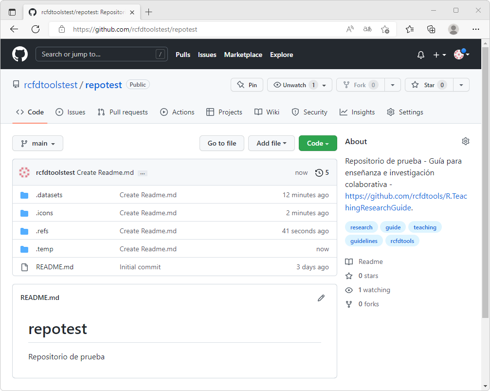

> Cuando necesite cargar archivos a su repositorio, en `Add File` encontrará la opción `Upload files` que permite arrastrar uno o múltiples archivos locales. Para cuentas de no pago, cada archivo independiente no debe superar 25 MB.
> 
> Desde gestores de repositorios Desktop, podrá realizar cargues de archivos de hasta 100 MB. En caso de que requiera cargar archivos grandes, comprima en múltiples partes de 95 MB.


## Ejemplo de creación de carpetas específicas y archivos Readme.md

Como explicamos anteriormente, un repositorio de GitHub puede ser utilizado para diferentes propósitos (desarrollar una App, crear un e-book, desarrollar una investigación, crear un curso...). Para este ejemplo, generaremos la estructura de un curso básico con contenido teórico / práctico, que está compuesto por 3 secciones y diferentes actividades por sección, y cuyo objetivo principal es enseñar fundamentos del lenguaje de programación Python. El procedimiento a seguir es el mismo presentado para la creación de carpetas comunes y la diferencia principal es que dentro de las secciones, existirán diferentes subcarpetas que corresponderán a las actividades. 

Estructura del curso ejemplo:

* Seccion01
  * Introduccion
  * Requirimientos
* Seccion02
  * Fundamentos
  * Instalacion
  * PrimerosPasos
  * PrimerScript
* Seccion03
  * InstalacionPandas
  * ExploracionDatos
  * AnalisisDatos

> Como observa en el ejemplo, no se ha definido un nombre específico para cada sección y al final se ha incluido la numeración consecutiva 01, 02, 03, que posteriormente permitirá que al ingresar más de 10 actividades, el ordenamiento de las secciones se visualice de forma consecutiva. El detalle específico de cada sección, se describe dentro del archivo Readme.md de cada carpeta.
> 
> Los nombres de las actividades dentro de cada sección no contienen una numeración específica y se describen a través de un nombre corto descriptivo. Como se indicó anteriormente, las secuencia de desarrollo de las actividades dentro de un curso, debe ser diseñada de tal forma que estas puedan ser reordenadas, actualizadas, eliminadas y puedan ser integradas con otros cursos para crear cursos con contenidos compartidos. Al igual que las secciones, cada actividad contendrá un archivo Readme.md dentro del cual se desarrollaran los contenidos específicos de cada actividad.


## Edición en línea de archivos de documentación Readme.md

Los archivos de documentación del repositorio, pueden ser modificados en línea desde el navegador de Internet. Para este ejemplo, crearemos un listado de referencias bibliográficas dentro del archivo Readme.md, localizado en la carpeta general de referencias, para ello, en la raíz del repositorio de clic en la carpeta `.refs` y a continuación de clic en el ícono de edición (lápiz) localizado a la derecha del recuadro del archivo Readme.md.


Incluya las siguientes referencias:

```
* [Sweigart, Al. Automate the Boring Stuff with Python, 2nd Edition: Practical Programming for Total Beginners 2nd Edition.](https://automatetheboringstuff.com/)
* [Sweigart, Al. The Big Book of Small Python Projects: 81 Easy Practice Programs.](https://inventwithpython.com/bigbookpython/)
* [Sweigart, Al. Beyond the Basic Stuff with Python: Best Practices for Writing Clean Code.](http://inventwithpython.com/beyond/)
* [Sweigart, Al. Cracking Codes with Python: An Introduction to Building and Breaking Ciphers.](https://inventwithpython.com/cracking/)
```

> Como observa, las referencias se han definido a través de una lista utilizando `*` y contienen la hipervinculación `[descripción](hiperenlace)` al libro en línea. 

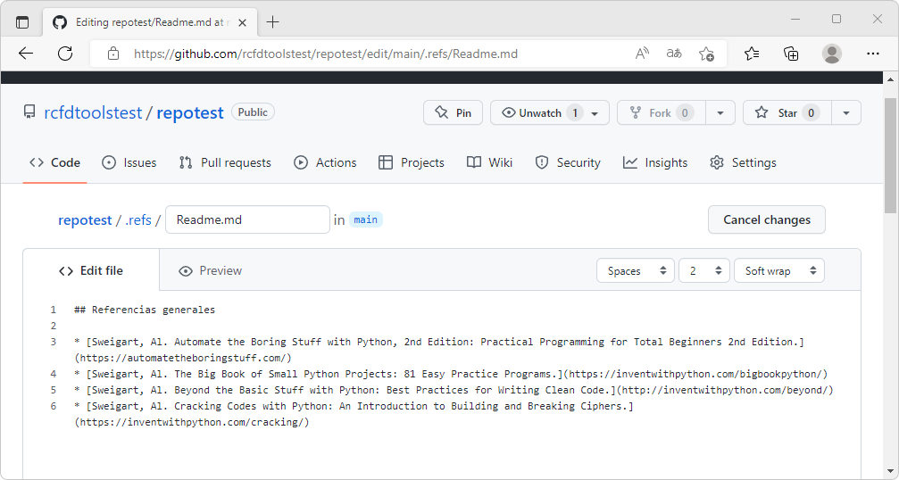

En la parte inferior de la ventana de edición, incluya como comentario de actualización o Commit: _"Inclusión de 4 referencias del autor Al Sweigart."_, y de clic en el botón `Commit changes`.

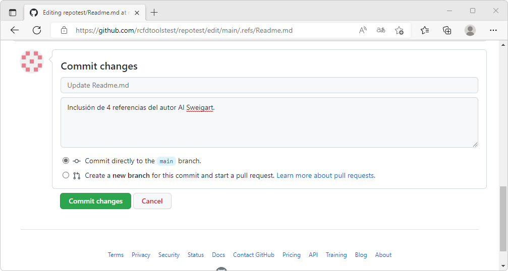

Visualice el resultado obtenido y la representación en HTML del archivo Markdown.


> Como pudo observar en el proceso de edición del archivo de referencias, es necesario conocer las marcas de Markdown que permiten crear listas o hipervincular texto, y no existe edición asistida que permita a partir de la selección de un texto, establecer p. ej., negrillas o cursiva. La ventana del editor permite realizar previsualización del archivo antes de que los cambios sean publicados.
> 
> En el centro de documentación wiki de repositorios en GitHub, sí existen herramientas de edición asistida que permiten editar directamente archivos de Markdown.

En la carpeta `.refs`, de clic en el archivo `Readme.md`, podrá observar las siguientes opciones:

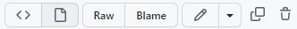

| Opción           | Descripción                                                                                                                                                                                                                                 |
|------------------|---------------------------------------------------------------------------------------------------------------------------------------------------------------------------------------------------------------------------------------------|
| <>               | Muestra dentro de la ventana de edición el texto fuente contenido dentro del archivo, tal como se observa cuando se esta editando.                                                                                                          |
| :page_facing_up: | Muestra el archivo Markdown en HTML. Opción por defecto.                                                                                                                                                                                    |
| Raw              | Muestra el archivo fuente dentro del navegador sin ningún tipo de representación o interpretación HTML.                                                                                                                                     |
| Blame            | Muestra el detalle de todos los cambios y modificaciones realizada dentro del archivo desde el momento de su creación. Dentro de esta opción podrá visualizar el Raw, volver a la vista normal o revisar el arbol del histórico de cambios. |
| :pencil2:        | Permite editar el archivo en línea, abrir a través de github.dev o GitHub Desktop.                                                                                                                                                          |
| Dos recuadros    | Copiar el contenido Raw dentro del portapapeles. (depende de la versión de GitHub utilizada)                                                                                                                                                |
| :wastebasket:    | Eliminar el archivo. Requiere Commit.                                                                                                                                                                                                       |

Blame  


History  


## GitHub App en Android o Apple iOS

Desde la tienda de aplicaciones de su teléfono móvil, instale la aplicación GitHub.

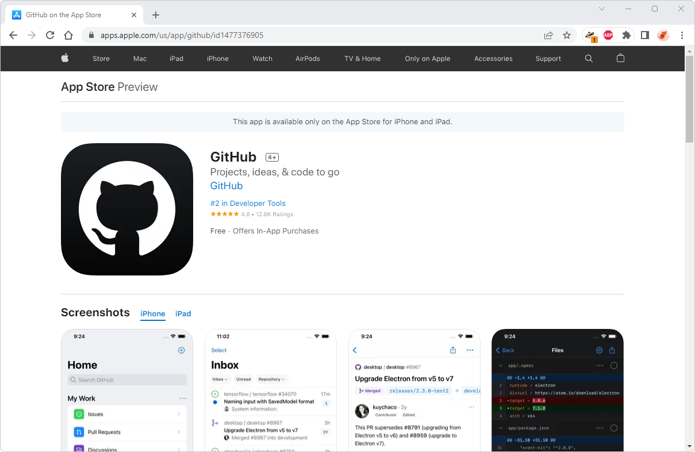
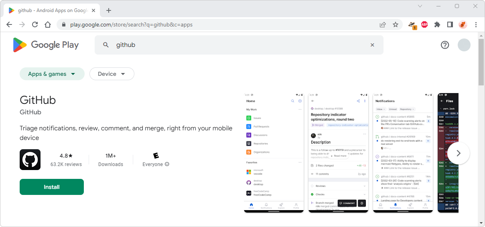

Abra la aplicación, ingrese con su cuenta de usuario y visualice el _Home_ de GitHub, podrá observar que en _My Work_ existen diferentes opciones.


De clic en la opción _Repositores_ para visualizar los repositorios de usuario.

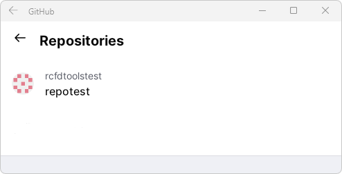

Podrá observar, p. ej., que existe el repositorio _repotest_, de clic sobre él. 


Dando clic en la opción _Browse code_, abra la carpeta de referencias y verifique las entradas que hemos incluido en el archivo Readme.md.


## Actividades complementarias:pencil2:

En la siguiente tabla se listan las actividades complementarias a ser desarrolladas por el estudiante.

|  #  | Alcance                                                                                                                                                                                                                                                                                                        |
|:---:|:---------------------------------------------------------------------------------------------------------------------------------------------------------------------------------------------------------------------------------------------------------------------------------------------------------------|
|  1  | Cree su propia cuenta de usuario en GitHub y el repositorio para un curso o investigación.                                                                                                                                                                                                                     |
|  2  | En la raíz del repositorio `<> Code`, cree el archivo LICENSE.md sin asociar una de las licencias disponibles en GitHub. Edite el contenido y agregue manualmente los términos de licencia.                                                                                                                    |
|  3  | Cree las carpetas comunes y al menos una de las secciones o capítulos con su estructura interna. Para cada carpeta cree un archivo Readme.md con su descripción. Descargue y cargue en la carpeta `.icons`, algunos íconos relacionados con el contenido de su repositorio.                                    |
|  4  | Dentro de uno de los documentos Readme.md, cree una tabla, una lista, enlaces, ilustraciones vinculadas a un enlace específico en Internet y su repositorio utilizando rutas absolutas y relativas. Incluya diferentes elementos del lenguaje de marcas Markdown.                                              |
|  5  | Active las discusiones y cree una entrada _General_ para que usuarios puedan reportar nuevas referencias sin clonar el repositorio.                                                                                                                                                                            |
|  6  | Dentro de los documentos Readme.md, cree mediante una tabla de una única fila, un panel de navegación que le permita ir a: actividad Anterior, inicio, Ayuda / Colabora y actividad Siguiente. Utilizando rutas relativas, enlace las actividades y el inicio. Asocie Ayuda / Colabora a una discusión creada. |
|  7  | Desde la opciones de `Insights` disponibles en la parte superior del repositorio, y desde el panel lateral `Community Standards`, establezca el código de conducta y el esquema de contribución.                                                                                                               |
|  8  | Clone el repositorio ejemplo de este curso https://github.com/rcfdtoolstest/repotest y edite el archivo `.refs/Readme.md` incluyendo una referencia relacionada con el lenguaje de programación Python. Ejecute el `Pull request` para solicitar al propietario la incorporación de esta nueva referencia.     |
|  9  | Instale la App de GitHub en su dispositivo móvil y verifique los contenidos creados en su repositorio.                                                                                                                                                                                                         |


## Preguntas y respuestas Q&A

| Pregunta                                                                                                                                                                                                                                     | Respuesta                                                                                                                                                                                                                                                                                                                                                                                                                                                                                                                                                    |
|----------------------------------------------------------------------------------------------------------------------------------------------------------------------------------------------------------------------------------------------|--------------------------------------------------------------------------------------------------------------------------------------------------------------------------------------------------------------------------------------------------------------------------------------------------------------------------------------------------------------------------------------------------------------------------------------------------------------------------------------------------------------------------------------------------------------|
| Mis cursos incluyen contenidos en Temas / subtemas / capítulos / subcapítulos / clases y/o actividades. ¿Es adecuado crear una estructura de directorios con 5 niveles y numerar cada actividad?                                             | No es una práctica habitual debido a que la navegabilidad por los contenidos se vuelve compleja y como se trata generalmente de actividades sucesivas o que pueden ser enlazadas desde otros repositorios, estas deben ser estructuradas con niveles similares.                                                                                                                                                                                                                                                                                              |
| ¿Debo conocer todas las marcas del lenguaje Markdown para crear las actividades detalladas de mis repositorios?                                                                                                                              | No es necesario, existen editores en línea o Desktop que permiten la edición asistida facilitando su creación, sin embargo, a medida que se escriben y editan documentos, las marcas son involuntariamente memorizadas permitiendo escribir mucho más rápido este tipo de documentos desde el teclado con editores minimalistas.                                                                                                                                                                                                                             |
| ¿Existen herramientas Desktop que faciliten la edición de este tipo de documentos y que permitan a su vez revisar la ortografía y gramática de mis contenidos?                                                                               | Sí, p. ej., PyCharm es una herramienta de desarrollo orientada al lenguaje Python que permite editar documentos Markdown de forma asistida e incluye un poderoso núcleo gramatical multiidioma.                                                                                                                                                                                                                                                                                                                                                              |
| ¿Es conveniente cambiar el nombre de mi archivo Readme.md por el nombre de la sección o la actividad?                                                                                                                                        | No, debido a que la visualización del contenido del documento principal de cada carpeta se realiza de forma predeterminada usando este archivo.                                                                                                                                                                                                                                                                                                                                                                                                              |
| ¿Puedo incluir archivos .md complementarios dentro de cada carpeta?                                                                                                                                                                          | Si y generalmente se utilizan archivos para complementar los contenidos de las actividades, p. ej. la presentación de otros casos de estudio, resultados obtenidos de un modelo o reportes detallados.                                                                                                                                                                                                                                                                                                                                                       |
| ¿Debo realizar algún pago por los servicios de GitHub?[^1]                                                                                                                                                                                   | Con GitHub Free para cuentas personales, puedes trabajar con colaboradores ilimitados en repositorios públicos ilimitados con un conjunto de características completo y en repositorios privados ilimitados con un conjunto de características limitado. Con GitHub Free, tu cuenta personal incluye: Soporte de la Comunidad de GitHub Las alertas del dependabot, Aplicación de la autenticación de dos factores, 2,000 minutos de GitHub Actions, 500 MB de almacenamiento de Registro del paquete de GitHub y Cargue de archivos individuales de 100 MB. |
| ¿Que pasa con mis repositorios si accidentalmente elimino uno o varios de ellos?                                                                                                                                                             | Todos los archivos son eliminados de la vista principal del repositorio, por lo que se recomienda como buena práctica, descargar periódicamente copias de seguridad o sincronizar en disco local desde aplicaciones Desktop. Desde la configuración de la cuenta, los repositorios eliminados pueden ser recuperados dentro de un tiempo determinado, siempre y cuando no se elimine la cuenta de usuario. Consulta la [guía de buenas prácticas](../../BestPractice.md).                                                                                    |
| ¿Que sucede con mis repositorios si mi cuenta de usuario es hackeada y eliminada?                                                                                                                                                            | Si tú cuenta de usuario de GitHub es eliminada, todos los repositorios, documentación y discusiones serán eliminadas permanentemente. Descarga frecuentemente copias de seguridad o sincroniza desde Desktop en tu equipo local tus repositorios.                                                                                                                                                                                                                                                                                                            |
| ¿Como puedo comprobar si un repositorio es oficialmente promovido por una institución o una organización y como puedo verificar la identidad de el o los creadores?                                                                          | Las organizaciones realizan invitaciones de adhesión a usuario registrados de la comunidad de GitHub y generalmente los repositorios personales de los usuarios que oficialmente están certificados, son clonados dentro de la organización.                                                                                                                                                                                                                                                                                                                 |                                                                                                                                                                                                                                                                                                                  |
| En mi tiempo libre estoy creando un nuevo curso y quiero que este sea difundido con certificación a través de la oferta académica de mi organización, ¿Es posible y como funciona la propiedad intelectual y los beneficios institucionales? | Cualquier repositorio personal de un usuario puede ser promovido dentro de la oferta oficial de una organización y los derechos de propiedad y beneficio dependen de las políticas y acuerdos propios realizados con cada organización. Se recomienda la asesoría de un experto.                                                                                                                                                                                                                                                                             | 
| ¿Un repositorio clonado se actualiza automáticamente cuando el propietario realiza modificaciones?                                                                                                                                           | No se actualizan automáticamente debido a que el clonador puede estar trabajando en la incorporación de mejoras para luego solicitar al autor que estas sean incorporadas. Una forma de actualización es eliminando el repositorio clonado y luego volver a clonar para obtener la versión más reciente.                                                                                                                                                                                                                                                     |
| ¿Puedo conocer cuantas veces ha sido clonado mi repositorio y que usuarios realizaron las clonaciones?                                                                                                                                       | Sí, directamente desde la pestaña principal de `<> Code` a través de las opciones mostradas en el panel derecho en `About`, al lado del ícono `fork` se muestran las clonaciones directas, al dar clic en el enlace podrás observar que usuarios realizaron las clonaciones y consultar sus repositorios. Las clonaciones por descarga pueden ser consultadas a través de la pestaña `Insights` con los reportes disponibles en `Traffic`.                                                                                                                   |

> Ayúdame desde este [hilo de discusión](https://github.com/rcfdtools/R.TeachingResearchGuide/discussions/7) a crear y/o responder preguntas que otros usuarios necesiten conocer o experiencias relacionadas con esta actividad.


## Referencias

* [Referencias generales](../../References.md)
* [Abreviaturas y definiciones generales](../../Definitions.md)
* [Consejos y buenas prácticas de desarrollo colaborativo](../../BestPractice.md)
* https://docs.github.com/es/get-started/signing-up-for-github
* https://docs.github.com/es/get-started/learning-about-github/githubs-products
* https://docs.github.com/es/get-started/quickstart/hello-world#introduction
* https://opensource.org/licenses/MIT
* https://pages.github.com/
* https://docs.github.com/en/get-started/quickstart/github-glossary


## Control de versiones

| Versión    | Descripción                                                                                                                                          | Autor                                      | Horas |
|------------|:-----------------------------------------------------------------------------------------------------------------------------------------------------|--------------------------------------------|:-----:|
| 2022.09.15 | GitHub App en Android o Apple iOS.                                                                                                                   | [rcfdtools](https://github.com/rcfdtools)  |  1.5  |
| 2022.08.26 | Actualizaciones generales. Definición de actividades prácticas a ser desarrolladas por el estudiante.                                                | [rcfdtools](https://github.com/rcfdtools)  |   2   |
| 2022.08.21 | Creación de carpetas comunes y archivos. Ejemplo de creación de carpetas específicas y archivos. Edición en línea de archivos de documentación. Q&A. | [rcfdtools](https://github.com/rcfdtools)  |   3   |
| 2022.08.18 | Versión inicial.                                                                                                                                     | [rcfdtools](https://github.com/rcfdtools)  |   3   |

_R.TeachingResearchGuide es de uso libre para fines académicos, conoce nuestra licencia, cláusulas, condiciones de uso y como referenciar los contenidos publicados en este repositorio, dando [clic aquí](../../LICENSE.md)._

_¡Encontraste útil este repositorio!, apoya su difusión marcando este repositorio con una ⭐ o síguenos dando clic en el botón Follow de [rcfdtools](https://github.com/rcfdtools) en GitHub._

| [◄ Anterior](../Markdown) | [:house: Inicio](../../README.md)  | [:beginner: Ayuda / Colabora](https://github.com/rcfdtools/R.TeachingResearchGuide/discussions/7) | [Siguiente ►](../GitHubOrganization) |
|---------------------------|------------------------------------|---------------------------------------------------------------------------------------------------|-------------------------------------|

[^1]: Tomado y/o adaptado de https://docs.github.com/es/get-started/learning-about-github/githubs-products