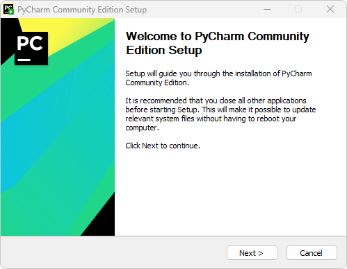
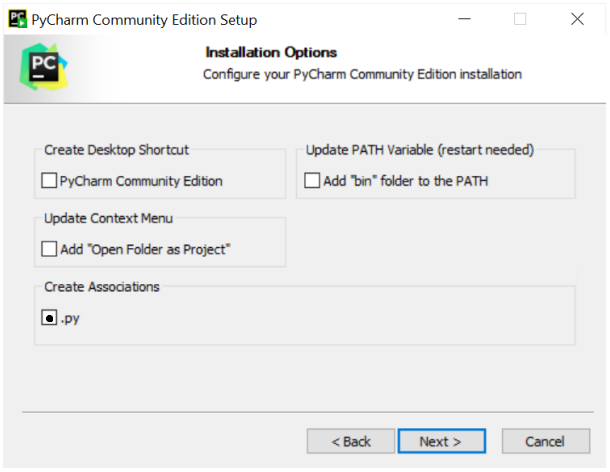
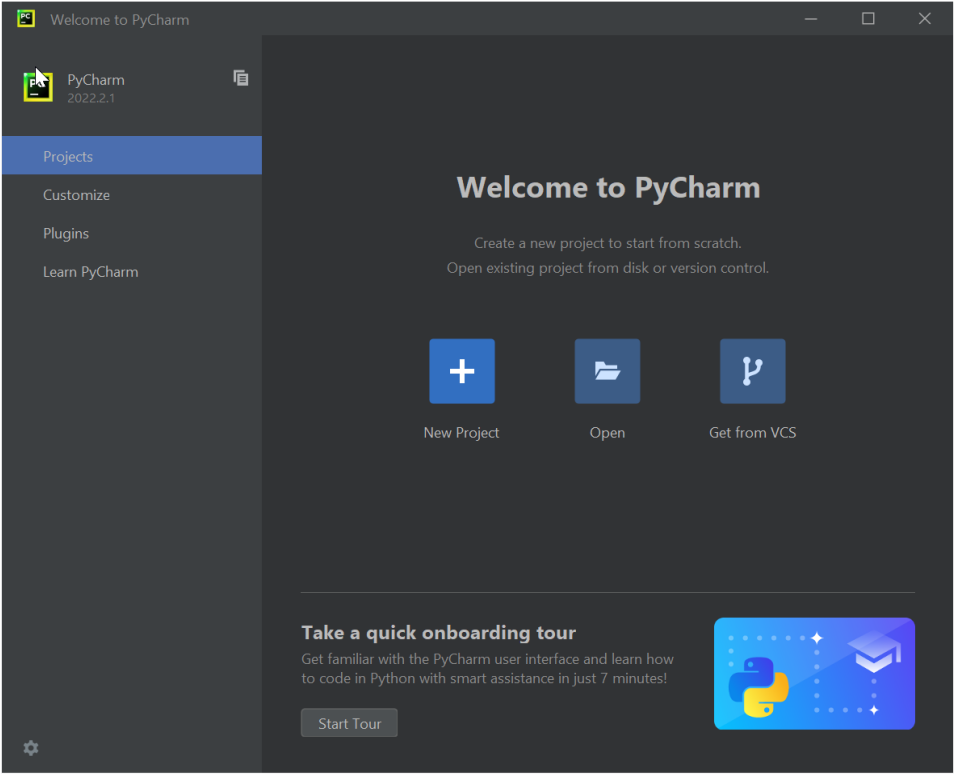
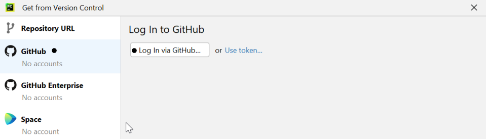
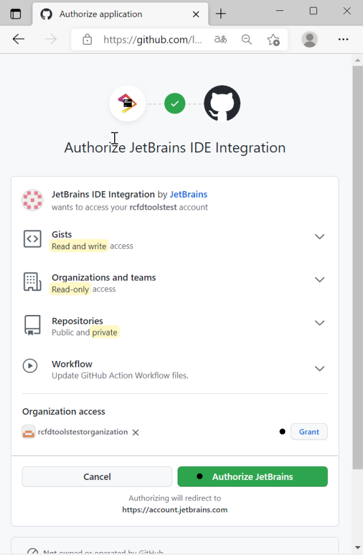
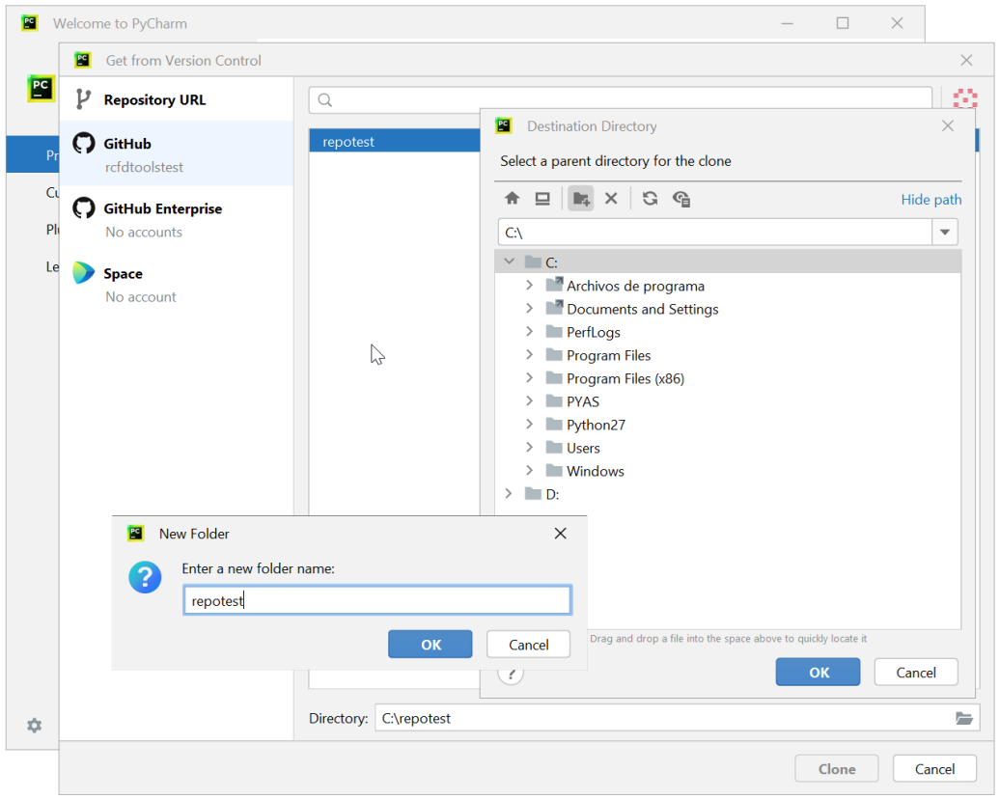
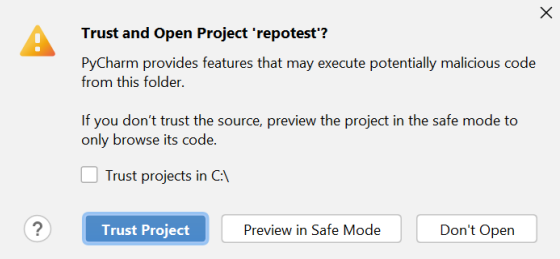
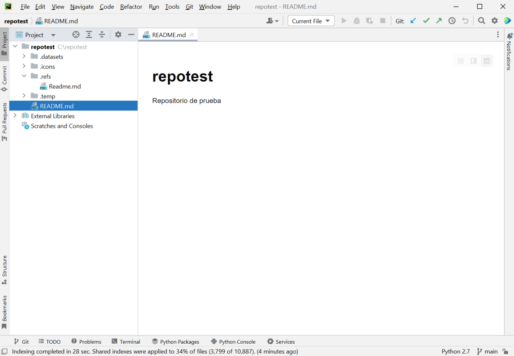
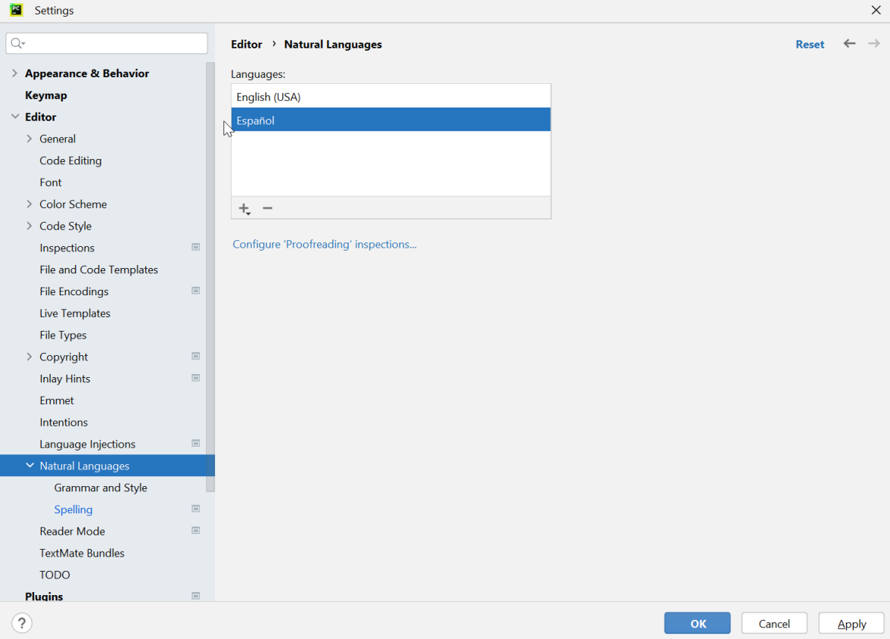

# :large_blue_circle:Sección 2 - Gestión local de repositorios GitHub con PyCharm Community

PyCharm Community es un entorno de desarrollo integrado (IDE) desktop, diseñado para la producción de proyectos basados en el lenguaje de programación Python, contiene editores avanzados y asistentes que no solamente permiten crear y editar código, sino también la documentación en formato de marcas Markdown, gestionar controles de cambios en múltiples repositorios, corrección de escritura, gramática avanzada, publicación y actualización comentada en GitHub.

# 2.1. Instalación, clonación local de proyecto GitHub y configuración general de PyCharm
Keywords: `Desktop` `JETBRAINS` `Clone` `Grammar` `Spelling` `VCS` `Git` `Plugins` `Inspections` `Community`

Para la gestión y clonación local de repositorios creados en GitHub, es necesario descargar, instalar y configurar la versión de uso libre PyCharm Community.

   

> GitHub dispone de la aplicación de gestión local [GitHub Desktop](https://docs.github.com/es/desktop/installing-and-configuring-github-desktop/overview/getting-started-with-github-desktop), habilitada para interactuar con GitHub utilizando una GUI en vez de la línea de comandos o de un navegador web, sin embargo, esta herramienta no dispone de un editor integrado de archivos y se concentra en gestionar los cambios Git sobre el repositorio. Debido a esto, es común usar herramientas IDE desktop como PyCharm, para gestionar integralmente los archivos de un proyecto, especialmente si el entorno de programación a usar es Python. [Video oficial aquí](https://www.youtube.com/watch?v=l7uo1d3R0Wo). 

## Objetivos

* Instalar y configurar la interfaz PyCharm.
* Clonar localmente mi repositorio GitHub. 

## Requerimientos

* [PyCharm Community](https://www.jetbrains.com/pycharm/) 2022.2.2 o superior
* Cuenta y repositorio GitHub. [:mortar_board:Aprender.](../../Section01/GitHubRepository)

## Instalación de PyCharm

1. Ingrese a https://www.jetbrains.com/pycharm/ y de clic en el botón _DOWNLOAD_.

2. En la página de descargas, seleccione el sistema operativo en el cual va a realizar la instalación, de clic en el botón Community / _Download_. Automáticamente iniciará la descarga. 

3. Desde la ventana de descargas de su navegador o desde la carpeta de descargas de su sistema operativo, ejecute el instalador descargado, p. ej. `pycharm-community-2022.2.1.exe `

Los requisitos de instalación y funcionamiento son:

* Sistema operativo de 64 bits para usuarios de Microsoft Windows 8, 10 u 11.
* 2 GB de memoria RAM libre con recomendación de 8 GB de memoria RAM en el equipo.
* 2.5 GB de espacio libre en disco y unidad de estado sólido SSD.
* Monitor con resolución mínima de 1024x768p, recomendado FHD 1920x1080p.
* Para proyectos que requieran de Python, se recomienda disponer de Python 2.7, 3.5 o superior.

De clic en el botón `Next >`

Indique la ruta de instalación, utilice la ruta por defecto y de clic en _Next_.

Establezca las opciones de instalación marcando la casilla _Create Associations .py_ y de clic en _Next_.

Defina el nombre de la carpeta en el menú inicio de su sistema operativo, por defecto _JerBrains_. De clic en _Install_, espere hasta que el proceso se complete y de clic en el botón Finish.

## Apertura de PyCharm y clonación de proyecto GitHub

1. Desde el menú inicio o desde sus aplicaciones, ejecute _PyCharm_, acepte las condiciones de uso y de clic en `Continue`.

Automáticamente, aparecerá la ventana de bienvenida de PyCharm donde encontrará los siguientes grupos de opciones:

| Grupo         | Opciones                                                                                                                                                 |
|---------------|----------------------------------------------------------------------------------------------------------------------------------------------------------|
| Projects      | Creación de un nuevo proyecto local, apertura de un proyecto local o apertura de un proyecto con sistema de control de versiones VCS.                    |
| Customize     | Personalización de la visualización general del entorno: tema, fuente y configuración de accesos rápidos por teclado.                                    |
| Plugins       | Panel para la instalación de complementos. Por defecto se instalan diferentes complementos como la edición de archivos Markdown, Shell Script, GitHub... |
| Learn PyCharm | Acceso a cursos interactivos embebidos, ayuda y recursos.                                                                                                |

> PyCharm Community Edition permite solo la visualización de los cuadernos de Jupyter de Python. Para la ejecución se requiere de la versión profesional de Pycharm. 

2. En la ventana de bienvenida y desde _Customize_, cambie la configuración del tema de color marcando la casilla `Sync with OS` que permitirá que utilizar el modo claro u oscuro de PyCharm de acuerdo a la configuración establecida en su sistema operativo.

3. En la ventana de bienvenida y desde _Projects_, seleccione la opción `Get from VCS` para abrir el repositorio creado en GitHub. De clic en el botón `Log In to GitHub`.

> En caso de que ya se encuentre trabajando en algún repositorio dentro de la interfaz de PyCharm, desde la barra de menús y en las opciones de _Git / Clone_, podrá acceder a la ventana _Get From Version Control_.

Automáticamente, será dirigido a su navegador de Internet, de clic en el botón `Authorize in GitHub`.

Ingrese su nombre de usuario y contraseña de GitHub.

Conceda los permisos de acceso a la organización a través del botón `Grant` y de clic en el botón `Authorize JetBrains`

Aparecerá el mensaje de autorización exitosa.

Una vez se realiza el ingreso y la autorización, en la ventana de bienvenida de PyCharm podrá visualizar los repositorios disponibles que el usuario ha creado en GitHub, para el ejemplo, el repositorio disponible se denomina `repotest` que corresponde al repositorio creado en la [Sección 1](https://github.com/rcfdtools/R.TeachingResearchGuide/tree/main/Section01/GitHubRepository) de este curso. Seleccione `repotest` y en la parte inferior defina la ruta donde serán clonados los archivos del repositorio disponible en la nube, utilizar por ejemplo la ruta `C:\repotest` o `D:\repotest`.

Luego de seleccionar o definir la ruta, de clic en el botón `Clone` ubicado en la parte inferior. Si previamente no se ha instalado el complemento Git, la clonación será cancelada y aparecerá un mensaje en la parte inferior derecha indicando que Git no está instalado y un enlace para descargar e instalar, dar clic en el enlace.

Una vez terminada la instalación del complemento Git, regrese nuevamente a la raíz de la pestaña _Projects_ y de clic nuevamente en `Get from VCS`, seleccione `repotest`, ingrese la ruta de clonación `C:\repotest` y de clic en `Clone`. Aparecerá un mensaje indicando si confía o no en el repositorio que va a clonar en disco, de clic en el botón `Trust Project`.

> Tenga en cuenta que antes de clonar un repositorio público de otro usuario, deberá verificar los archivos contenidos que descargará desde la nube. Pueden existir repositorios que contienen Malware u otros tipos de archivos malignos que pueden corromper sus propios proyectos o su sistema operativo.  

Una vez termine la sincronización, podrá observar en el panel izquierdo denominado Project, la estructura de directorios y los archivos que fueron creados en la nube y será mostrado el archivo README.md contenido en la raíz del repositorio en modo de previsualización.

## Configuración general de PyCharm

Luego de realizada la instalación, la conexión a los servicios de GitHub en la nube y la clonación local del repositorio, es necesario configurar en el editor el paquete de idioma que será utilizado para la corrección asistida de ortografía y gramática; el control de versiones y las opciones generales del proyecto.

1. En el menú _File_, seleccione la opción _Settings_ u oprima la combinación de teclas <kbd>Ctrl</kbd>+<kbd>Alt</kbd>+<kbd>S</kbd>. Seleccione el grupo de opciones _Editor / Natural Languages_. De clic en la opción `+`, seleccione Español y luego de clic en el botón `Apply`.

> Tenga en cuenta que la adición de un lenguaje natural no cambia el idioma de la interfaz de usuario, esta seguirá en idioma inglés. 

2. En Natural Languages, de clic en la opción _Grammar and Style_, active las opciones de _tipografía avanzada_ y de clic en `Apply`.

> Como observa, PycCharm contiene opciones de gramática asistida que le ayudarán a escribir de forma profesional los contenidos de los documentos Markdown.

3. En Natural Languages, de clic en la opción _Spelling_. Revise la configuración preestablecida que le permitirá crear diccionarios para toda la aplicación y todos los proyectos o crear diccionarios por cada proyecto. Adicionalmente, podrá generar una lista de nuevas palabras aceptadas, p. ej. palabra técnicas que no estén definidas dentro del diccionario.

4. Dentro del grupo de opciones de _Spelling_ de clic en el enlace _Configure 'Spelling' inspection..._ Esta opción le permitirá configurar la forma como son mostradas las inspecciones sobre el documento, p. ej. los íconos, el subrayado para resaltar texto con error de tipografía, gramática y ortografía. 

La configuración por defecto contiene inspecciones generales y por tipo de archivo, p. ej. inspecciones para archivos Markdown, Python, JSON, HTML y XML entre otros.

5. Con respecto a las opciones de control de versión o VCS, de forma predeterminada en el grupo de opciones _Version Control_, se encuentra la configuración requerida para Git, control sobre los comentarios de modificación, rastreo de directorios para identificar archivos que son cargados manualmente al directorio del proyecto y las cuentas de GitHub definidas para los controles de versión.

6. Para la configuración específica del proyecto abierto y clonado localmente desde GitHub, el grupo de opciones _Project: MiProyecto_, presenta las siguientes características:

| Opciones           | Descripción                                                                                                                                                                        |
|--------------------|------------------------------------------------------------------------------------------------------------------------------------------------------------------------------------|
| Python Interpreter | Configuración del intérprete de Python que será asociado a los scripts del proyecto. Aplica solo para repositorios dentro de los cuales se van a utilizar y ejecutar archivos .py. |
| Project Structure  | Estructura general de directorios generales, directorios fuente y directorios excluidos.                                                                                           | 

En la parte inferior de la ventana, encontrará un campo donde podrá definir exclusiones de archivos para el proyecto, p. ej. archivos temporales que no se deben incluir en la publicación de una nueva versión. 

7. En caso de que requiera de la instalación de Plugins adicionales, desde la misma ventana de configuración encontrará las opciones para ingresar al Marketplace o revisar y configurar los complementos instalados.

> :lady_beetle:Nota: en el evento de que la sincronización no sea realizada correctamente obteniendo un error denominado _TODO_, comprima la carpeta `.idea`, elimínela del directorio local de su equipo y vuelva a realizar la sincronización a través de un `Commit/Push`, luego restaure el comprimido de la carpeta `.idea` en su localización original. 

## Actividades complementarias:pencil2:

En la siguiente tabla se listan las actividades complementarias a ser desarrolladas por el estudiante.

|  #  | Alcance                                                                                                                 |
|:---:|:------------------------------------------------------------------------------------------------------------------------|
|  1  | Descargue, instale y clone localmente su repositorio de GitHub.                                                         |
|  2  | Realice la configuración general de PyCharm instalando el paquete para corrección gramatical y de escritura en español. |

## Preguntas y respuestas Q&A

| Pregunta                                                                                     | Respuesta                                                                                                                                                                                                                                                              |
|----------------------------------------------------------------------------------------------|------------------------------------------------------------------------------------------------------------------------------------------------------------------------------------------------------------------------------------------------------------------------|
| ¿Requiero de una versión de pago para gestionar mis proyectos GitHub desde PyCharm?          | No, la versión community provee las herramientas necesarias para crear, editar, publicar y mantener tus repositorios.                                                                                                                                                  |
| ¿Para ejecutar cuadernos de Python Jupyter, requiero de la versión profesional de PyCharm?   | Sí, la versión Community únicamente permite la visualización de los notebook. Para la ejecución de Jupyter Notebooks, se recomienda la IDE de [Visual Studio Code de Microsoft](https://visualstudio.microsoft.com/), que a través de Plugins permite de forma libre, crear y ejecutar este tipo de archivos. |

> Ayúdame desde este [hilo de discusión](https://github.com/rcfdtools/R.TeachingResearchGuide/discussions/14) a crear y/o responder preguntas que otros usuarios necesiten conocer o experiencias relacionadas con esta actividad.

## Referencias

* [Referencias generales](../../References.md)
* [Abreviaturas y definiciones generales](../../Definitions.md)
* [Consejos y buenas prácticas de desarrollo colaborativo](../../BestPractice.md)
* https://www.jetbrains.com/help/pycharm/jupyter-notebook-support.html#get-started

## Control de versiones

| Versión    | Descripción                                                                                                                          | Autor                                      | Horas |
|------------|:-------------------------------------------------------------------------------------------------------------------------------------|--------------------------------------------|:-----:|
| 2022.08.31 | Versión inicial. Instalación de PyCharm. Apertura de PyCharm y clonación local de proyecto GitHub. Configuración general de PyCharm. | [rcfdtools](https://github.com/rcfdtools)  |   5   |

_R.TeachingResearchGuide es de uso libre para fines académicos, conoce nuestra licencia, cláusulas, condiciones de uso y como referenciar los contenidos publicados en este repositorio, dando [clic aquí](../../LICENSE.md)._

_¡Encontraste útil este repositorio!, apoya su difusión marcando este repositorio con una ⭐ o síguenos dando clic en el botón Follow de [rcfdtools](https://github.com/rcfdtools) en GitHub._

| [◄ Anterior](../../Section02) | [:house: Inicio](../../README.md) | [:beginner: Ayuda / Colabora](https://github.com/rcfdtools/R.TeachingResearchGuide/discussions/14) | [Siguiente ►](../SingleProject) |
|-------------------------------|-----------------------------------|----------------------------------------------------------------------------------------------------|--------------------------------|

[^1]: 